# Introduction

In the previous lectures, we mainly considered **Newtonian fluids**, for which the deviatoric stress tensor is proportional to the strain-rate/shear-rate tensor,

$$
\sigma_{ij}'
=
\eta \dot{\gamma_{ij}},
$$

where $\sigma_{ij}'$ is the deviatoric stress tensor, $\dot{\gamma_{ij}}$ is the strain-rate tensor, and $\eta$ is the dynamic viscosity.

A Newtonian fluid is completely characterized by a single constant material parameter: its viscosity. Many biological materials, however, do not behave in this simple manner.

Examples include blood, mucus, cytoplasm, extracellular matrices, polymer solutions, emulsions, protein gels, bacterial suspensions.These materials often contain: deformable particles, polymers, proteins, or droplets which give rise to much richer mechanical behavior.

The goal of this lecture is to introduce some typical non-Newtonian behaviors and get a sense of how and why biological fluids deviate from Newtonian behavior.

# Newtonian and non-Newtonian fluids

For a Newtonian fluid,

$$
\sigma_{ij}'
=
\eta \gamma_{ij},
$$

with a viscosity $\eta$ that is independent of the applied deformation rate.

Consequently, the shear stress increases linearly with shear rate.

](figures/ShearStressRate.png){#fig-ShearStressRate}

The slope of the curve defines the viscosity:

$$
\eta
=
\frac{\partial \sigma_{ij}'}{\partial \dot{\gamma_{ij}}}.
$$

For a Newtonian fluid, this slope is constant. Examples include water, air, and most simple liquids.

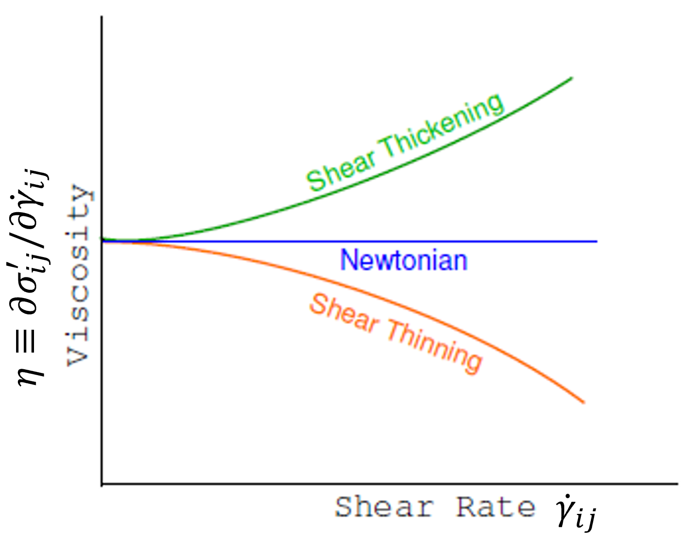{#fig-Thixo}

## Non-Newtonian fluids

Many fluids exhibit a viscosity that depends on the applied deformation rate. In this case,

$$
\eta
=
\eta(\dot{\gamma}).
$$

The stress-shear relationship is therefore nonlinear. A common phenomenological model, amongst many, is the **power-law fluid**

$$
\boxed{
\sigma_{ij}'
=
\mu \gamma_{ij}^{\,n}
}
$$

where:

- $\mu$ is a consistency coefficient,
- $n$ is the flow index.

### Shear thinning

When $n<1$, the apparent viscosity decreases as the shear rate increases. This behaviour is observed in liquids such as ketchup, blood, and many polymer solutions.

<video controls style="width:100%; max-width:700px;">
  <source src="figures/Ketchup.mp4">
</video>
Video: Shear-thinning Ketchup. [Original video](https://www.youtube.com/watch?v=X_cLJvUBlxw)

Physically, constituents that are initially tangled or disordered progressively align with the flow, reducing resistance to deformation.

### Shear thickening

When $n>1$, the apparent viscosity increases with increasing shear rate. Examples include cornstarch suspensions, or concentrated particulate suspensions.

<video controls style="width:100%; max-width:700px;">
  <source src="figures/Cornstarch.mp4">
</video>
Video: Shear-thickening Cornstarch. [Original video](https://youtube.com/clip/UgkxoGKhF-yXz1AlWkAWekfbL3WtfilVdUug?si=HL5uXSjS30w2djGQ)

At high deformation rates, particles become locally crowded and hinder one another's motion, causing the material to stiffen.

# Biological fluids

Biological fluids are rarely single-component liquids. Instead, they are often complex mixtures containing proteins, cells, polymers, vesicles, extracellular structures. Consequently, their rheological properties are typically non-Newtonian.

## Example: blood

Blood provides a particularly important example.

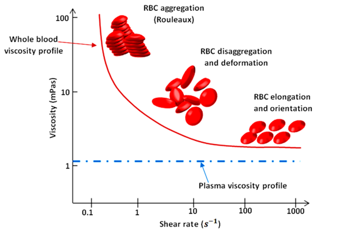{#fig-BloodVisc}

At low shear rates, red blood cells aggregate, forming large structures known as *rouleaux*, which leads to a high viscosity.

As the shear rate increases, those aggregates first break apart, then, as the shear rate increases further, the cells deform and align with the flow.

The apparent viscosity therefore decreases. Blood is consequently a strongly shear-thinning fluid.

This behavior is essential for circulation, as it facilitates blood flow easily through narrow vessels while maintaining high cell concentrations favouring oxygen delivery.

# Yield-stress fluids

Many materials behave like solids when weakly stressed but flow like liquids when sufficiently stressed. Examples include toothpaste, cooking dough, mayonnaise, yogurt, soft ice cream.

{#fig-YieldStress}

These materials possess a **yield stress**.

Below a critical stress, $\sigma < \sigma_s$, the material behaves as a solid. Above this threshold, $\sigma > \sigma_s$, the material flows.

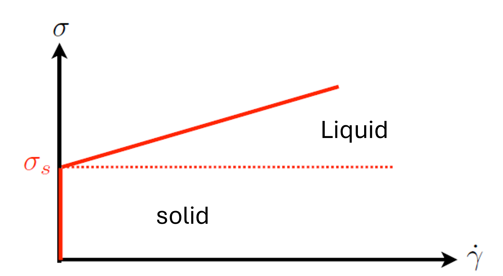{#fig-YieldStress}

This behaviour can be combined with a shear-thinning of shear-thickening behavior above the threshold, leading to a diversity of phenomenological models, including the Bingham model:

$$
\sigma-\sigma_s
=
\eta \dot\gamma.
$$

for which flow only begins once the yield stress has been exceeded, and then behaves as a Newtonian fluid.

A more general expression, known as the Herschel-Bulkley model, combines yield stress and power-law behavior:

$$
\sigma-\sigma_s
=
k\dot\gamma^{\,n}.

$$

Many food products and biological materials are successfully described using this model.

Another constitutive model frequently used for biological fluids, particularly blood, is the **Casson model**.
 
It assumes that the square root of the shear stress varies linearly with the square root of the shear rate:
 
$$
\sqrt{\sigma}
-
\sqrt{\sigma_s}
=
\sqrt{\eta_C \dot\gamma},
$$
 
Like the Herschel-Bulkley model, the Casson model predicts the existence of a yield stress below which the material does not flow. However, it often provides a better description of suspensions of deformable particles, which is why it has historically been used to model blood rheology. Note that, in this case, $\eta_C$ is different from $\frac{\partial \sigma_{ij}'}{\partial \dot{\gamma_{ij}}}$, and is therefore not the viscosity, but rather an intrinsic parameter with the dimensions of a viscosity.

:::{.callout-note collapse="true"}
## An example: ketchup rheology

Ketchup is a classic example of a **complex fluid** because it combines two important rheological properties:

1. **Yield-stress behavior**
2. **Shear-thinning behavior**

Most people have experienced both effects. A ketchup bottle may remain apparently solid when held upside down, indicating that gravity alone is insufficient to initiate flow. However, after shaking or squeezing the bottle, the ketchup suddenly begins to flow and becomes progressively easier to pour.

Ketchup is a concentrated suspension containing:

- tomato solids,
- polysaccharides,
- proteins,
- water,
- stabilizing thickeners.

These ingredients form a weak interconnected microstructure that resists deformation.

### Yield stress

At very low applied stresses, the internal structure remains intact and the ketchup behaves like a soft solid.

Flow only begins when the applied stress exceeds a critical threshold known as the **yield stress**,

$$
\sigma > \sigma_s.
$$

This explains why ketchup often remains inside an inverted bottle despite its own weight.

A common constitutive description is the Herschel-Bulkley model,

$$
\boxed{
\sigma-\sigma_s
=
k\dot\gamma^{\,n},
}
$$

which combines a yield stress $\sigma_s$ with non-Newtonian flow behavior.

### Shear thinning

Once flow has started, ketchup exhibits strong shear thinning.

As the shear rate increases:

- particle aggregates are disrupted,
- polymer chains become more aligned,
- the internal microstructure becomes progressively organized.

The resistance to flow therefore decreases.

This effect is observed experimentally by measuring the apparent viscosity

$$
\eta_{\rm app}
=
\frac{\sigma}{\dot\gamma}.
$$

For ketchup,

$$
\eta_{\rm app}
\downarrow
\qquad\text{as}\qquad
\dot\gamma
\uparrow.
$$

### Measuring ketchup rheology

The rheological properties of ketchup can be measured using a rotational rheometer.

{#fig-YieldStress}

The instrument imposes a controlled shear rate and measures the resulting stress.

Typical measurements show:

- a nonlinear stress-versus-shear-rate relationship,
- a rapidly decreasing apparent viscosity with increasing shear rate.

. [More resources:Effects of additional thickeners](https://doi.org/10.1111/j.1365-2621.2008.01868.x)](figures/KetchupMeasurements.png){#fig-KetchupStress}

The stress data are often successfully fitted using power-law or Herschel-Bulkley models.

The combination of yield stress and shear thinning is particularly desirable for food products.

At rest:

- the yield stress prevents unwanted flow,
- the high viscosity inhibits phase separation,
- the product remains stable on the shelf.

During use, however, shaking or squeezing exceeds the yield stress,
allowing the microstructure to break down. During use, the viscosity decreases, and the ketchup flows easily.

This combination explains why ketchup can remain stationary in a bottle for months yet pour readily when required.
:::

# Thixotropy

Some materials exhibit a viscosity that changes with time.

This behavior is known as **thixotropy**.

A thixotropic material becomes progressively easier to deform when subjected to a sustained shear stress.

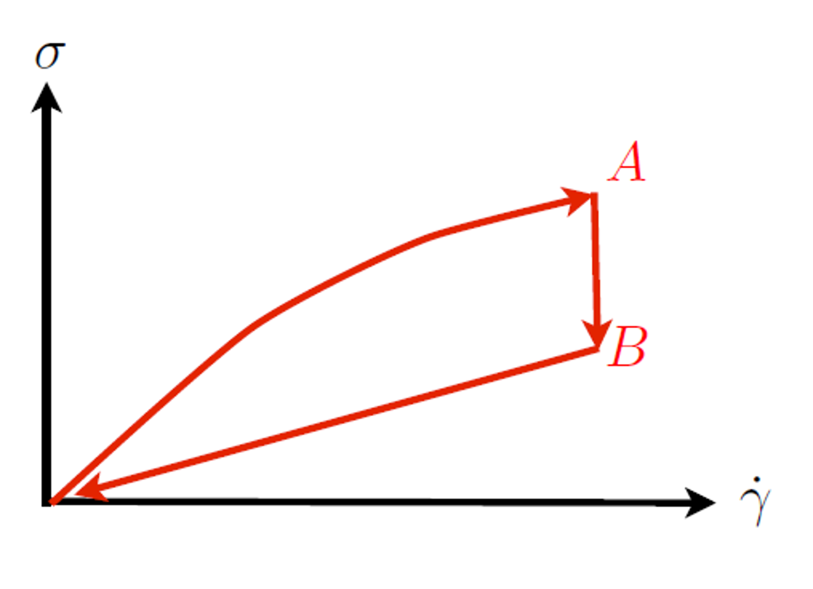{#fig-Thixo}

If the shear rate is increased and subsequently decreased, the stress does not necessarily follow the same trajectory.

A hysteresis loop appears because the material structure evolves during deformation.

Examples include paints, yogurts, gels, and biological suspensions.

The key idea is that the microscopic structure requires time to reorganize. Consequently, the rheological response depends not only on the current deformation but also on the deformation history.

# Solids, liquids and timescales

We often learn that solids and liquids are fundamentally different.

In practice, the distinction is frequently a matter of timescale.

A famous example is the **pitch-drop experiment**. 

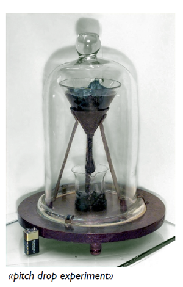{#fig-PicthDrop}

Pitch appears rigid over seconds or minutes but flows over years: one drop is produced approximately every decade. [More from Queensland UNiversity](https://smp.uq.edu.au/pitch-drop-experiment), [Live feed of teh experiment](http://thetenthwatch.com/feed/)

This observation motivates a deeper question:

> Is a solid simply a liquid with an extremely long relaxation time?

To address this question, we must first introduce elasticity.

# Elastic response of solids

Unlike fluids, solids resist deformation.

Consider a displacement field

$$
\mathbf u(\mathbf r).
$$

The corresponding adn so-called strain tensor, used to quantify small local deformations, is

$$
\boxed{
\epsilon
=
\frac{\nabla \mathbf u
+
(\nabla \mathbf u)^T}{2}.
}
$$

The strain tensor measures changes in shape and size, i.e. deformations of the object.

The shear component of such deformation is characterized by the shear strain $\gamma$, which does not take into account global expansion or compression of the material. For small deformations,

$$
\gamma_{ij}
=
2\left(
\epsilon_{ij}
-
\frac{\epsilon_{kk}}{3}\delta_{ij}
\right).
$$

The shear strain tensor describes how the shape of a material changes. In fluids, however, stresses are generally not determined by the amount of deformation, but rather by how rapidly the deformation occurs.

:::{.callout-note}
This expression is pretty obviously related to the shear rate tensor that we have been using through a time derivative: $\dot{\gamma}=\frac{d\gamma_{i,j}}{dt}$, since $v_i=\frac{du_i}{dt}$.
:::

## Stress-strain relation for elastic solids

For an isotropic linear elastic solid,

$$
\sigma_{ij}
=
K\epsilon_{kk}\delta_{ij}
+
2G
\left(
\epsilon_{ij}
-
\frac{\epsilon_{kk}}{3}\delta_{ij}
\right),
$$

where:

- $K$ is the bulk modulus,
- $G$ is the shear modulus.

This plays the same role for solids as

$$
\sigma_{ij}'
=
\eta\gamma_{ij}
$$

does for fluids.

The difference is fundamental:

- fluids respond to **strain rate**,
- solids respond to **strain** itself.

# Viscoelasticity

Many biological materials behave neither as perfect solids nor as perfect liquids.

Instead, they exhibit both viscous behavior and elastic behavior.Such materials are called **viscoelastic**.

## Physical picture

Consider a deformable polymer suspended in a liquid.

When stretched,

- the surrounding liquid dissipates energy,
- the polymer stores elastic energy.

The material therefore simultaneously behaves like:

- a dashpot (viscous element),
- a spring (elastic element).

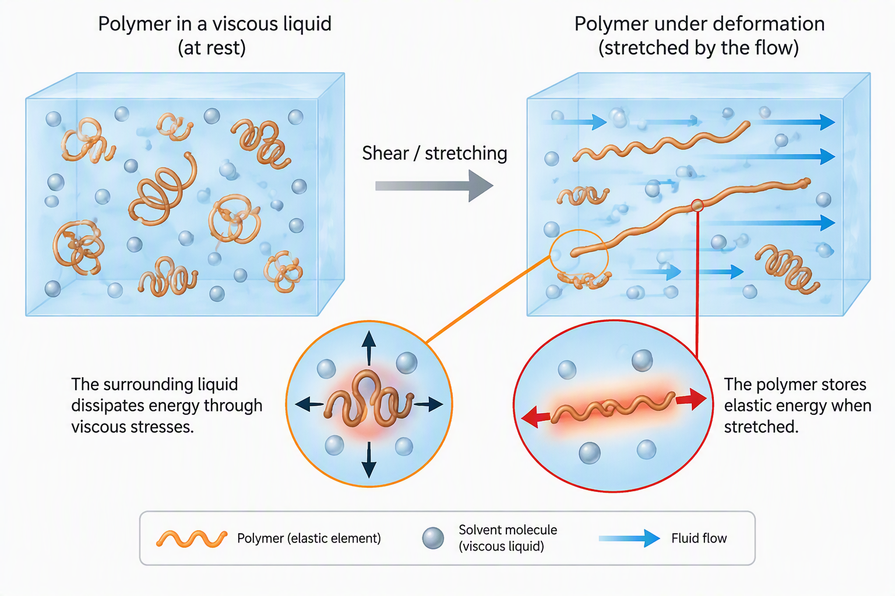{#fig-ViscoEl}

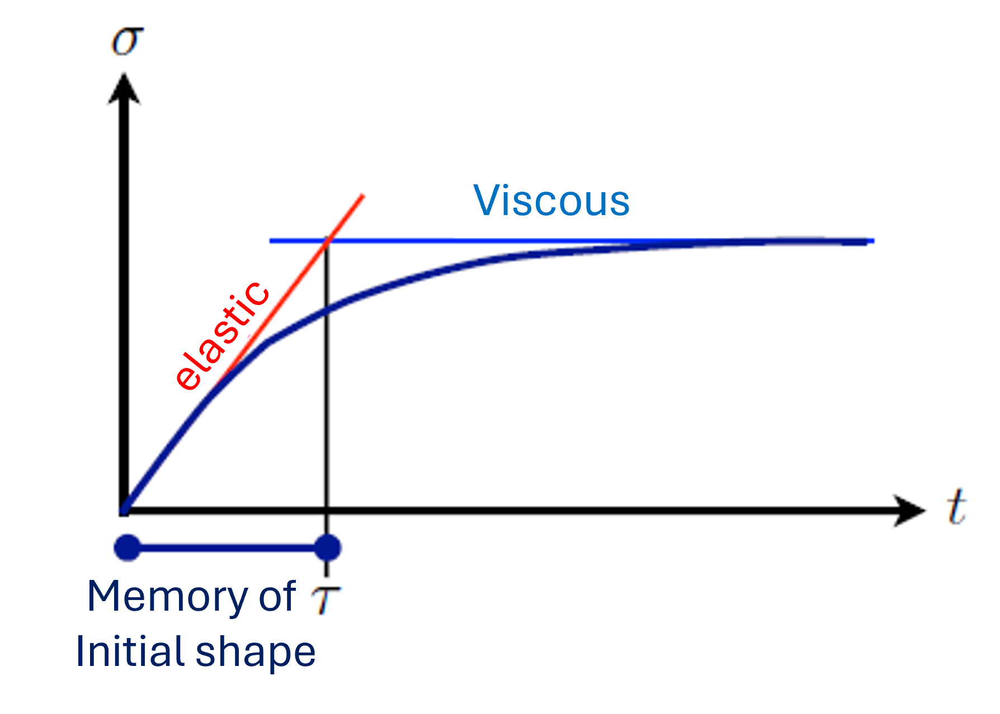{#fig-ViscoEl}

## Relaxation time

A useful timescale can be obtained by comparing elastic and viscous responses.

For an elastic solid,

$$
\sigma \sim G\gamma.
$$

For a viscous liquid,

$$
\sigma \sim \eta \dot\gamma.
$$

Since

$$
\dot\gamma \sim \frac{\gamma}{\tau},
$$

equating both contributions gives

$$
\boxed{
\tau
=
\frac{\eta}{G}.
}
$$

This quantity is known as the **relaxation time**.

It measures how long a material remembers its initial configuration.When observing the materia over an experimental time $t$, if

$$
t\ll\tau,
$$

the material behaves predominantly elastically. But if

$$
t\gg\tau,
$$

the material behaves predominantly as a liquid.

For water,

$$
\tau
=
\frac{\eta}{G}
\approx
10^{-12}\ \mathrm s.
$$

Water therefore loses memory of its original shape almost instantaneously.

In contrast, polymeric and biological materials can exhibit relaxation times ranging from milliseconds to hours.

# Rheological classification

The relaxation time provides a useful way of classifying materials.

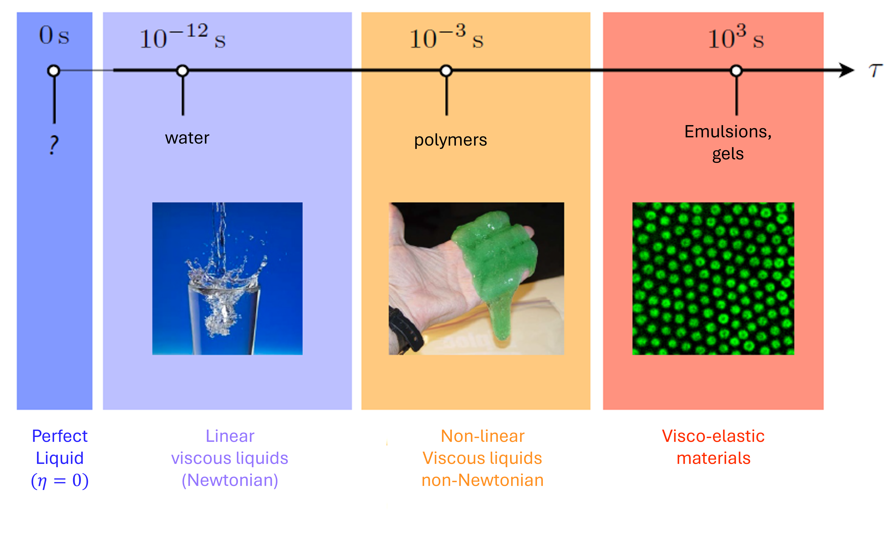{#fig-ViscoEl}

From left to right:

1. Perfect fluids ($\eta=0$)
2. Newtonian fluids
3. Non-Newtonian fluids
4. Viscoelastic systems

A useful rule of thumb is:

> The larger the relaxation time, the more "solid-like" the material appears over experimental timescales.

# The Maxwell model

One of the simplest viscoelastic models consists of:

- a spring,
- a dashpot,

connected in series, to form the constitutive element of the material.

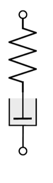{#fig-Maxwell}

Because the two elements are in series, a common stress is transferred through the whole constitutive element:

$$
\sigma=\sigma_1=\sigma_2,
$$

while the total strain is

$$
\gamma
=
\gamma_1+\gamma_2.
$$

Using:

$$
\sigma_1=G\gamma_1,
$$

and

$$
\sigma_2=\eta\dot\gamma_2,
$$

in the definition of the total strain rate, one obtains

$$
\boxed{
\sigma
+
\tau\dot\sigma
=
\eta\dot\gamma,
}
$$

with

$$
\tau=\frac{\eta}{G}.
$$

## Stress-relaxation experiment

Suppose a sudden deformation is imposed and maintained:

$$
\gamma=\gamma_0.
$$

The Maxwell equation becomes

$$
\sigma
+
\tau\dot\sigma
=
0.
$$

The solution is

$$
\boxed{
\sigma(t)
=
\sigma_0 e^{-t/\tau},
}
$$

which also leads to an effective elastic modulus
$$
G(t)
=
\frac{\sigma}{\gamma_0}
=
G_0 e^{-t/\tau}.
$$

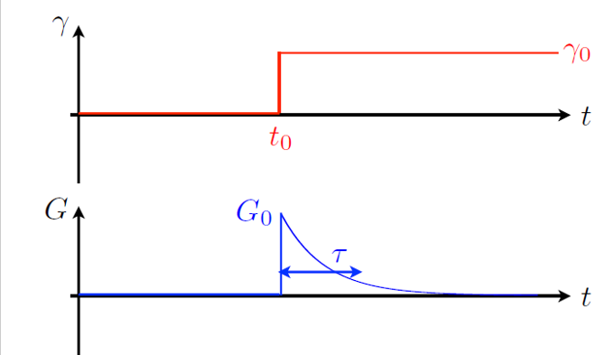{#fig-Maxwell}

The stored stress and the effective elastic modulus progressively disappears. The material forgets its initial configuration over a timescale $\tau$.

## Dynamic rheology

A very powerful method for characterizing viscoelastic materials consists of applying oscillatory deformations.

Suppose

$$
\gamma(t)
=
\gamma_0
\sin(\omega t).
$$

The response depends on the material.

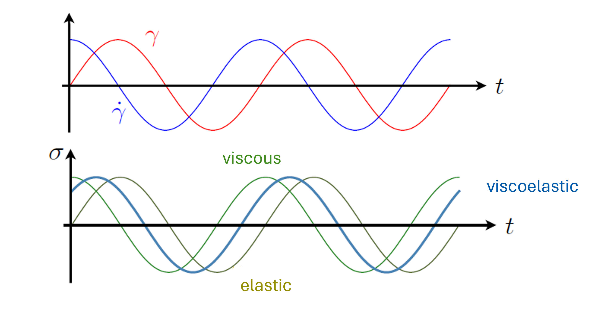{#fig-Maxwell}

For an elastic solid, the stress is in phase with the strain:

$$
\sigma
=
G\gamma_0
\sin(\omega t).
$$

No phase shift occurs.However, for a newtonian fluid, the stress is proportional to the strain rate:

$$
\sigma
=
\eta\gamma_0\omega
\cos(\omega t).
$$

Since

$$
\cos(\omega t)
=
\sin(\omega t+\pi/2),
$$

the stress is shifted by

$$
\frac{\pi}{2}.
$$

In general, for viscoelastic materials,

$$
\boxed{
\sigma
=
\sigma_0
\sin(\omega t+\delta).
}
$$

The phase shift satisfies

$$
0<\delta<\frac{\pi}{2}.
$$

The material therefore behaves partly like a solid and partly like a liquid.

### Storage and loss moduli

Using complex notation,

$$
\gamma
=
\gamma_0 e^{i\omega t},
$$

the stress can be written

$$
\sigma
=
(G'+iG'')
\gamma
=
\sigma_0 e^{i(\omega t +\delta)}
$$

The quantities $G'$ and $G''$ are known as the storage modulus and the loss modulus, respectively.

$G'$ measures energy stored elastically, i.e. the solid-like component of the response, while $G''$ measures viscous dissipation, i.e. the liquid-like component of the response.

From the expression above, it appears that the ratio provides the phase difference between the shear stress and shear rate:

$$
\tan\delta
=
\frac{G''}{G'}
$$

and $\delta$ then provides a convenient measure of the balance between viscous and elastic behavior.

### Maxwell model in oscillatory rheology

Using the constitutive equation of the Maxwell model

$$
\boxed{
\sigma+\tau\dot{\sigma}
=
\eta\dot{\gamma},
}
$$

with $\tau=\frac{\eta}{G}$ being the relaxation time, one can predict an expected response of the material when assuming an oscillatory shear and stress.

Indeed, we are assuming $\gamma(t)=\gamma_0 e^{i\omega t}$, and looking for a stress of the form $\sigma(t)=(G'+iG'')\gamma(t)$.

Substituting these expressions into the Maxwell equation gives

$$
\boxed{
G'
=
G
\frac{\omega^2\tau^2}
     {1+\omega^2\tau^2}
}
$$

and

$$
\boxed{
G''
=
G
\frac{\omega\tau}
     {1+\omega^2\tau^2}.
}
$$

](figures/MaxwellModelProteinGels.png){#fig-MaxwellProteins}

#### Low-frequency behavior

Consider first the limit

$$
\omega\tau \ll 1.
$$

This corresponds to deformation occurring very slowly compared with the material relaxation time.

The material has sufficient time to relax any stored stress before the direction of deformation changes.

Using the expressions above,

$$
G'
\approx
G\omega^2\tau^2
\propto
\omega^2,
$$

while

$$
G''
\approx
G\omega\tau
\propto
\omega.
$$

Therefore

$$
G'' \gg G'.
$$

The response is dominated by viscous dissipation.

Physically, the material behaves like a liquid because the polymers continuously reorganize while being deformed.

#### High-frequency behavior

Now consider

$$
\omega\tau \gg 1.
$$

The imposed deformation varies more rapidly than the material can relax.

The polymers do not have time to rearrange, so elastic stresses accumulate.

In this limit,

$$
G'
\approx G,
$$

while

$$
G''
\approx
\frac{G}{\omega\tau}.
$$

Consequently,

$$
G' \gg G''.
$$

The response is dominated by elasticity.

The material now behaves much more like a solid.

#### Crossover frequency

The transition between these two regimes occurs near

$$
\boxed{
\omega\tau \sim 1.
}
$$

At this frequency, the experimental timescale

$$
\frac{1}{\omega}
$$

becomes comparable to the intrinsic relaxation time

$$
\tau.
$$

The material is neither fully liquid-like nor fully solid-like.

Instead, it exhibits the strongest viscoelastic behavior.

:::{.callout-note  collapse="true"}
## Further physical interpretation
### Why does $G''$ exhibit a maximum?

The loss modulus may be written as

$$
G''
=
G
\frac{\omega\tau}
     {1+\omega^2\tau^2}.
$$

At low frequencies, increasing $\omega$ causes more rapid deformation and therefore larger viscous dissipation.

As a result,

$$
G''
\propto\omega.
$$

However, at high frequencies the material no longer has enough time to flow.

The response becomes increasingly elastic and viscous dissipation decreases:

$$
G''
\propto
\frac{1}{\omega}.
$$

The competition between these two effects produces a maximum.

Differentiating with respect to $\omega$ shows that the maximum occurs at

$$
\boxed{
\omega=\frac{1}{\tau}.
}
$$

The peak in $G''$ therefore provides a direct experimental measurement of the relaxation time.

### Why does $G'$ saturate?

The storage modulus is

$$
G'
=
G
\frac{\omega^2\tau^2}
     {1+\omega^2\tau^2}.
$$

At low frequency,

$$
G' \propto \omega^2,
$$

because polymers have enough time to relax and cannot accumulate significant elastic stress.

As the frequency increases, the polymers become effectively trapped during each oscillation cycle.

The response therefore becomes increasingly spring-like until

$$
G'
\rightarrow G.
$$

The storage modulus saturates at the elastic modulus of the spring.
:::

## Experimental interpretation

A typical frequency sweep therefore reveals:

- a low-frequency regime where $G''>G'$ (liquid-like behaviour);
- a crossover near $\omega\tau\approx1$;
- a high-frequency regime where $G'>G''$ (solid-like behaviour).

This is precisely the behaviour observed in many polymer solutions, protein gels and biological materials.

The frequency at which the two curves cross provides valuable information about the underlying relaxation processes, while the plateau value of $G'$ gives access to the material's elastic modulus.

# The Kelvin-Voigt model

A second fundamental viscoelastic model, called the Kelvin-Voigt model, consists of the same component (a spring and a dashpot), but connected in parallel.

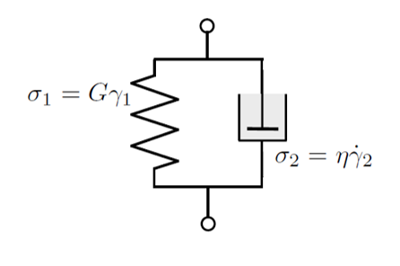{#fig-MaxwellProteins}

In this geometry:

$$
\gamma=\gamma_1=\gamma_2,
$$

while the stresses add:

$$
\sigma=\sigma_1+\sigma_2.
$$

Therefore

$$
\boxed{
\sigma
=
G\gamma
+
\eta\dot\gamma.
}
$$

## Physical interpretation

The Kelvin-Voigt model exhibits:

- delayed elasticity,
- strain recovery after unloading,
- stronger solid-like behavior at long times.

It is often a useful model for biological tissues.

## Delayed elasticity

One of the most characteristic predictions of the Kelvin-Voigt model is its response to a sudden application of stress.

Suppose a constant stress

$$
\sigma=\sigma_0
$$

is applied at time $t=0$.

The constitutive equation

$$
\sigma
=
G\gamma
+
\eta\dot\gamma
$$

becomes

$$
\sigma_0
=
G\gamma
+
\eta\dot\gamma.
$$

Solving this differential equation yields

$$
\boxed{
\gamma(t)
=
\frac{\sigma_0}{G}
\left[
1-
e^{-t/\tau}
\right],
}
$$

where

$$
\tau
=
\frac{\eta}{G}.
$$

Unlike an ideal elastic solid, which deforms instantaneously, the Kelvin-Voigt material approaches its final deformation progressively.

The characteristic time

$$
\tau=\frac{\eta}{G}
$$

therefore corresponds to the timescale required for elastic deformation to develop.

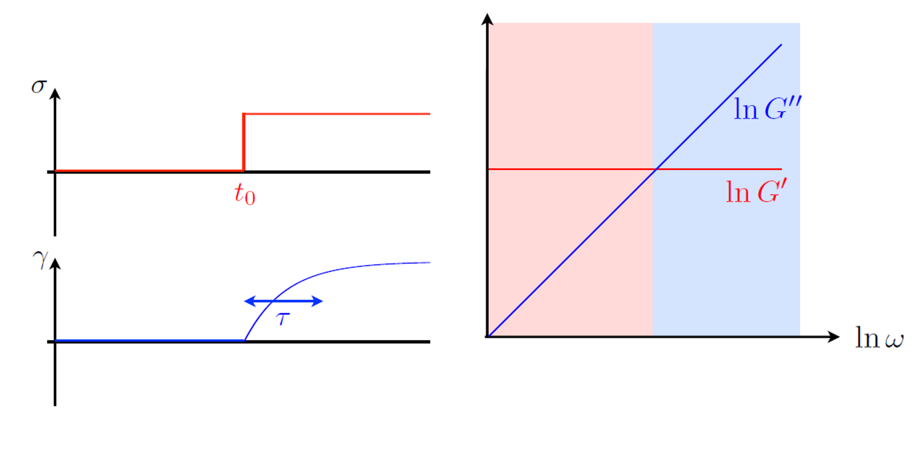

## Dynamic rheology

As for the Maxwell model, we may probe the response of a Kelvin-Voigt material using an oscillatory deformation

$$
\gamma(t)
=
\gamma_0 e^{i\omega t}.
$$

Substituting this expression into

$$
\sigma
=
G\gamma
+
\eta\dot\gamma
$$

gives

$$
\sigma
=
\left(
G+i\eta\omega
\right)
\gamma.
$$

By identification with

$$
\sigma
=
(G'+iG'')\gamma,
$$

we obtain

$$
\boxed{
G'=G,
}
$$

and

$$
\boxed{
G''=\eta\omega.
}
$$

Unlike the Maxwell model, the storage modulus is independent of frequency:

$$
G'=G.
$$

The material therefore retains an elastic component at all timescales.

The spring continuously supports part of the applied stress, making the response intrinsically solid-like.

### Loss modulus

The loss modulus increases linearly with frequency:

$$
G''=\eta\omega.
$$

At higher frequencies, the dashpot experiences larger deformation rates and therefore dissipates more energy.

Consequently, the viscous contribution becomes increasingly important as the oscillation frequency increases.

### Low-frequency behavior

For

$$
\omega\tau\ll1,
$$

we have

$$
G'' \ll G'.
$$

The response is dominated by elasticity.

Even at very low frequencies, the Kelvin-Voigt material behaves more like a soft solid than a liquid.

This is in stark contrast with the Maxwell model, where the low-frequency limit is liquid-like.

### High-frequency behavior

For

$$
\omega\tau\gg1,
$$

the loss modulus grows while the storage modulus remains constant,

$$
G''\gg G'.
$$

The material still stores elastic energy through the spring, but viscous dissipation becomes increasingly significant because the dashpot is forced to deform more rapidly.

### Comparison with the Maxwell model

The Maxwell and Kelvin-Voigt models may be viewed as opposite limits of viscoelastic behavior.

| Property | Maxwell | Kelvin-Voigt |
|-----------|-----------|-----------|
| Arrangement | Series | Parallel |
| Stress relaxation | Yes | No |
| Delayed elasticity | No | Yes |
| Long-time behavior | Liquid-like | Solid-like |
| $G'$ at low frequency | Small | Constant |
| $G''$ at low frequency | Dominant | Small |

The Maxwell model is particularly well suited to materials that eventually flow, such as polymer solutions and viscoelastic fluids.

The Kelvin-Voigt model is often a better description of soft solids and biological tissues that progressively deform under load while retaining a finite elastic stiffness.

## Experimental interpretation

A frequency sweep of a Kelvin-Voigt material therefore reveals:

- a storage modulus that remains approximately constant,
- a loss modulus that increases approximately linearly with frequency,
- an increasingly dissipative response as the deformation rate increases.

The observation of a nearly constant $G'$ over a broad frequency range is often indicative of an elastic network structure, such as those found in gels, connective tissues and many biological materials.

# Microrheology

So far we have discussed bulk rheology.

An alternative approach consists of tracking microscopic tracer particles embedded within the material.

**[Insert tracer-particle illustration]**

From the fluctuations and motion of these probes one can recover:

- local viscosity,
- local elasticity,
- heterogeneity of the material.

This technique, known as **microrheology**, is particularly useful for:

- cells,
- biofilms,
- hydrogels,
- intracellular environments.

# Beyond Maxwell and Kelvin-Voigt

Real biological materials are often much more complex than either model.

Examples include:

- cytoskeleton networks,
- mucus,
- extracellular matrices,
- protein gels.

Nevertheless, many complex systems can be approximated by combining:

- Maxwell elements,
- Kelvin-Voigt elements,

in series or parallel.

These phenomenological models provide a useful starting point for understanding the mechanical behavior of biological materials.

# Learning outcomes

After this lecture, you should be able to:

- distinguish Newtonian and non-Newtonian fluids;
- explain shear thinning and shear thickening;
- describe yield-stress fluids;
- explain the concepts of thixotropy and viscoelasticity;
- define the relaxation time $\tau=\eta/G$;
- explain the physical meaning of the Maxwell and Kelvin-Voigt models;
- interpret storage and loss moduli;
- understand how rheological measurements reveal the microscopic structure of biological materials.