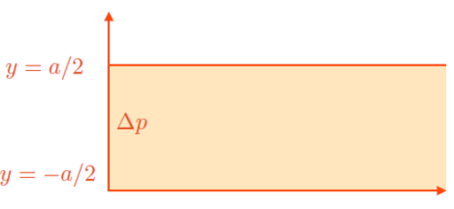

# Introduction

In this problem class, we will apply the conservation laws developed in the lecture notes to determine the velocity profile of a fluid flowing between two parallel plates.

The objectives are:

1. Solve the Navier-Stokes equations for a Newtonian fluid.
2. Extend the derivation to a power-law fluid.
3. Understand the physical role of pressure gradients, viscosity, and constitutive equations.

Throughout the exercises, do not attempt to solve the full Navier-Stokes equation immediately. Instead, progressively exploit the symmetries and assumptions of the problem to simplify the equations.

# Geometry and assumptions

We consider two stationary parallel plates separated by a distance \(a\).

The plates are located at

$$
y=\pm \frac{a}{2}.
$$

The flow is driven by a uniform pressure gradient along the \(x\)-direction.

{#fig-StressTensor}

The following assumptions apply throughout:

- stationary flow,
- incompressible flow,
- flow confined to the $x$-$y$ plane,
- fully-developed flow,
- no-slip boundary conditions at both walls.

---

# Exercise 1: Newtonian fluid

Consider a Newtonian fluid satisfying

$$
\sigma_{ij}
=
-p\delta_{ij}
+
\eta
\left(
\frac{\partial v_i}{\partial x_j}
+
\frac{\partial v_j}{\partial x_i}
\right).
$$

The imposed pressure gradient is

$$
\frac{\partial p}{\partial x}
=
-\frac{\Delta p}{L}.
$$

Your goal is to determine the velocity profile $v_x(y)$.

## Step 1: Use the symmetries of the problem

Begin by exploiting the assumptions.

- Stationary flow : Which terms disappear from the Navier-Stokes equation when formulating this hypothesis?

- Fully-developed flow: The geometry is translationally invariant along $x$ and $z$. What does this imply mathematically?

-Two-dimensional flow: The problem statement gives $v_z=0$. Which velocity components remain potentially non-zero?

-Incompressibility: what equation can you get from this hypothesis? Use the wall boundary conditions to find what this implies for $v_y$. 

::: {.callout-note collapse="true"}
### Hint

The no-slip condition applies to every velocity component at the walls.
:::

## Step 3: Simplify the Navier-Stokes equation

Insert the previous results into

$$
\rho
\left(
\frac{\partial\mathbf v}{\partial t}
+
(\mathbf v\cdot\nabla)\mathbf v
\right)
=
-\nabla p
+
\eta\nabla^2\mathbf v.
$$

### Question

What remains of:

- the local acceleration term?
- the convective acceleration term?

After simplification, write the $x$-component of the equation.

::: {.callout-note collapse="true"}
### Hint

You should obtain an equation involving

$$
\frac{\partial p}{\partial x}
$$

and

$$
\frac{\partial^2 v_x}{\partial y^2}.
$$
:::

## Step 4: Solve the differential equation

Insert

$$
\frac{\partial p}{\partial x}
=
-\frac{\Delta p}{L}.
$$

You should obtain an ordinary differential equation in $y$.

Integrate once.

What physical quantity appears after the first integration?

Integrate a second time.

Two integration constants will appear.

How can they be determined?

### Boundary conditions

How can you formulate teh boudnary conditions mathematically in regard to $v_x$ ?

## Step 5: Check your result

Before moving on, verify that the solution satisfies:

- no-slip at both plates;
- left-right symmetry about \(y=0\); including extremum velocity at the channel centre.

---

# Exercise 2: Power-law fluid

We now replace the Newtonian constitutive equation with the power-law model

$$
\sigma = 2\mu \gamma^n.
$$

The geometry and boundary conditions remain unchanged. 

## Step 1: Repeat the symmetry analysis

All geometric assumptions from Exercise 1 still apply.

Determine:

- which velocity components vanish,
- which derivatives vanish,
- which stress components may remain non-zero.

::: {.callout-note collapse="true"}
### Hint

Only one velocity component survives.

Consequently, only one independent shear stress component remains.
:::

## Step 2: Write the constitutive relation

Express the remaining shear stress component in terms of the velocity gradient.

## Step 3: Simplify the momentum equation

Use exactly the same reasoning as for the Newtonian fluid.

Reduce the $x$-component of the momentum equation to a one-dimensional ordinary differential equation.

After integrating once, an integration constant appears.

How can the symmetry of the channel be used to determine this constant? 

::: {.callout-note collapse="true"}
### Hint

The geometry is symmetric with respect to

$$
y=0.
$$

Think about the behaviour of the shear stress at the centre plane.
:::

## Step 4: Determine the velocity profile

After obtaining an expression for

$$
\frac{\partial v_x}{\partial y},
$$

integrate a second time.

Apply the no-slip condition at the walls.

You should obtain a family of velocity profiles depending on the exponent $n$.

## Step 5: Explore limiting cases

Evaluate qualitatively what happens when:

- $n<1,
- $n=1$,
- $n>1$.

How does the shape of the profile change?

Which case corresponds to the Newtonian fluid solved previously?

---

# Physical interpretation

The pressure gradient supplies mechanical energy to the fluid.

Viscosity transfers momentum toward the walls, where the no-slip condition imposes zero velocity.

The final flow profile arises from the balance between:

- pressure forces,
- viscous stresses.

For a power-law fluid, the constitutive relation modifies how stress responds to shear rate, changing the shape of the velocity profile while leaving the overall solution strategy unchanged.

---

# Checklist before leaving the problem class

For both fluids, make sure that you can:

- identify all assumptions made,
- simplify the continuity equation,
- simplify the Navier-Stokes equation,
- justify every discarded term,
- apply no-slip boundary conditions,
- use symmetry arguments,
- derive the governing ordinary differential equation,
- explain physically why the velocity profile has its observed shape.

These steps are far more important than memorising the final velocity profile.