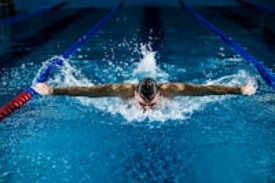
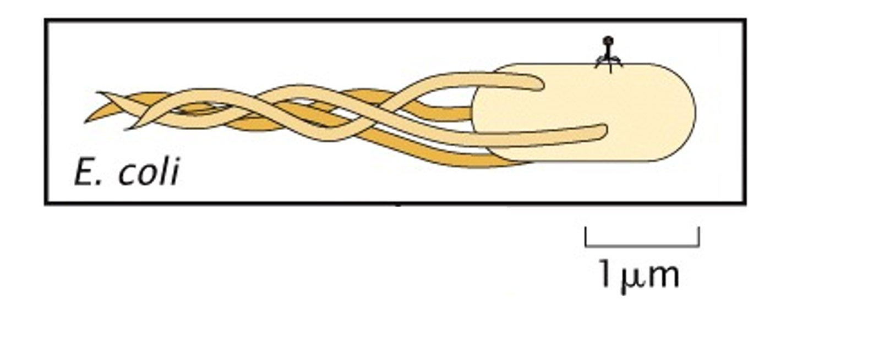
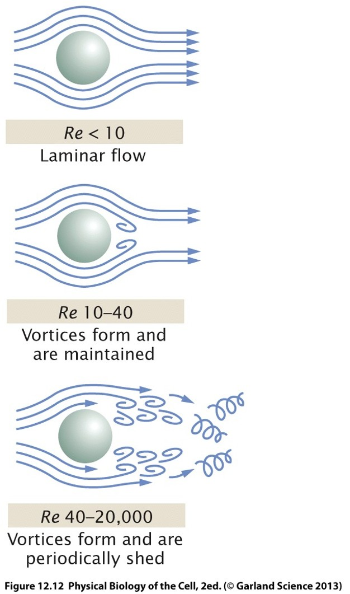
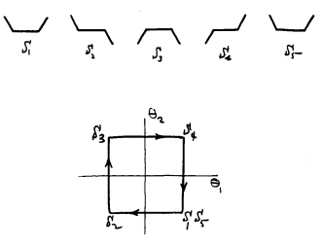
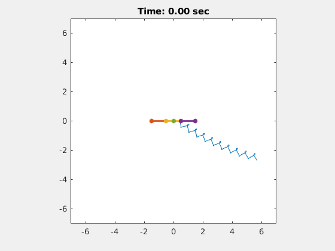
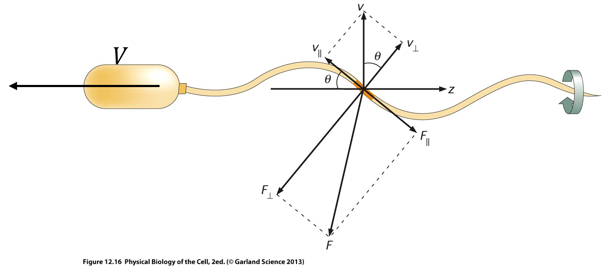

# Introduction

In the previous lecture, we derived the Navier-Stokes equation:

$$
\underbrace{
\color{red}{
\rho
\left(
\frac{\partial \mathbf v}{\partial t}
+
(\mathbf v\cdot\nabla)\mathbf v
\right)
}
}_{\text{\color{red}{Inertia}}}
=
\underbrace{
\color{blue}{
-\nabla p
}
}_{\text{\color{blue}{Pressure}}}
+
\underbrace{
\color{green}{
\eta\nabla^2\mathbf v
}
}_{\text{\color{green}{Viscous dissipation}}}
+
\underbrace{
\color{purple}{
\mathbf f_V
}
}_{\text{\color{purple}{Volume forces}}}
$$

A powerful way to understand fluid flows is to compare the relative importance of the different terms appearing in the Navier-Stokes equation. To do this, we estimate the order of magnitude of each term using characteristic scales:

- length scale $L$
- velocity scale $U$
- pressure scale $\Delta P$
- Fluid density $\rho$

The characteristic magnitude of each contribution can be estimated as

| Term | Physical meaning | Characteristic scale |
|--------|--------|--------|
| $\color{red}{\rho\left(\frac{\partial \mathbf v}{\partial t}+(\mathbf v\cdot\nabla)\mathbf v\right)}$ | Inertia | $\rho U^2/L$ |
| $\color{blue}{-\nabla p}$ | Pressure forces | $\Delta P/L$ |
| $\color{green}{\eta\nabla^2\mathbf v}$ | Viscous dissipation | $\eta U/L^2$ |
| $\color{purple}{\mathbf f_V}$ | Volume forces (e.g. gravity) | $\rho g$ |

In many situations, some of these effects dominate while others become negligible. Rather than solving the full Navier-Stokes equation, we can often gain physical insight by comparing the relative magnitudes of its terms. Taking ratios of these characteristic magnitudes leads to a family of dimensionless numbers that characterize different flow regimes:

The Reynolds number compares inertial effects to viscous effects:
 
$$
\boxed{
Re
=
\frac{\color{red}\text{Inertia}}{\color{green}\text{Viscous forces}}
=
\frac{\rho U L}{\eta}.
}
$$

We can interpret the value of teh Reynolds number based on on its magnitude:

- $Re \gg 1$: inertia dominates viscosity;  
- $Re \ll 1$: viscosity dominates inertia.  
 
The Reynolds number is one of the most important quantities in fluid mechanics and will be the focus of this lecture.
 
The Euler number compares pressure forces to inertial forces:
 
$$
\boxed{
Eu
=
\frac{\color{blue}\text{Pressure}}{\color{red}\text{Inertia}}
=
\frac{\Delta P}{\rho U^2}.
}
$$

- $Eu \gg 1$: pressure forces dominate inertia;  
- $Eu \ll 1$: inertial effects dominate pressure forces.  

The Froude number compares inertial effects to gravity:
 
$$
\boxed{
Fr
=
\sqrt{
\frac{\color{red}\text{Inertia}}{\color{purple}\text{Gravity}}
}
=
\frac{U}{\sqrt{gL}}
.
}
$$

Interpretation: 

- $Fr \gg 1$: inertia dominates gravity; 
- $Fr \ll 1$: gravity dominates inertia. 
 
The Froude number plays an important role in free-surface flows such as rivers, waves and ship hydrodynamics.

## Why dimensionless numbers matter

Suppose two flows have completely different:

- sizes,
- velocities,
- viscosities,
- densities.

If they have the same dimensionless numbers, they will often behave in a very similar manner.
 
Dimensionless numbers therefore allow us to identify entire classes of fluid flows without solving the governing equations explicitly.
 
For biological systems, the most important quantity is usually the Reynolds number, because it determines whether fluid motion is governed primarily by inertia or viscosity.
 
In the remainder of this lecture, we will discover that many microorganisms operate at
 
$$
Re \ll 1,
$$
 
where the physics becomes dramatically different from our everyday experience.


# Characteristic Reynolds numbers

To appreciate the enormous range of Reynolds numbers encountered in nature, let us estimate a few values.

## Human swimming

Typical values:

$$
L \sim 1\ \mathrm{m},
$$

$$
U \sim 10^{-1}-1\ \mathrm{m\,s^{-1}},
$$

$$
\rho \sim 10^3\ \mathrm{kg\,m^{-3}},
$$

$$
\eta \sim 10^{-3}\ \mathrm{Pa\,s}.
$$

This gives

$$
Re \sim 10^5.
$$

Human swimming is therefore strongly inertia dominated.

{#fig-HumanSwimmer}

## Bacteria

Typical values:

$$
L \sim 1\ \mu\mathrm m,
$$

$$
U \sim 10\ \mu\mathrm m\,s^{-1},
$$

$$
\rho \sim 10^3\ \mathrm{kg\,m^{-3}},
$$

$$
\eta \sim 10^{-3}\ \mathrm{Pa\,s}.
$$

This yields

$$
Re \sim 10^{-5}.
$$

For bacteria, inertia is essentially irrelevant.Therefore, the physical world experienced by a bacterium is completely different from the one experienced by a swimmer, as it is dominated by viscous drag forces.

{#fig-BacteriaSwimmer}

# Origin of drag forces

When an object moves through a fluid, it experiences a force opposing its motion, known as the **drag force**.

The physical origin of this force depends strongly on the Reynolds number. At high Reynolds number, drag originates primarily from the momentum imparted to the surrounding fluid. At low Reynolds number, drag originates primarily from viscous stresses generated near the object's surface.

To understand the difference, we estimate the magnitude of each contribution.

## Inertial drag

Consider a body of cross-sectional area $A$ moving through a fluid with speed $U$.

As the body advances, it continuously deflects fluid that was initially at rest. You can also think of it in the referential of the block, and then it is continuously pushed by this amount of fluid that it is stopping in its track.

](figures/DragForce.png){#fig-DragForce}

During a small time interval $dt$, the body faces a volume of liquid

$$
dV \simeq AU\,dt.
$$

The mass of fluid intercepted during this interval is therefore

$$
dm
=
\rho\,dV
=
\rho AU\,dt.
$$

In the body referential, this fluid goes from a velocity of order $U$ to virtually 0 along its axis of motion.

The corresponding change in momentum is

$$
dp_{fluid}
=
(0-U)\,dm.
$$

Using Newton's third and second law, the force acting on the body is

$$
F_i
=
-\frac{dp_{fluid}}{dt},
$$

we obtain

$$
F_i
\approx
\frac{U\,dm}{dt}.
$$

Substituting the mass flow rate,

$$
F_i
\approx
\frac{U(\rho AU\,dt)}{dt}.
$$

Therefore,

$$
\boxed{
F_i
\sim
\rho A U^2.
}
$$

This contribution is called the **inertial drag**. This  force scales with:

- the density of the fluid,
- the obstacle cross-sectional area,
- the square of the velocity.

The quadratic dependence on velocity arises because:

1. increasing the velocity causes more fluid to be intercepted every second;
2. each fluid parcel also receives a larger momentum change.

Since both effects scale as $U$, the resulting force scales as $U^2$.


## Viscous drag

A second contribution arises from the viscosity of the fluid.

Because of the no-slip boundary condition, fluid in contact with the object's surface has the same velocity as the surface.

As a result, velocity gradients develop near the body.

Suppose the velocity increases from $v=0$ at the surface to $v=U$ over a characteristic distance $l$. This distance must be, in first order of approximation, proportional to the object size. The full demonstration is a bit long, but it should seem pretty intuitibe that an object should not disturb a distance much larger nor much smaller than itself.

The velocity gradient is then of the order of

$$
\frac{\partial v}{\partial y}
\sim
\frac{U}{l}.
$$

For a Newtonian fluid of viscosity $\eta$, the resulting shear stress is

$$
\sigma
=
\eta
\frac{\partial v}{\partial y}
=
\eta\frac{U}{l}.
$$

Therefore, the total force,  obtained by multiplying the stress by the area over which it acts, becomes:

$$
F_v
\sim
A\sigma
=
A\eta\frac{U}{l}
\approx
l\eta U.
$$


This contribution is called the **viscous drag**. The viscous drag increases because:

- larger viscosities generate larger shear stresses;
- larger objects provide more surface area over which these stresses act;
- larger velocities generate steeper velocity gradients.

Unlike inertial drag, viscous drag scales linearly with velocity.

## Total drag

The total drag force is the sum of both contributions:

$$
F_D
=
F_i
+
F_v.
$$

Using the scaling estimates derived above:

$$
F_D
\sim
\alpha\,\rho A U^2
+
\beta\,\eta U L,
$$

where $\alpha$ and $\beta$ are dimensionless numerical constants that depend on the object's geometry. To determine which contribution dominates, we compare the two scaling laws:

$$
\frac{F_i}{F_v}
=
\frac{\rho A U^2}
{\eta U L}
\approx
\frac{\rho U L}{\eta}
=
Re.
$$

This result recalls the physical meaning of the Reynolds number:

$$
\boxed{
Re
=
\frac{\text{Inertial forces}}
{\text{Viscous forces}}.
}
$$

When

$$
Re\gg1,
$$

drag is dominated by momentum transfer to the fluid.

When

$$
Re\ll1,
$$

drag is dominated by viscous stresses.


For a spherical particle, one can work out numerical coefficients through the Navier-Stokes equation:

$$
\begin{cases}
Re\ll1
&
\Longrightarrow
F_D = -6\pi\eta R\,v
\\[8pt]
Re\gg1
&
\Longrightarrow
F_D \approx \frac{\rho R^2 v^2}{2},
\end{cases}
$$
although the inertial case is more complex because vortices and turbulence make it more complex.

The transition between these two regimes is governed by the Reynolds number. The proportionality constants (previous $\alpha$ and $\beta$) appearing in the drag force depends on the shape of the object.

More generally,

$$
\mathbf F_D
=
-C_{\rm drag}\,\eta\,L\,\mathbf v,
$$

where $C_{\rm drag}$ is a dimensionless geometric factor and $L$ is a characteristic length of the object.

The physical origin of this dependence is that different geometries generate different flow fields and therefore different viscous stresses around their surfaces. Objects with the same size but different shapes generally experience different drag forces.

For a long, thin cylinder (or rod) of length $L$, moving parallel or perpendicular to its main axis, the drag coefficients are different:

$$
\boxed{
\mathbf F_\parallel
\simeq
-2\pi \eta L\,\mathbf v_\parallel,
}
$$

$$
\boxed{
\mathbf F_\perp
\simeq
-4\pi \eta L\,\mathbf v_\perp.
}
$$

The drag experienced for motion perpendicular to the rod is therefore approximately twice as large as that for motion parallel to the rod.

This anisotropy plays a central role in the propulsion of microorganisms. In particular, bacterial flagella generate thrust because different parts of the flagellum experience different parallel and perpendicular drag forces as they rotate through the fluid, as we will demonstrate.

# Why inertia disappears for microorganisms

Consider a bacterium propelled by a constant swimming force.

Newton's second law becomes

$$
F_{\text{swim}}
-
6\pi\eta Rv
=
m\frac{dv}{dt}.
$$

The solution is

$$
v(t)
=
\frac{F_{\text{swim}}}{6\pi\eta R}
+
\left(v_0-\frac{F_{\text{swim}}}{6\pi\eta R}\right)e^{-t/\tau},
$$

where

$$
\tau
=
\frac{m}{6\pi \eta R}
\propto
\frac{\rho R^3}{R\eta}
\propto Re\frac{R}{v}
\approx{1 \mu s}.
$$

This means that if a bacterium stops swimming, its velocity vanishes almost instantaneously.One can also compute that the distance travelled over that time would be around $0.1\,\overset{\circ}{A}$. Unlike a swimmer or a cyclist, microorganisms cannot coast: their Motion requires continuous propulsion.

# The world of Stokes flow

The Stokes equation, appearing when neglecting the inertial terms in the Navier-Stokes equation,

$$
0
=
-\nabla p
+
\eta\nabla^2\mathbf v
+
\mathbf f_V,
$$

is linear. This leads to various features of the flow field, which is known as Stokes flow :

- Laminar flow : Low-Reynolds-number flows are typically smooth. Vortices and turbulent cascades are absent.Fluid parcels follow predictable trajectories along constant streamlines.

{#fig-DragForce}

- Time reversible flow: Suppose all velocities in a Stokes flow are reversed. The governing equation remains unchanged. Consequently, every motion is exactly reversible.

This last feature has extraordinary consequences for locomotion.

# Purcell's scallop theorem

A swimmer must move by cyclic body deformation (at least, if they want to swim for a significant amount of time). 

Because Stokes flow is time reversible, any motion identical under time reversal cannot generate propulsion, i.e. loops in a configuration space are required. In other words:

$$
\boxed{
\text{A reciprocal motion cannot produce net swimming at low } Re.
}
$$

This explains why a scallop could not swim at low Reynolds number.

<video controls style="width:100%; max-width:700px;">
  <source src="figures/Scallop.mp4">
</video>
Video: Swimming scallops.


A scallop has only one degree of freedom:


- open,
- close.

](figures/Scallop1D.png){#fig-DragForce}

The opening motion exactly undoes the closing motion in the configuration space. Therefore, a scallop can not swim at low Reynolds number.

This result is known as the **Scallop Theorem**.

## How to escape the theorem

Swimming requires at least two independent degrees of freedom,and the swimmer must execute a cycle in a multidimensional shape space.

The forward stroke and backward stroke must follow different paths.

Only then can a net displacement occur.

::: {.columns}

::: {.column width="35%"}


Trajectory in configuration space fo a microswimmer [Source](https://www.damtp.cam.ac.uk/user/tong/fluids/lowreynolds.pdf)
:::

:::{.column width="65%"}


Corresponding motion. [Source](https://sassafras13.github.io/ScallopTheorem/)
:::
:::

# Flagellar propulsion

Many bacteria propel themselves using one or several rotating flagella.

A bacterial flagellum is a long, thin helical filament driven by a rotary molecular motor embedded in the cell membrane.

Typical dimensions are:

$$
L \sim 10\ \mu\mathrm{m},
$$

$$
P \sim 2\ \mu\mathrm{m},
$$

$$
D \sim 0.5\ \mu\mathrm{m},
$$

where

- $L$ is the contour length of the flagellum,
- $P$ is the helical pitch,
- $D$ is the helix diameter.

{#fig-Flagel}

A helical filament makes a constant angle $\theta$ with its axis of rotation.

From elementary geometry,

$$
\tan\theta
=
\frac{\pi D}{P}.
$$

::: {.callout-note collapse="true"}
## Geometry of a helical flagellum

Consider one complete turn of the helix.

Imagine "unrolling" the cylindrical surface on which the helical filament lies.

One complete turn of the helix then becomes a straight line on a rectangle:

```text
             Axis of the flagellum

                    ↑
                    │  Pitch = P
                    │
                    │
                    │
                    ●─────────────●
                   /             /
                  /   Helix     /
                 /    turn     /
                /             /
               ●─────────────●

                Circumference = πD
```

The right triangle formed has:

- horizontal side: $\pi D$ (one circumference of the helix),
- vertical side: $P$ (the pitch of the helix),


The angle $\theta$ between the filament and the flagellum axis therefore satisfies

$$
\tan\theta
=
\frac{\pi D}{P}.
$$

:::


For the dimensions above,

$$
\tan\theta
=
\frac{\pi\times 0.5}{2}
\simeq 0.8,
$$

giving

$$
\theta
\simeq 40^\circ.
$$

The flagellum typically rotates at a frequency

$$
f \sim 100\ \mathrm{Hz}.
$$

Since each segment follows a circular trajectory of diameter $D$, its characteristic speed is

$$
v
\simeq
\pi Df.
$$

Using the values above,

$$
v
\simeq
\pi\times 0.5\times 100
\approx
150\ \mu\mathrm{m\,s^{-1}}.
$$

Thus, although the bacterium itself only swims at a few tens of micrometres per second, individual segments of the flagellum move considerably faster.

The velocity of a small filament element can be decomposed into two components:

- one parallel to the filament,
- one perpendicular to the filament.

From the geometry of the helix,

$$
v_{\parallel}
=
v\sin\theta,
$$

$$
v_{\perp}
=
v\cos\theta.
$$

At low Reynolds number, the drag on a thin rod depends on the direction of motion.

A filament moving parallel to its axis experiences a smaller resistance than one moving perpendicular to its axis.

For a small segment $dl$, the drag forces are approximately

$$
dF_{\parallel}
\simeq
2\pi\eta\,dl\,v_{\parallel},
$$

and

$$
dF_{\perp}
\simeq
4\pi\eta\,dl\,v_{\perp}.
$$

The perpendicular drag coefficient is therefore roughly twice the parallel one.

This anisotropy is the essential ingredient required for propulsion.

If both drag coefficients were identical, every force component would cancel and no net swimming would occur.

The drag forces $dF_\parallel$ and $dF_\perp$ do not act along the swimming direction.

To determine propulsion, we project both forces onto the axis of the helix.

The component of force along the swimming direction is

$$
dF_p
=
-\cos\theta\, dF_{\parallel}
+
\sin\theta\, dF_{\perp}.
$$

Substituting the drag expressions gives

$$
dF_p
=
-\cos\theta
\left(
2\pi\eta\,dl\,v\sin\theta
\right)
+
\sin\theta
\left(
4\pi\eta\,dl\,v\cos\theta
\right).
$$

Combining terms,

$$
dF_p
=
2\pi\eta\,v\,\sin\theta\cos\theta\,dl.
$$

Integrating over the entire flagellum yields

$$
F_p
=
\int dF_p
=
2\pi\eta Lv\sin\theta\cos\theta.
$$

Using

$$
2\sin\theta\cos\theta
=
\sin(2\theta),
$$

we obtain

$$
\boxed{
F_p
=
\pi\eta Lv\,\sin(2\theta).
}
$$

Finally, substituting

$$
v=\pi Df,
$$

gives

$$
\boxed{
F_p
=
\pi^2\eta LDf\,\sin(2\theta).
}
$$

This is the propulsive force generated by the rotating flagellum.

## Estimating the swimming speed

The cell body also experiences viscous drag.

Approximating the bacterium as a slender rod of length $L$, its drag force scales as

$$
F_D
\simeq
2\pi\eta LV.
$$

where $V$ is the swimming speed.

At steady state, inertia is negligible and force balance requires

$$
F_p = F_D.
$$

Therefore,

$$
\pi^2\eta LDf\,\sin(2\theta)
=
2\pi\eta LV.
$$

After simplification,

$$
\boxed{
V
=
\frac{\pi}{2}
Df\sin(2\theta).
}
$$

Using

$$
D=0.5\ \mu\mathrm{m},
\qquad
f=100\ \mathrm{Hz},
\qquad
\theta\simeq40^\circ,
$$

gives

$$
V
\simeq
75\ \mu\mathrm{m\,s^{-1}}.
$$

This estimate is remarkably close to experimentally observed bacterial swimming speeds, which are typically of order

$$
30\ \mu\mathrm{m\,s^{-1}}.
$$

Given the simplicity of the model, agreement within a factor of two is already very good.

The crucial ingredient is the anisotropy of viscous drag:

$$
dF_{\perp}
>
dF_{\parallel}.
$$

Because motion perpendicular to the filament experiences more resistance than motion parallel to it, the drag forces do not cancel perfectly. Their imbalance produces a net force along the helix axis.

A rotating helix therefore converts rotational motion into translational motion, allowing bacteria to swim even in the highly viscous, low-Reynolds-number world where reciprocal motions fail.


# Outrunning diffusion

Swimming is not only useful for locomotion.

It also helps microorganisms search for nutrients.

A small particle, such a the ones a bacteria would use for food, undergoes thermal fluctuations. Its probability density satisfies the diffusion equation

$$
\frac{\partial \rho}{\partial t}
=
D\nabla^2\rho.
$$

The diffusion coefficient of a sphere is

$$
\boxed{
D
=
\frac{k_B T}{6\pi\eta R}.
}
$$

The characteristic diffusion distance is

$$
l
\sim
\sqrt{2Dt}.
$$

However, for a bacteria to travel a distance $l$, the swimming time is

$$
t_{\rm swim}
=
\frac{l}{v},
$$

while the diffusion time is

$$
t_D
=
\frac{l^2}{D}.
$$

Taking the ratio,

$$
\boxed{
S
=
\frac{t_D}{t_{\rm swim}}
=
\frac{lv}{D}.
}
$$

This quantity is sometimes called the **Sherwood number** in this context.

When

$$
S>1,
$$

swimming reaches the target faster than diffusion.

For typical bacterial values,

$$
D \sim 500\ \mu\mathrm m^2/s,
$$

$$
v \sim 30\ \mu\mathrm m/s,
$$

giving a crossover distance of roughly

$$
l
\sim
20\ \mu\mathrm m.
$$

Swimming therefore becomes advantageous on length scales larger than a few cell sizes.

# Learning outcomes

After this lecture you should be able to:

- define the Reynolds number and interpret it physically;
- derive the Stokes equation from Navier-Stokes;
- explain the difference between inertial and viscous drag;
- understand why microorganisms cannot coast;
- explain the physical origin of the Scallop theorem;
- describe how helical flagella generate propulsion;
- compare swimming and diffusion as transport mechanisms.
