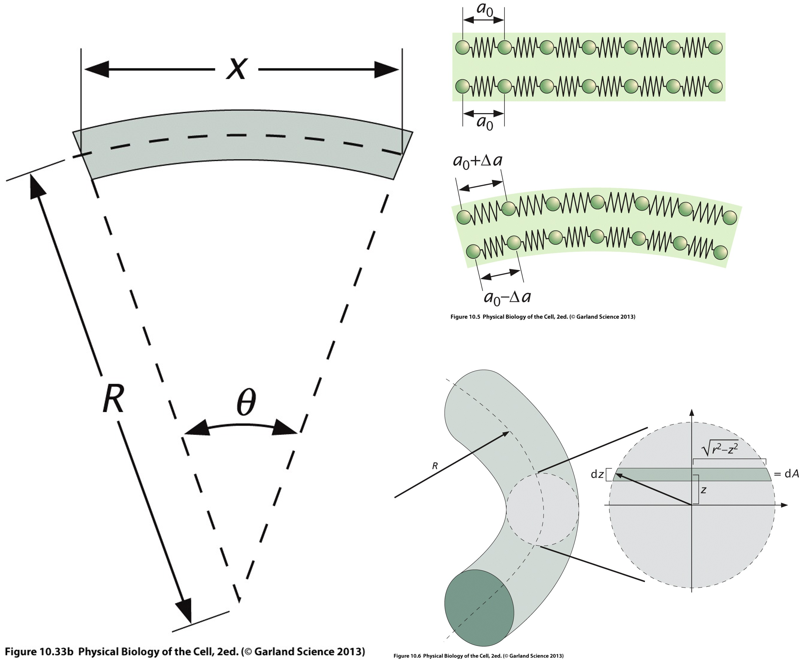
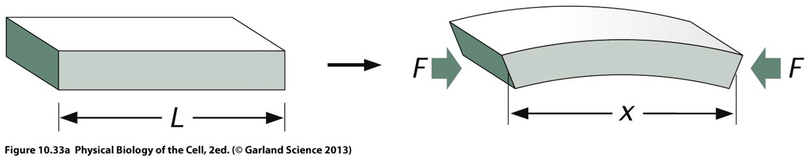
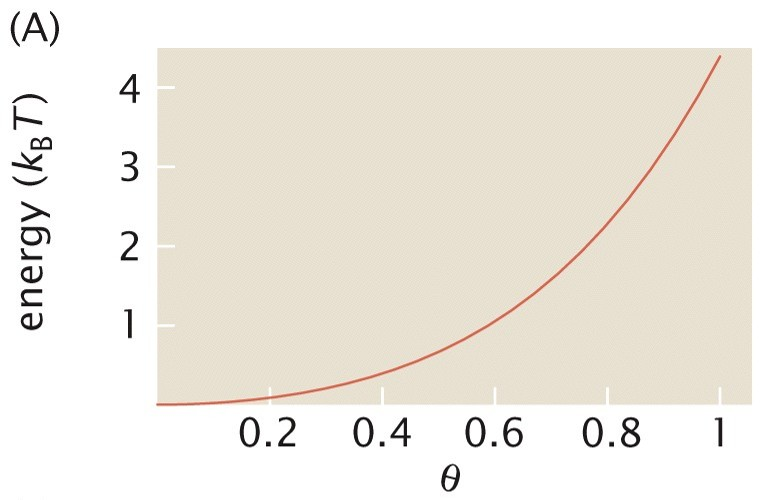

# Membrane elasticity

In the previous lecture, we saw that introducing a non-ideal osmometer factor considerably improves the prediction of red blood cell swelling and hemolysis. However, the origin of this correction remains to be understood.

A natural hypothesis is that part of the osmotic work is used to deform the membrane itself. Red blood cells are not simple liquid droplets: their membrane and membrane-associated cytoskeleton possess elastic properties that resist deformation.

To understand how membrane mechanics influences cell shape and volume regulation, we must first examine the different ways in which a membrane can deform.

## Three types of membrane deformation

A lipid membrane may store elastic energy through three main deformation modes:

1. Stretching,
2. Tilting (or shear),
3. Bending.

Among these mechanisms, bending is typically the most important for red blood cells and lipid vesicles.

## Stretching

Stretching corresponds to a change in membrane area.

If a membrane patch of initial area

$$
a_0
$$

is stretched to an area

$$
a=a_0+\Delta a,
$$

the corresponding elastic energy is

$$
\boxed{
U_s
=
\frac{1}{2}
k_s
\left(
\frac{\Delta a}{a_0}
\right)^2
a_0,
}
$$

where

$$
k_s
$$

is the surface stretching modulus.

The corresponding membrane tension is

$$
\boxed{
\sigma_s
=
k_s
\frac{\Delta a}{a_0}.
}
$$

This relation is directly analogous to Hooke's law for a spring, $F=kx$.

In biological membranes, stretching is energetically expensive because lipid bilayers are nearly incompressible.

As a consequence, the total membrane area is often approximately conserved.

This deformation energy is however particularly important when long membrane protrusions, known as tethers, are formed.

## Tilting (shear)

A second possible deformation mode involves tilting membrane molecules relative to the local membrane normal.

Consider a membrane molecule whose orientation is represented by a vector $\mathbf d$.

Let

$$
\mathbf n
$$

be the local membrane normal.

The corresponding elastic energy may be written

$$
\boxed{
U_t
=
\frac12
k_t
|\mathbf n\times\mathbf d|^2,
}
$$

where

$$
k_t
$$

is a tilt modulus.

The associated restoring torque is

$$
\boxed{
\boldsymbol{\tau}_t
=
-k_t
(\mathbf n\times\mathbf d).
}
$$

Unlike stretching, tilt deformations are relatively uncommon in lipid membranes. They generally require forces acting directly on the membrane molecules themselves, for example through:

- magnetic dipoles,
- electric dipoles,
- embedded proteins.

In most biological situations, the two lipid monolayers can partially slide relative to one another, making pure tilt deformations comparatively unimportant.

## Bending

The third deformation mode is **bending**, in which the membrane changes shape without significantly changing its area.

Unlike stretching, which modifies the local membrane area, bending mainly changes the relative geometry of the two lipid layers. Lipids on one side of the membrane become slightly compressed, while lipids on the opposite side become slightly stretched.

Bending is particularly important for biological membranes because stretching is energetically very expensive. As a consequence, most shape changes of vesicles and red blood cells occur primarily through bending rather than through significant changes in membrane area.

Among the three deformation modes discussed so far,

- stretching,
- tilting,
- bending,

bending is usually the dominant contributor to the elastic energy of lipid membranes and red blood cells.

The challenge is therefore to determine how much energy is associated with a given membrane shape.

Unlike stretching and tilting, where the relevant variables are either scalar of a simple vector, bending depends on the local **curvature** of the membrane, which needs to be defined by considering the neighborhood a of single point.

Intuitively:

- a flat membrane should have little or no bending energy;
- a strongly curved membrane should have a larger bending energy;
- the sign and direction of the curvature may also matter if the two sides of the membrane are not equivalent.

To construct a quantitative model of membrane elasticity, we must therefore introduce a precise mathematical description of curvature.

# Curvature: geometry fundamentals

## Curvature of a two-dimensional curve

Consider a parametric curve

$$
\mathbf r(s)
=
(x(s),y(s)),
$$

where $s$ is the arc length measured along the curve. By construction, the arc length is the parameter that verifies

$$
\left(
\frac{dx}{ds}
\right)^2
+
\left(
\frac{dy}{ds}
\right)^2
=
1.
$$

The tangent vector is defined as

$$
\boxed{
\mathbf t
=
\frac{d\mathbf r}{ds},
}
$$

and has unit magnitude:

$$
|\mathbf t|=1.
$$

The normal vector is defined by

$$
\boxed{
\mathbf n
=
\frac{d\mathbf t/ds}
{|d\mathbf t/ds|}.
}
$$

The curvature is the rate at which the tangent changes direction:

$$
\boxed{
C
=
\left|
\frac{d\mathbf t}{ds}
\right|.
}
$$

For instance, if one considers a circle of radius $R$, one finds

$$
\boxed{
C
=
\frac1R.
}
$$

Thus:

- small radius $\rightarrow$ large curvature,
- large radius $\rightarrow$ small curvature.

:::{.callout-note collapse="true"}
### Detailed example: a circle

A circle may be parametrized using

$$
\mathbf r(\theta)
=
(R\cos\theta,R\sin\theta).
$$

Since

$$
s=R\theta,
$$

we obtain

$$
\mathbf t
=
\left(
-\sin \frac{s}{R},
\cos \frac{s}{R}
\right),
$$

and

$$
\mathbf n
=
\left(
-\cos \frac{s}{R},
-\sin \frac{s}{R}
\right).
$$

Differentiating gives

$$
\left|
\frac{d\mathbf t}{ds}
\right|
=
\frac1R,
$$

confirming the expected result.
:::

## Curvature of a surface

For membranes, the relevant object is not a curve but a surface.

At each point of a surface, infinitely many curvatures may be measured depending on the chosen direction, delivering an infinite number of curvatures. However, one can define two **principal curvatures** $\kappa_1$ and $\kappa_2$, corresponding to the minimum and maximum curvatures passing through a given point.

The principal curvatures may also be interpreted geometrically as the eigenvalues of the local curvature matrix.

To see this, consider a small neighborhood around a point $P$ on the surface. If the tangent plane at $P$ is chosen as the $(x_1,x_2)$ plane, the surface may be described locally by a height function $h(x_1,x_2)$.

For sufficiently small deformations, the local curvature is then characterized by the second derivatives of this height function,

$$
\frac{\partial^2 h}
     {\partial x_i \partial x_j}.
$$

The matrix

$$
\mathbf H
=
\begin{pmatrix}
\dfrac{\partial^2 h}{\partial x_1^2}
&
\dfrac{\partial^2 h}{\partial x_1\partial x_2}
\\[8pt]
\dfrac{\partial^2 h}{\partial x_2\partial x_1}
&
\dfrac{\partial^2 h}{\partial x_2^2}
\end{pmatrix}
$$

is known as the Hessian matrix of the surface.

Its eigenvalues correspond to the principal curvatures $\kappa_1$ and $\kappa_2$, while the associated eigenvectors identify the directions along which these curvatures are measured.

A subtle but important point is that the surface normal $\mathbf n$ must be assigned a definite orientation. Reversing the direction of the normal changes the sign of the principal curvatures and of the mean curvature, although the Gaussian curvature remains unchanged.

This orientation becomes important when discussing membrane mechanics because the two sides of a biological membrane are generally not equivalent. Consequently, a membrane can exhibit a preferred or **spontaneous curvature**, which depends on the chosen orientation of the normal vector. For closed objects, it is conventional to choose the normal vector as pointing **outwards**.

Two combinations of the principal curvatures appear repeatedly in membrane mechanics.

The first combination is the mean curvature, defined as

$$
\boxed{
K
=
\frac{\kappa_1+\kappa_2}{2}.
}
$$

The second combination is the Gaussian curvature, defined as

$$
\boxed{
K_G
=
\kappa_1\kappa_2.
}
$$

These quantities completely determine the leading contributions to membrane bending energy.

# Helfrich bending energy

The most widely used model of membrane elasticity was proposed by Helfrich.

The key idea is that the bending energy must depend on curvature.

Restricting the energy to the lowest-order curvature terms leads to the Helfrich bending energy:

$$
\boxed{
U_b
=
\int dA
\left[
\frac{\kappa}{2}
(2K-K_0)^2
+
\bar{\kappa}K_G
\right].
}
$$

where

- $\kappa$ is the bending modulus,
- $\bar\kappa$ is the Gaussian bending modulus,
- $K_0$ is the spontaneous curvature.

## Physical interpretation

### Bending modulus

The coefficient $\kappa$ measures the energetic cost of bending the membrane.

Typical values are

$$
\kappa
\sim
10^{-20}\ {\rm J}.
$$

### Spontaneous curvature

The quantity

$$
K_0
$$

represents a preferred curvature.

It appears when the two sides of the membrane are not identical, for example due to:

- different lipid compositions, with asymmetric shapes
- asymmetric protein distributions.

### Gaussian curvature

The Gaussian curvature term contributes

$$
\int \bar\kappa K_G\,dA.
$$

For a fixed topology, this integral is constrained by the Gauss-Bonnet theorem and therefore remains constant.

As a consequence, it often does not influence shape changes unless topology changes occur (e.g. during vesicle fusion or cellular division).

# Computing curvature rigorously

Up to this point, we have argued that the principal curvatures can be interpreted locally as the eigenvalues of the matrix of second derivatives

$$
\frac{\partial^2 h}{\partial x_i\partial x_j},
$$

provided that the coordinates $(x_1,x_2)$ are chosen within the tangent plane of the surface at the point of interest.

This local description is extremely useful for building intuition, but it becomes insufficient when we wish to describe an entire membrane. Indeed, the tangent plane changes from point to point on a curved surface, and so do the local coordinates attached to it.

When computing quantities such as the total bending energy,

$$
U_b=\int_A dA\,f(K,K_G),
$$

we must integrate over the whole surface using a single parametrization. We can no longer redefine the coordinate system independently at every point to coincide with the local tangent plane.

As we move along the surface, the local normal vector

$$
\mathbf n
$$

changes direction. Curvature must therefore be characterized by how this normal vector rotates from one point to another. This is the central idea underlying differential geometry: rather than describing curvature through second derivatives measured in a local tangent plane, we describe it through the variation of the surface normal over the entire surface.

To do so, we introduce a smooth parametrization of the surface

$$
\mathbf X(u_1,u_2),
$$

where $(u_1,u_2)$ are coordinates labeling points on the membrane.

](figures/SurfaceParam.png)

The geometry of the surface is then encoded in two fundamental objects:

- the **first fundamental form**, which describes distances and angles on the surface;
- the **second fundamental form**, which describes how the surface bends in three-dimensional space.

Together, these quantities allow us to determine the principal curvatures, the mean curvature and the Gaussian curvature at every point of the membrane while maintaining a single global description of the surface.

The first fundamental form is

$$
I_{ij}
=
\partial_i\mathbf X
\cdot
\partial_j\mathbf X.
$$

The local normal vector is

$$
\mathbf n
=
\frac{
\partial_1\mathbf X
\times
\partial_2\mathbf X
}{
|
\partial_1\mathbf X
\times
\partial_2\mathbf X
|
}.
$$

The second fundamental form is

$$
II_{ij}
=
\mathbf n
\cdot
\partial_i\partial_j\mathbf X.
$$

One can show that the principal curvatures are obtained as the roots of

$$
\boxed{
\det(II-\kappa I)=0.
}
$$

While these calculations are beyond the scope of this course, they illustrate why determining membrane curvature is a nontrivial geometrical problem. Curious students are encouraged to determine formally the curvature of simple objects such as the sphere and cylinder with this method, to get a sense of its usage.

:::{.callout-note}
For the curious and motivated reader [M. Deserno, Chemistry and physics of lipids (2015)](https://doi.org/10.1016/j.chemphyslip.2014.05.001) provides an excellent and techinally detailed overview and some application of curvature stresses computation.
:::

# The shape of red blood cells

The total free energy of a membrane vesicle combines:

- bending energy,
- area constraints,
- pressure differences.

The Helfrich free energy can be written

$$
\boxed{
F
=
\int dA
\frac{\kappa}{2}
(2K-K_0)^2
+
\gamma A
-
\Delta p
\int dV.
}
$$

where

$$
\Delta p
=
p_{\rm in}-p_{\rm out}
$$

is the pressure difference across the membrane.

The coefficient

$$
\gamma
$$

acts as a Lagrange multiplier enforcing area conservation.

The equilibrium shape of the membrane is obtained by minimizing the Helfrich free energy, i.e. finding a shape that leads to $\delta F = 0$, subject to the constraints imposed by the membrane area and the enclosed volume.

A sphere is always a possible solution of this minimization problem. However, it is not always the most stable one, i.e. the configuration with the lowet energy level.

For certain combinations of:

- spontaneous curvature $K_0$,
- pressure difference $\Delta p=p_{\rm in}-p_{\rm out}$,
- membrane area,
- enclosed volume,

small deviations from the spherical shape can actually decrease the total free energy.

In mathematical terms, the first spherical-harmonic perturbations of the sphere can become energetically favorable, indicating that the spherical shape has become unstable.

As a result, the membrane spontaneously evolves toward a lower-energy configuration. For parameter values relevant to red blood cells, this leads to the emergence of biconcave shapes that closely resemble healthy erythrocytes. This has been demonstrated initially in  Zhong-Can & Helfrich, Physical review letters,  (1987), and a modern and pedagogic review is provided in [Martínez-Balbuena, L., et al., American Journal of Physics 89.5 (2021): 465-476.](https://doi.org/10.1119/10.0003452)

[Minimization of the Helfrich energy and emergence of RBC-like shapes [Credits](https://doi.org/10.1119/10.0003452)](figures/RBCInstability.png)

Typical values used in such calculations are

$$
\kappa
\approx
10^{-20}\ {\rm J},
$$

$$
K_0
\approx
-1.74\ \mu{\rm m}^{-1},
$$

$$
R_0
\approx
3\ \mu{\rm m},
$$

and

$$
\Delta p
\approx
4\times10^{-2}\ {\rm J\,m^{-3}}.
$$

The emergence of the characteristic biconcave RBC shape can therefore be interpreted as an elastic instability of an initially spherical membrane, driven by the competition between bending elasticity, spontaneous curvature and osmotic pressure.

# Elastic instability and buckling

The Helfrich model suggests that the characteristic biconcave shape of healthy red blood cells may arise from an **elastic instability** of an initially spherical membrane.

Applying this idea to membranes requires some advanced technical analisys, but we can get a sense of it by examining a simpler mechanical example: the buckling of an elastic beam under compression.

The key message will be:

> A structure may remain straight or spherical under small loads, but once a critical threshold is exceeded, a deformed configuration becomes energetically favorable.

This is exactly the type of phenomenon that occurs in many elastic systems, including membranes.

## Elastic energy of a bent beam

Consider a beam of length

$$
L_0,
$$

initially straight and made of a bundle of elastic fibers.

In one dimension, the elastic energy associated with elongation is

$$
U_s
=
\frac{E}{2}
\left(
\frac{\Delta L}{L_0}
\right)^2,
$$

where

$$
E
=
\frac{9KG}{G+3K}
$$

is Young's modulus, expressed in terms of the bulk modulus $K$ and shear modulus $G$.

To compute the energy associated with bending, imagine that the initially straight bundle of fibers is bent into an arc of radius $R$ and opening angle $\theta$.

The central fiber defines a neutral axis whose length remains

$$
L_0=R\theta.
$$

Now consider a fiber located a distance $z$ from the neutral axis.

Its new length becomes

$$
L(z)
=
(R+z)\theta.
$$

The elongation of that fiber is therefore

$$
\Delta L
=
L(z)-L_0
=
(R+z)\theta-R\theta
=
z\theta.
$$

Using $\theta=\frac{L_0}{R}$, this can be written

$$
\boxed{
\Delta L
=
\frac{z}{R}L_0.
}
$$

Substituting into the elastic energy gives

$$
U_s
=
\frac12 E
\left(
\frac{z}{R}
\right)^2.
$$

This is the elastic energy density associated with a fiber located at height $z$.

## Integrating over the whole beam

Different fibers experience different strains depending on their distance from the neutral axis.

To obtain the total elastic energy, we integrate over the beam cross-section.

Let

$$
\Omega
$$

denote the cross-sectional area.

The total bending energy is

$$
U_b
=
L_0
\int_\Omega
\frac12
E
\frac{z^2}{R^2}
\,dA.
$$

Rearranging,

$$
U_b
=
\frac{EL_0}{2R^2}
\int_\Omega z^2\,dA.
$$

The integral

$$
I
=
\int_\Omega z^2\,dA
$$

is known as the **second moment of area**.

It characterizes how material is distributed relative to the neutral axis.

We therefore obtain

$$
\boxed{
U_b
=
\frac{EL_0}{2R^2}
I.
}
$$

This is the elastic energy cost of bending the beam.

A more flexible beam corresponds to a smaller value of $EI$.

## Applying a compressive force

We now apply a compressive force

$$
F
$$

at both ends of the beam.

If the beam bends, its projected length along the compression direction becomes $x$.

We now apply a constant compressive force $F$ at both ends of the beam. Since the force is constant and directed along the compression axis,
 
$$
\mathbf F
=
-F\,\mathbf e_x,
$$
 
it must derive from a potential energy $U_F(x)$ satisfying
 
$$
\mathbf F
=
-\nabla U_F.
$$
 
In one dimension,
 
$$
F_x
=
-\frac{\partial U_F}{\partial x},
$$
 
which becomes
 
$$
-F
=
-\frac{\partial U_F}{\partial x}.
$$
 
Integrating immediately gives
 
$$
\boxed{
U_F=Fx+C.
}
$$
 
The additive constant is arbitrary, since only energy differences matter. Choosing the reference such that the undeformed beam ($x=L_0$) has zero potential energy,
 
$$
U_F(L_0)=0,
$$
 
yields
 
$$
C=-FL_0.
$$
 
Therefore,
 
$$
\boxed{
U_F
=
-F(L_0-x).
}
$$
 

To change this projected length $x$, the bent beam forms an arc of radius $R$ and opening angle $\theta$.

Since $L_0=R\theta$, we have

$$
\boxed{
R
=
\frac{L_0}{\theta}.
}
$$

The projected length is

$$
x
=
2R\sin\left(\frac{\theta}{2}\right).
$$

Substituting the expression for $R$,

$$
\boxed{
x
=
\frac{2L_0}{\theta}
\sin\left(\frac{\theta}{2}\right).
}
$$

Substituting

$$
R=\frac{L_0}{\theta}
$$

into the bending energy gives

$$
U_b
=
\frac{EI}{2L_0}
\theta^2.
$$

The total energy becomes

$$
U_{\rm tot}
=
\frac{EI}{2L_0}\theta^2
-
F
\left(
L_0
-
\frac{2L_0}{\theta}
\sin\frac{\theta}{2}
\right).
$$

To understand the stability of the straight state, we consider small deformations

$$
\theta\ll1.
$$

Using

$$
\sin\left(\frac{\theta}{2}\right)
=
\frac{\theta}{2}
-
\frac{\theta^3}{48}
+
O(\theta^5),
$$

we obtain

$$
\frac{2}{\theta}
\sin\left(\frac{\theta}{2}\right)
=
1
-
\frac{\theta^2}{24}
+
O(\theta^4).
$$

Consequently,

$$
L_0-x
=
\frac{L_0}{24}\theta^2
+
O(\theta^4).
$$

Substituting into the total energy gives

$$
\boxed{
U_{\rm tot}
\approx
\left(
\frac{EI}{2L_0}
-
\frac{FL_0}{24}
\right)\theta^2
+
O(\theta^4).
}
$$

## Stability analysis

The configuration

$$
\theta=0
$$

corresponds to a perfectly straight beam.

Whether this state is stable depends on the sign of the coefficient multiplying

$$
\theta^2.
$$

### Small compressive forces

If

$$
F
<
\frac{12EI}{L_0^2},
$$

then

$$
\frac{EI}{2L_0}
-
\frac{FL_0}{24}
>
0.
$$

The energy increases when $\theta$ increases.

Therefore,

$$
\theta=0
$$

remains a stable equilibrium.

### Large compressive forces

If

$$
F
>
\frac{12EI}{L_0^2},
$$

then

$$
\frac{EI}{2L_0}
-
\frac{FL_0}{24}
<
0.
$$

The straight configuration now corresponds to a maximum of energy rather than a minimum.

Any small perturbation lowers the energy and triggers bending.

The beam spontaneously buckles.

[Energy versus angle above the buckling threshold](figures/EnergyAboveBuckling.jpg)

The critical force is therefore

$$
\boxed{
F_c
=
\frac{12EI}{L_0^2}.
}
$$

This is known as the **Euler buckling instability**.

# Modern computational modeling

Analytical calculations are valuable but limited.

Today, membrane mechanics is often investigated using numerical simulations that combine:

- Helfrich elasticity,
- hydrodynamic forces,
- membrane constraints,
- osmotic pressure.

These approaches can reproduce many experimentally observed red blood cell shapes and dynamics, including explanations of bistability and the shapes observed at various osmotic pressures.

One of the major successes of these models has been the prediction of a large variety of red blood cell morphologies.
 
Depending on parameters such as:
 
- membrane composition,
- spontaneous curvature,
- osmotic pressure,
- membrane area-to-volume ratio,
 
the same membrane can adopt markedly different equilibrium configurations, including:
 
- stomatocytes,
- discocytes,
- spherocytes,
- echinocytes.
 
These numerical phase diagrams have helped explain why apparently small biochemical or osmotic changes can induce dramatic changes in cell morphology.
 
In addition, modern simulations are able to reproduce many experimentally observed shape transitions and bistabilities. In some regions of parameter space, several shapes may coexist as local minima of the membrane free energy, allowing transitions between morphologies under external perturbations.
 
The current challenge is no longer merely to reproduce equilibrium shapes, but to predict the full dynamics of red blood cells under physiologically relevant conditions.

A key parameter controlling these dynamics is the viscosity of the fluid contained inside the cell, $\eta_{\rm in}$, which is primarily determined by the concentrated hemoglobin solution forming the cytosol.

This parameter enters virtually all dynamic models of red blood cells. It influences:

- deformation rates,
- tank-treading and tumbling transitions,
- shape transitions in microvascular flows,
- interactions between neighboring cells,
- the effective rheology of blood.

Unlike membrane elasticity, whose values are now reasonably well documented, the intracellular viscosity remains much more difficult to determine experimentally and has long been a source of disagreement between different theoretical and numerical studies. Historically, simulations have used viscosity contrasts

$$
\lambda
=
\frac{\eta_{\rm in}}{\eta_{\rm out}},
$$

ranging from

$$
\lambda = 1
$$

for computational convenience, to more realistic values around

$$
\lambda \approx 5,
$$

while some recent studies have suggested that significantly larger values may be required to reproduce experimental observations.

A further complication is that red blood cells are continuously aging. During their approximately 120-day lifespan, they progressively lose water and become denser. As a consequence, the concentration of hemoglobin inside the cell increases, which in turn increases the viscosity of the cytosol. One should therefore not necessarily expect a single viscosity value for all healthy red blood cells. 

## A recent example: viscosity distributions in healthy red blood cells

A [recent study](https://doi.org/10.1119/10.0003452) addressed this question by combining density-gradient measurements with rheological measurements of extracted RBC cytosol. Rather than looking for a single value of the intracellular viscosity, the authors sought to determine its entire distribution within a healthy blood sample. 

Their approach relies on two observations:

1. The density of a red blood cell increases as it ages because it gradually loses water.
2. The viscosity of concentrated hemoglobin solutions increases very rapidly with hemoglobin concentration.

The authors first measured the density distribution of red blood cells using isopycnic centrifugation in Percoll density gradients. They observed that healthy RBC populations exhibit an approximately Gaussian distribution of cell densities rather than a single density value.

](figures/RBCDensity.png)

They then measured the viscosity of cytosol extracted from red blood cells and established a relationship between cytosol density and viscosity. This relationship revealed a very strong increase in viscosity with increasing density, reflecting the fact that hemoglobin solutions are already close to their maximum packing concentration under physiological conditions. 

](figures/CytosolProperties.png)

Combining the density distribution of RBCs with the density-viscosity relationship allowed the authors to infer the viscosity distribution of the cytosol within a healthy RBC population.

Their main conclusion was striking:

$$
\boxed{
\lambda \approx 10
}
$$

for the average red blood cell under physiological conditions. This value is considerably larger than the viscosity contrasts often used in numerical simulations.

Even more importantly, the intracellular viscosity is not characterized by a single value. Instead, the study predicts a broad log-normal distribution extending approximately from

$$
\lambda \approx 5
$$

to

$$
\lambda \approx 20,
$$

with a median value close to

$$
\lambda \approx 10.
$$

Older red blood cells were estimated to possess more than twice the cytosol viscosity of younger cells because of their reduced water content. 

[Predicted distribution of intracellular viscosity contrasts in a healthy RBC population [Credits](https://doi.org/10.1119/10.0003452)](figures/ViscosityContrast.png)

## Consequences for numerical modeling

This result highlights an important limitation of many current computational models.

Most simulations still assume that all red blood cells:

- have the same viscosity,
- have the same density,
- have the same age,
- have identical mechanical properties.

In reality, healthy blood contains a distribution of cells with different physical characteristics.

Future simulations may therefore need to move beyond the concept of a single "representative" red blood cell and instead incorporate distributions of:

- membrane properties,
- cell volumes,
- intracellular viscosities,
- cell ages.

Such approaches may prove essential for accurately reproducing blood rheology in health and disease.

More generally, this example illustrates an important theme in modern biological physics:

> Progress increasingly depends on combining detailed experiments, physical modeling, and numerical simulations to determine the effective material properties of living systems.

The red blood cell remains one of the best laboratories in which to develop and test these approaches.

# Key take-home messages

- Membrane elasticity provides a likely explanation for deviations from ideal osmometer behavior.
- Stretching, tilting and bending are the three principal membrane deformation modes.
- Bending is usually the dominant contribution for lipid vesicles and red blood cells.
- Membrane bending is governed by curvature.
- The Helfrich model provides the standard description of membrane elasticity.
- Minimization of the Helfrich free energy predicts non-spherical cell shapes.
- The biconcave shape of healthy red blood cells can be interpreted as an elastic instability of a membrane vesicle.
- Modern computational models successfully reproduce many experimentally observed RBC morphologies.