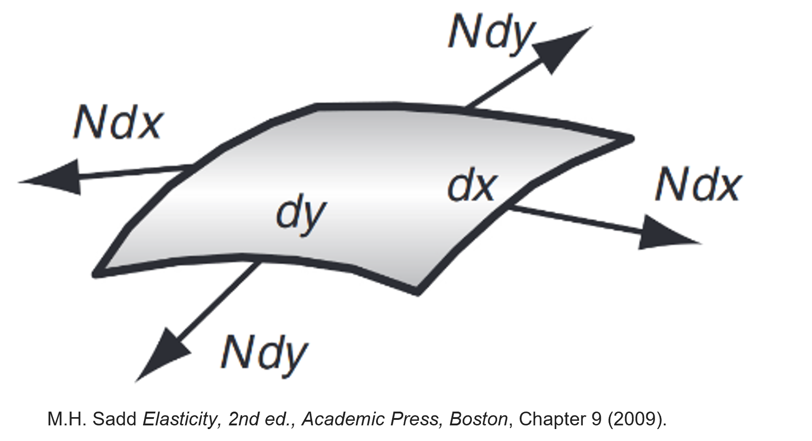
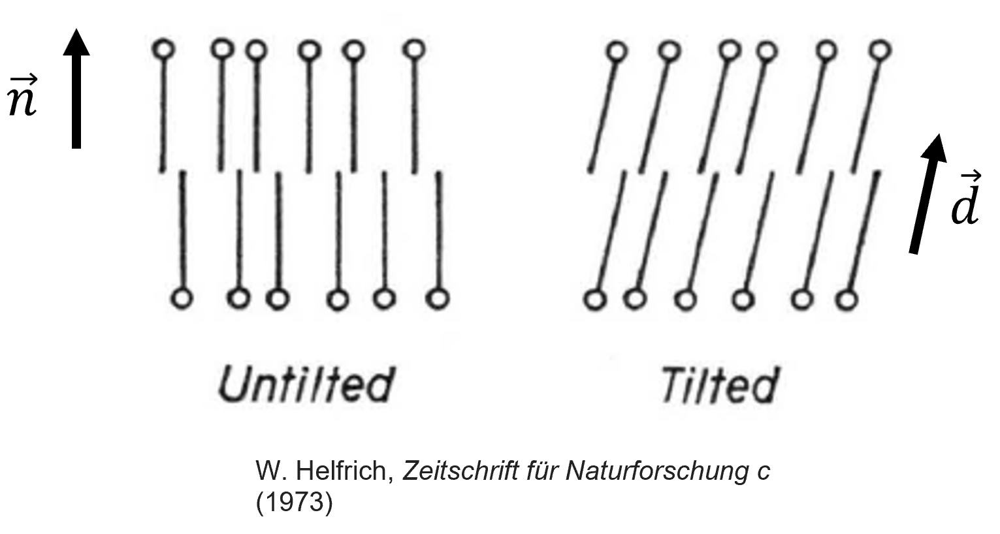
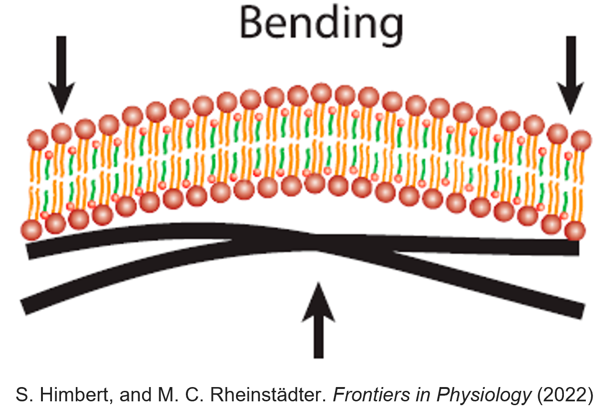
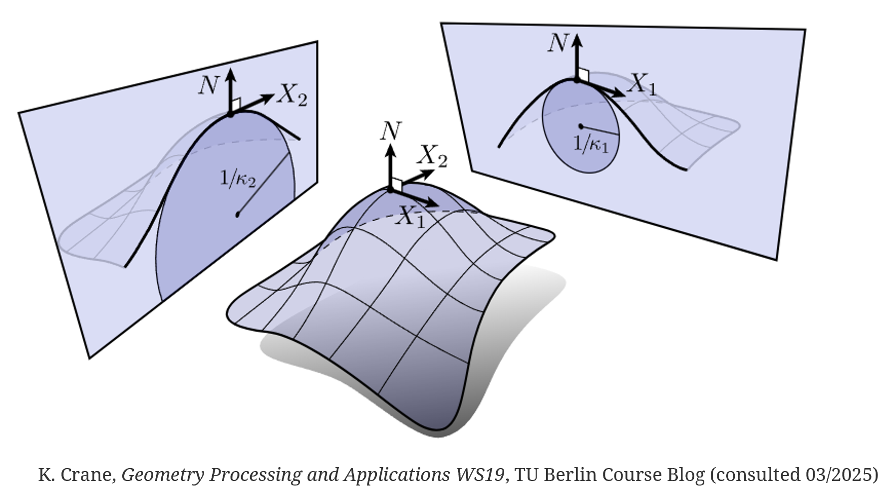

# Membrane elasticity

In the previous lecture, we saw that introducing a non-ideal osmometer factor considerably improves the prediction of red blood cell swelling and hemolysis. However, the origin of this correction remains to be understood.

A natural hypothesis is that part of the osmotic work is used to deform the membrane itself. Red blood cells are not simple liquid droplets: their membrane and membrane-associated cytoskeleton possess elastic properties that resist deformation.

To understand how membrane mechanics influences cell shape and volume regulation, we must first examine the different ways in which a membrane can deform.

## Three types of membrane deformation

A lipid membrane may store elastic energy through three main deformation modes:

1. Stretching,
2. Tilting (or shear),
3. Bending.

Among these mechanisms, bending is typically the most important for red blood cells and lipid vesicles.

## Stretching

Stretching corresponds to a change in membrane area.

If a membrane patch of initial area

$$
a_0
$$

is stretched to an area

$$
a=a_0+\Delta a,
$$

the corresponding elastic energy is

$$
\boxed{
U_s
=
\frac{1}{2}
k_s
\left(
\frac{\Delta a}{a_0}
\right)^2
a_0,
}
$$

where

$$
k_s
$$

is the surface stretching modulus.

The corresponding membrane tension is

$$
\boxed{
\sigma_s
=
k_s
\frac{\Delta a}{a_0}.
}
$$

This relation is directly analogous to Hooke's law for a spring, $F=kx$.

In biological membranes, stretching is energetically expensive because lipid bilayers are nearly incompressible.

As a consequence, the total membrane area is often approximately conserved.

This deformation energy is however particularly important when long membrane protrusions, known as tethers, are formed.

## Tilting (shear)

A second possible deformation mode involves tilting membrane molecules relative to the local membrane normal.

Consider a membrane molecule whose orientation is represented by a vector $\mathbf d$.

Let

$$
\mathbf n
$$

be the local membrane normal.

The corresponding elastic energy may be written

$$
\boxed{
U_t
=
\frac12
k_t
|\mathbf n\times\mathbf d|^2,
}
$$

where

$$
k_t
$$

is a tilt modulus.

The associated restoring torque is

$$
\boxed{
\boldsymbol{\tau}_t
=
-k_t
(\mathbf n\times\mathbf d).
}
$$

Unlike stretching, tilt deformations are relatively uncommon in lipid membranes. They generally require forces acting directly on the membrane molecules themselves, for example through:

- magnetic dipoles,
- electric dipoles,
- embedded proteins.

In most biological situations, the two lipid monolayers can partially slide relative to one another, making pure tilt deformations comparatively unimportant.

## Bending

The third deformation mode is **bending**, in which the membrane changes shape without significantly changing its area.

Unlike stretching, which modifies the local membrane area, bending mainly changes the relative geometry of the two lipid layers. Lipids on one side of the membrane become slightly compressed, while lipids on the opposite side become slightly stretched.

Bending is particularly important for biological membranes because stretching is energetically very expensive. As a consequence, most shape changes of vesicles and red blood cells occur primarily through bending rather than through significant changes in membrane area.

Among the three deformation modes discussed so far,

- stretching,
- tilting,
- bending,

bending is usually the dominant contributor to the elastic energy of lipid membranes and red blood cells.

The challenge is therefore to determine how much energy is associated with a given membrane shape.

Unlike stretching and tilting, where the relevant variables are either scalar of a simple vector, bending depends on the local **curvature** of the membrane, which needs to be defined by considering the neighborhood a of single point.

Intuitively:

- a flat membrane should have little or no bending energy;
- a strongly curved membrane should have a larger bending energy;
- the sign and direction of the curvature may also matter if the two sides of the membrane are not equivalent.

To construct a quantitative model of membrane elasticity, we must therefore introduce a precise mathematical description of curvature.

# Curvature: geometry fundamentals

## Curvature of a two-dimensional curve

Consider a parametric curve

$$
\mathbf r(s)
=
(x(s),y(s)),
$$

where $s$ is the arc length measured along the curve. By construction, the arc length is the parameter that verifies

$$
\left(
\frac{dx}{ds}
\right)^2
+
\left(
\frac{dy}{ds}
\right)^2
=
1.
$$

The tangent vector is defined as

$$
\boxed{
\mathbf t
=
\frac{d\mathbf r}{ds},
}
$$

and has unit magnitude:

$$
|\mathbf t|=1.
$$

The normal vector is defined by

$$
\boxed{
\mathbf n
=
\frac{d\mathbf t/ds}
{|d\mathbf t/ds|}.
}
$$

The curvature is the rate at which the tangent changes direction:

$$
\boxed{
C
=
\left|
\frac{d\mathbf t}{ds}
\right|.
}
$$

For instance, if one considers a circle of radius $R$, one finds

$$
\boxed{
C
=
\frac1R.
}
$$

Thus:

- small radius $\rightarrow$ large curvature,
- large radius $\rightarrow$ small curvature.

:::{.callout-note collapse="true"}
### Detailed example: a circle

A circle may be parametrized using

$$
\mathbf r(\theta)
=
(R\cos\theta,R\sin\theta).
$$

Since

$$
s=R\theta,
$$

we obtain

$$
\mathbf t
=
\left(
-\sin \frac{s}{R},
\cos \frac{s}{R}
\right),
$$

and

$$
\mathbf n
=
\left(
-\cos \frac{s}{R},
-\sin \frac{s}{R}
\right).
$$

Differentiating gives

$$
\left|
\frac{d\mathbf t}{ds}
\right|
=
\frac1R,
$$

confirming the expected result.
:::

## Curvature of a surface

For membranes, the relevant object is not a curve but a surface.

At each point of a surface, infinitely many curvatures may be measured depending on the chosen direction, delivering an infinite number of curvatures. However, one can define two **principal curvatures** $\kappa_1$ and $\kappa_2$, corresponding to the minimum and maximum curvatures passing through a given point.

The principal curvatures may also be interpreted geometrically as the eigenvalues of the local curvature matrix.

To see this, consider a small neighborhood around a point $P$ on the surface. If the tangent plane at $P$ is chosen as the $(x_1,x_2)$ plane, the surface may be described locally by a height function $h(x_1,x_2)$.

For sufficiently small deformations, the local curvature is then characterized by the second derivatives of this height function,

$$
\frac{\partial^2 h}
     {\partial x_i \partial x_j}.
$$

The matrix

$$
\mathbf H
=
\begin{pmatrix}
\dfrac{\partial^2 h}{\partial x_1^2}
&
\dfrac{\partial^2 h}{\partial x_1\partial x_2}
\\[8pt]
\dfrac{\partial^2 h}{\partial x_2\partial x_1}
&
\dfrac{\partial^2 h}{\partial x_2^2}
\end{pmatrix}
$$

is known as the Hessian matrix of the surface.

Its eigenvalues correspond to the principal curvatures $\kappa_1$ and $\kappa_2$, while the associated eigenvectors identify the directions along which these curvatures are measured.

A subtle but important point is that the surface normal $\mathbf n$ must be assigned a definite orientation. Reversing the direction of the normal changes the sign of the principal curvatures and of the mean curvature, although the Gaussian curvature remains unchanged.

This orientation becomes important when discussing membrane mechanics because the two sides of a biological membrane are generally not equivalent. Consequently, a membrane can exhibit a preferred or **spontaneous curvature**, which depends on the chosen orientation of the normal vector. For closed objects, it is conventional to choose the normal vector as pointing **outwards**.

Two combinations of the principal curvatures appear repeatedly in membrane mechanics.

The first combination is the mean curvature, defined as

$$
\boxed{
K
=
\frac{\kappa_1+\kappa_2}{2}.
}
$$

The second combination is the Gaussian curvature, defined as

$$
\boxed{
K_G
=
\kappa_1\kappa_2.
}
$$

These quantities completely determine the leading contributions to membrane bending energy.

# Helfrich bending energy

The most widely used model of membrane elasticity was proposed by Helfrich.

The key idea is that the bending energy must depend on curvature.

Restricting the energy to the lowest-order curvature terms leads to the Helfrich bending energy:

$$
\boxed{
U_b
=
\int dA
\left[
\frac{\kappa}{2}
(2K-K_0)^2
+
\bar{\kappa}K_G
\right].
}
$$

where

- $\kappa$ is the bending modulus,
- $\bar\kappa$ is the Gaussian bending modulus,
- $K_0$ is the spontaneous curvature.

## Physical interpretation

### Bending modulus

The coefficient $\kappa$ measures the energetic cost of bending the membrane.

Typical values are

$$
\kappa
\sim
10^{-20}\ {\rm J}.
$$

### Spontaneous curvature

The quantity

$$
K_0
$$

represents a preferred curvature.

It appears when the two sides of the membrane are not identical, for example due to:

- different lipid compositions, with asymmetric shapes
- asymmetric protein distributions.

### Gaussian curvature

The Gaussian curvature term contributes

$$
\int \bar\kappa K_G\,dA.
$$

For a fixed topology, this integral is constrained by the Gauss-Bonnet theorem and therefore remains constant.

As a consequence, it often does not influence shape changes unless topology changes occur (e.g. during vesicle fusion or cellular division).

# Computing curvature rigorously

:::{.callout-note}
Expand the intro of this justification.
:::

For an arbitrary surface,

$$
\mathbf X(u_1,u_2),
$$

determining the curvature is substantially more difficult than taking second derivatives.

Indeed, curvature depends on changes in the local normal vector.

The first fundamental form is

$$
I_{ij}
=
\partial_i\mathbf X
\cdot
\partial_j\mathbf X.
$$

The local normal vector is

$$
\mathbf n
=
\frac{
\partial_1\mathbf X
\times
\partial_2\mathbf X
}{
|
\partial_1\mathbf X
\times
\partial_2\mathbf X
|
}.
$$

The second fundamental form is

$$
II_{ij}
=
\mathbf n
\cdot
\partial_i\partial_j\mathbf X.
$$

The principal curvatures are obtained as the roots of

$$
\boxed{
\det(II-\kappa I)=0.
}
$$

While these calculations are beyond the scope of this course, they illustrate why determining membrane curvature is a nontrivial geometrical problem.

# The shape of red blood cells

The total free energy of a membrane vesicle combines:

- bending energy,
- area constraints,
- pressure differences.

The Helfrich free energy can be written

$$
\boxed{
F
=
\int dA
\frac{\kappa}{2}
(2K-K_0)^2
+
\gamma A
-
\Delta p
\int dV.
}
$$

where

$$
\Delta p
=
p_{\rm in}-p_{\rm out}
$$

is the pressure difference across the membrane.

The coefficient

$$
\gamma
$$

acts as a Lagrange multiplier enforcing area conservation.

Minimizing this free energy predicts a rich variety of equilibrium shapes.

Remarkably, for parameters relevant to red blood cells, the spherical shape may become unstable and deform into biconcave shapes closely resembling healthy erythrocytes.

Typical parameters are:

$$
\kappa
\approx
10^{-20}\ {\rm J},
$$

$$
K_0
\approx
-1.74\ \mu{\rm m}^{-1},
$$

$$
R_0
\approx
3\ \mu{\rm m}.
$$

This provides a compelling physical explanation for the characteristic RBC morphology.

# Elastic instabilities and buckling

The red blood cell shape may be viewed as a consequence of a more general phenomenon: elastic instability.

A simple example is the buckling of a compressed beam.

Consider a bundle of elastic fibres of length

$$
L.
$$

The bending energy scales as

$$
\boxed{
U_b
=
\frac{EI}{2L}
\theta^2,
}
$$

where

- $E$ is Young's modulus,
- $I$ is the second moment of area.

Applying a compressive force

$$
F
$$

adds

$$
U_F
=
-F(L-x).
$$

For small angles,

$$
U_{\rm tot}
\approx
\left(
\frac{EI}{2L}
-
\frac{FL}{24}
\right)
\theta^2.
$$

The straight configuration becomes unstable when the coefficient of

$$
\theta^2
$$

changes sign.

This occurs at the critical force

$$
\boxed{
F_c
=
\frac{12EI}{L^2}.
}
$$

Above this threshold, the beam spontaneously buckles.

The transition from spherical to biconcave RBC shapes can be understood as a closely related symmetry-breaking instability.

# Modern computational modeling

Analytical calculations are valuable but limited.

Today, membrane mechanics is often investigated using numerical simulations that combine:

- Helfrich elasticity,
- hydrodynamic forces,
- membrane constraints,
- osmotic pressure.

These approaches can reproduce many experimentally observed red blood cell shapes and dynamics.

=
c_0
e^{-V\Delta\rho gh/k_BT}.
$$

Such variability must be considered when comparing theoretical predictions with experiments.

# Key take-home messages

- Membrane elasticity provides a likely explanation for deviations from ideal osmometer behavior.
- Stretching, tilting and bending are the three principal membrane deformation modes.
- Bending is usually the dominant contribution for lipid vesicles and red blood cells.
- Membrane bending is governed by curvature.
- The Helfrich model provides the standard description of membrane elasticity.
- Minimization of the Helfrich free energy predicts non-spherical cell shapes.
- The biconcave shape of healthy red blood cells can be interpreted as an elastic instability of a membrane vesicle.
- Modern computational models successfully reproduce many experimentally observed RBC morphologies.