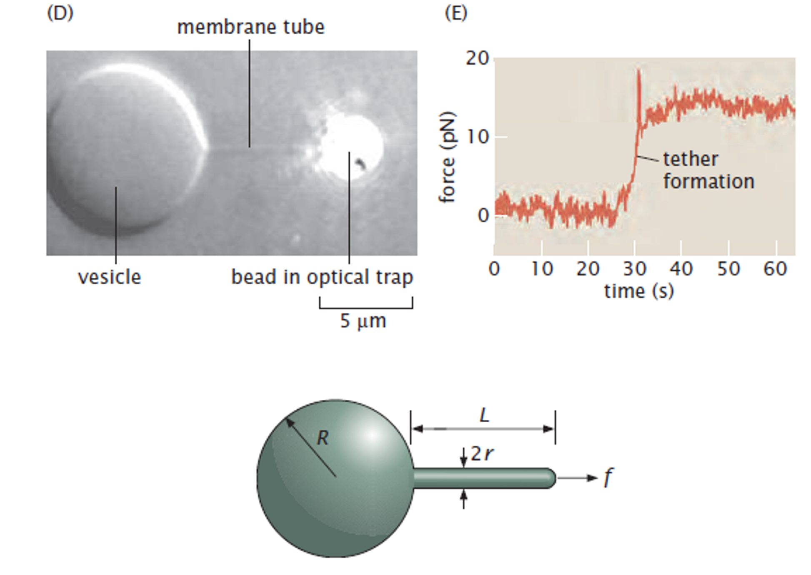

# Introduction

In this problem class, we will apply the concepts introduced in the lecture on membrane elasticity to two concrete situations:

1. Determining membrane properties from tether-pulling experiments.
2. Computing the curvature of a sphere from the first and second fundamental forms.

The objective is not only to obtain numerical results, but also to become familiar with the physical and geometrical reasoning used in modern membrane mechanics.

# Exercise 1: Membrane pulling

## Membrane tubes and tether formation

Cellular membranes are not static structures. In many biological systems, narrow membrane tubes, often referred to as **tethers**, can be pulled from larger membrane reservoirs.

Examples include:

- the endoplasmic reticulum,
- the Golgi apparatus,
- intracellular transport vesicles,
- giant lipid vesicles used in biophysical experiments.

These membrane tubes can be generated in several ways. In laboratory experiments, they are often pulled using optical tweezers attached to a small bead. In living cells, similar structures are frequently generated by molecular motors that pull on the membrane while moving along cytoskeletal filaments.

Experiments show that the force required to initiate and maintain a tether is typically of the order of $f \sim 10\ {\rm pN}$. Once formed, the tether can extend over distances much larger than its radius while remaining connected to the original membrane reservoir.

The figure provided in the problem statement indicates the characteristic dimensions involved in such experiments:

- the force $f$,
- the tether length $L$,
- the tether radius $r$,
- the radius $R$ of the membrane reservoir.

Typical values are approximately

$$
f \approx 10\ {\rm pN},
$$

$$
r \approx 50\ {\rm nm},
$$

and

$$
R \approx 10\ {\rm \mu m}.
$$

We will assume that the spontaneous curvature of the membrane is negligible.

The goal of this exercise is to understand how the geometry and mechanics of the membrane determine:

- the radius of the tether,
- the force required to pull it,
- the membrane tension,
- the membrane bending modulus.

### Question 1 - Geometrical decomposition
 
Before writing down any energy, identify the simple geometrical objects that constitute the membrane shape shown in the figure.
You should identify three elementary geometries whose areas, volumes and curvatures are known analytically.

:::{.callout-tip collapse="true"}
#### Hint
 
Look separately at:

- the large membrane reservoir,
- the long tether,
- the terminal cap closing the tether.

Try to associate each region with a standard object whose principal curvatures are immediately known.
:::

### Question 2 - Bending energy

Using the Helfrich model (without spontaneous curvature), express the total bending energy of the membrane as a function of:

- $R$,
- $r$,
- $L$,
- $\kappa$.

How does the assumption $r\ll R$ simplify this expression?

:::{.callout-tip collapse="true"}
#### Hint 1

The Helfrich bending energy, without spontaneous curvature, can be written as

$$
U_b
=
\int_A
\frac{\kappa}{2}
(2K)^2\,dA,
$$

For each geometrical component:

1. Determine the principal curvatures.
2. Compute the mean curvature

$$
K
=
\frac{\kappa_1+\kappa_2}{2}.
$$

3. Compute

$$
\frac{\kappa}{2}(2K)^2.
$$

4. Integrate over the corresponding area.
:::

:::{.callout-tip collapse="true"}
#### Hint 2

Useful results:

Sphere of radius $R$

$$
\kappa_1=\kappa_2=\frac1R.
$$

Cylinder of radius $r$

$$
\kappa_1=\frac1r,
\qquad
\kappa_2=0.
$$

Remember that the cap closing the tether is not cylindrical.
:::

:::{.callout-tip collapse="true"}
#### Hint 3

The problem states that

$$
r\ll R.
$$

After obtaining the full expression, identify which contributions are expected to dominate.
:::

### Question 3 - Stretching energy

Write an expression for the membrane stretching energy, as a function of the geometric parameters $R,\qquad r,\qquad L$ and the stretching modulus.

:::{.callout-tip collapse="true"}
#### Hint 1

The membrane stretching energy can be written

$$
U_s
=
\frac{k_s}{2}
\frac{(A-A_0)^2}{A_0}.
$$
:::

:::{.callout-tip collapse="true"}
#### Hint 2
The area of the tether scales linearly with $L$.

It is convenient to introduce the membrane tension

$$
\sigma
=
k_s
\frac{A-A_0}{A_0},
$$

and rewrite the stretching contribution in terms of $\sigma$.
:::

### Question 4 - What energy contributions are still missing?

So far, only elastic energies have been considered.

Identify the two additional contributions to the total energy of the system.

:::{.callout-tip collapse="true"}
#### Hint 1
One contribution is associated with the force $f$.

The other is associated with the fact that the pressure inside and outside the vesicle may differ.

Write the corresponding energy terms.
:::

:::{.callout-tip collapse="true"}
#### Hint 2

Recall from the lecture that:

- a constant force derives from a linear potential energy,
- pressure differences perform work when the enclosed volume changes.
:::

### Question 5 - Equilibrium conditions

At equilibrium, the membrane adopts a shape for which the total energy respects some specific conditions.

Write those equilibrium conditions.

:::{.callout-tip collapse="true"}
#### Hint 1
At equilibrium, the membrane adopts a shape for which the tota is stationary with respect to all independent geometrical parameters
:::

:::{.callout-tip collapse="true"}
#### Hint 2
Collect all contributions obtained previously and write a total energy

$$
U_{\rm tot}(R,r,L).
$$

Keep the expression as explicit as possible.

The total energy should contain:

- bending energy,
- stretching energy,
- pressure-volume work,
- force contribution.

Remember to use

$$
r\ll R
$$

to simplify the equilibrium equations.

Identify which terms become negligible compared with the others.
:::

:::{.callout-tip collapse="true"}
#### Hint 3

Estimate the relative size of the various bending contributions.

Compare terms proportional to

$$
\frac1R
\qquad \text{and} \qquad
\frac1r.
$$

using the experimental dimensions.
:::

:::{.callout-tip collapse="true"}
#### Hint 4

Ask yourself which geometrical quantities are free to vary.

For each independent variable $q$,
$$
\frac{\partial U_{\rm tot}}{\partial q}
=
0.
$$

You should obtain three independent equations.
:::

### Question 8 - Determination of membrane properties

Use the experimental values

$$
f\approx10\ {\rm pN},
$$

$$
r\approx50\ {\rm nm},
$$

$$
R\approx10\ {\rm \mu m}
$$

to estimate:

1. the membrane tension $\sigma$,
2. the bending modulus $\kappa$,
3. the pressure difference

$$
\Delta p
=
p_{\rm in}-p_{\rm out}.
$$

:::{.callout-tip collapse="true"}
#### Hint

Do not substitute numerical values immediately.

First isolate the quantities of interest from the equilibrium equations.

Only then evaluate the resulting expressions numerically.
:::

### Interpretation

Once numerical values have been obtained, compare them with the values encountered in the lecture.

Do your estimates:

- have physically reasonable magnitudes?
- correspond to realistic membrane tensions?
- fall within the expected range for lipid membranes?

If not, revisit the approximations used during the derivation.

The purpose of this exercise is not only to perform the calculations, but also to understand how geometry, elasticity and pressure combine to determine the formation of membrane tethers.

---

# Exercise 2: Curvature of a sphere

In the lecture we introduced the first and second fundamental forms as the proper way to define curvature on a general surface.

We now apply this formalism to the simplest example: a sphere.

**[Insert figure from the problem sheet]**

---

## Step 1: Parametrize the surface

Consider a sphere of radius $R$.

Choose two parameters

$$
(u_1,u_2)
$$

and write an explicit parametrization

$$
\mathbf X(u_1,u_2).
$$

### Hint

Spherical coordinates are the natural choice.

The usual angular variables are particularly convenient.

---

## Step 2: Tangent vectors

Compute

$$
\partial_1\mathbf X,
\qquad
\partial_2\mathbf X.
$$

Verify that both vectors are tangent to the surface.

---

## Step 3: First fundamental form

Compute

$$
I_{ij}
=
\partial_i\mathbf X
\cdot
\partial_j\mathbf X.
$$

### Goal

Construct the matrix

$$
I.
$$

### Check

The matrix should be symmetric.

---

## Step 4: Surface normal

Compute the unit normal vector

$$
\mathbf n
=
\frac{
\partial_1\mathbf X
\times
\partial_2\mathbf X
}
{
\left|
\partial_1\mathbf X
\times
\partial_2\mathbf X
\right|
}.
$$

### Question

Does the chosen normal point inward or outward?

---

## Step 5: Second derivatives

Compute

$$
\partial_i\partial_j\mathbf X.
$$

You will need these quantities to construct the second fundamental form.

---

## Step 6: Second fundamental form

Compute

$$
II_{ij}
=
\mathbf n
\cdot
\partial_i\partial_j\mathbf X.
$$

As for the first fundamental form, build the corresponding matrix

$$
II.
$$

---

## Step 7: Principal curvatures

The principal curvatures satisfy

$$
\det
\left(
II-\kappa I
\right)
=
0.
$$

### Question

Solve this equation and determine

$$
\kappa_1,
\qquad
\kappa_2.
$$

### Hint

Because a sphere has the same curvature in every direction, the answer should not depend on the chosen point.

---

## Step 8: Mean and Gaussian curvature

Use

$$
K
=
\frac{\kappa_1+\kappa_2}{2},
$$

and

$$
K_G
=
\kappa_1\kappa_2.
$$

to determine:

- the mean curvature,
- the Gaussian curvature.

### Check

Compare your result with the intuitive definition of curvature introduced earlier in the lecture for a circle of radius $R$.

---

# Questions for discussion

After completing the exercises, make sure you can answer the following questions.

### Membrane pulling

- Why is stretching generally neglected compared with bending in lipid membranes?
- Why does the measured force provide information about the bending modulus?

### Surface geometry

- Why are principal curvatures easier to define locally than globally?
- Why does one need the first and second fundamental forms to compute curvature on an arbitrary surface?
- Why are all directions equivalent on a sphere but not on a general membrane?

---

# Learning outcomes

By the end of this problem class, you should be able to:

- derive equilibrium conditions from an elastic energy
- connect membrane-scale mechanics with experimentally observed cell behavior
- estimate membrane mechanical parameters from experiments
- compute the first and second fundamental forms of a surface
- determine principal curvatures from differential geometry
