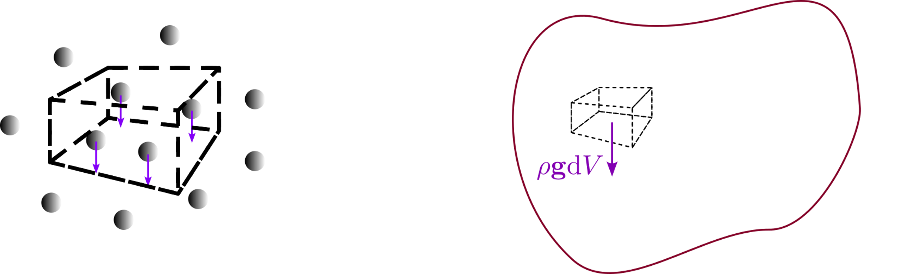
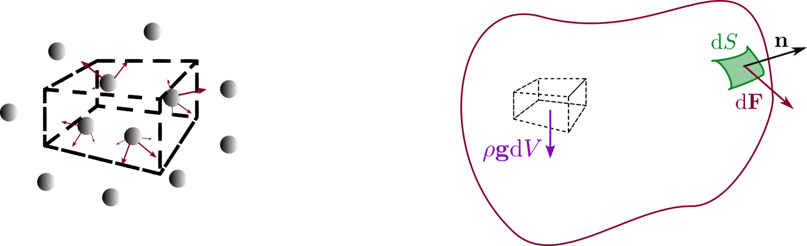
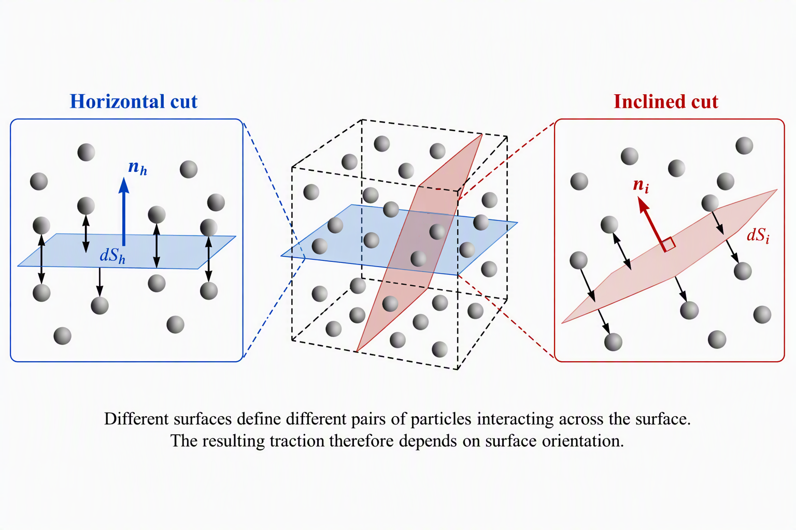
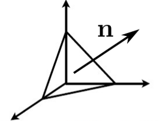
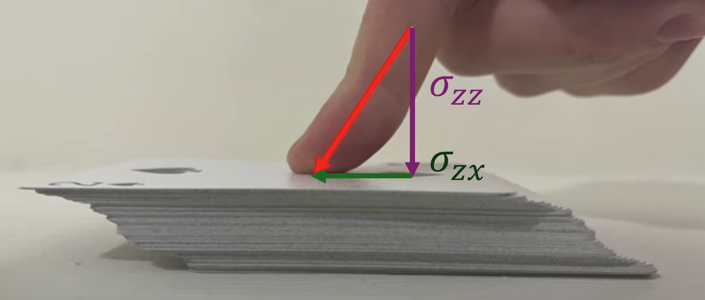
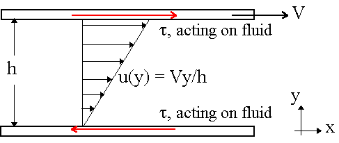
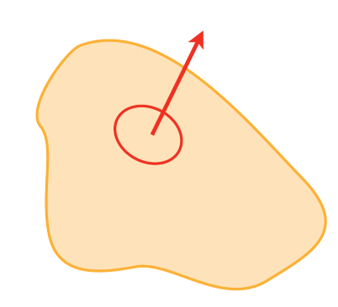

# Introduction

Many biological systems involve fluids:

- blood flow through vessels,
- transport within cells,
- swimming microorganisms,
- suspensions of proteins, cells and bacteria,
- diffusion of nutrients and signalling molecules.

Although these systems differ greatly in scale, they are governed by a common set of physical laws.

The purpose of these notes is to derive the Navier-Stokes equation from Newton's laws and to explain the physical meaning of every term involved.

Throughout these notes, bold symbols denote vectors.

| Symbol | Meaning | SI unit |
|----------|----------|----------|
| $\mathbf r$ | Position vector | m |
| $t$ | Time | s |
| $\rho$ | Mass density | kg m$^{-3}$ |
| $\mathbf v$ | Velocity field | m s$^{-1}$ |
| $p$ | Pressure | Pa |
| $\boldsymbol{\sigma}$ | Stress tensor | Pa |
| $\eta$ | Dynamic viscosity | Pa s |
| $\mathbf f_V$ | Volume force density | N m$^{-3}$ |
| $\mathbf g$ | gravitational acceleration | m s$^{-2}$ |

# From point particles to continuous media

## Newtonian mechanics

For a collection of particles, Newton's second law states

$$
\sum \mathbf F = \frac{d\mathbf p}{dt},
$$

where $\mathbf p$ is the momentum of the particle.

Classical mechanics therefore describes:

- particle positions,
- particle velocities,
- forces acting on each particle.

This description rapidly becomes impossible when dealing with fluids, since a macroscopic fluid contains roughly

$$
10^{23}
$$

molecules per mole.

## The continuum hypothesis

Instead of describing individual molecules, we average quantities over a sufficiently small volume.

This volume must:

- be large compared with molecular dimensions,
- be small compared with the length scales of interest.

We then define smooth fields such as the local mass density $\rho(\mathbf r,t)$, the velocity field $\mathbf v(\mathbf r,t)$, and the pressure field $p(\mathbf r,t)$.

This approximation is known as the **continuum hypothesis**. Under this hypothesis, fluids can be treated using differential calculus.

::: {.callout-note collapse="true"}
# Preamble: the mathematical nature of physical quantities

In order to discuss forces in continuous media, compared with point mechanics, we need a new mathematical object to describe physical quantities, known as a tensor. As you are reading these notes, you should ba familiar with scalar and vector physical quantities:

## Scalars

Scalars possess magnitude only. They're represented by a single number.

Examples:

- temperature,
- mass,
- density,
- pressure.

## Vectors

Vectors possess magnitude and direction. They are represented by a $N\times 1$ matrix, or array, where $N$ is the dimension of the described system, which depends on the choice of reference frame.

Examples:

- displacement,
- velocity,
- force.

## Second-rank tensors

In a simple way, one can say a tensor describes how a vector quantity depends on direction.

The simplest example is a matrix:

$$
\mathbf T
=
\begin{pmatrix}
T_{xx} & T_{xy} & T_{xz}\\
T_{yx} & T_{yy} & T_{yz}\\
T_{zx} & T_{zy} & T_{zz}
\end{pmatrix}.
$$

Tensors appear naturally when describing stresses in a continuous medium.

Indeed, the force exerted across a given surface depends not only on position but also on the orientation of that surface. Gradients of vector quantites are also important in continuous media.

## Change of reference frame

One of the defining properties of physical quantities is that their description should not depend on the coordinate system used by the observer.

### Scalars

Scalars are unchanged when the coordinate system is rotated.

For example, the temperature at a point remains the same regardless of how we orient our axes.

If

$$
T = 300\,\mathrm{K},
$$

then every observer measures exactly the same value.

### Vectors

The components of a vector depend on the chosen coordinate system, even though the physical vector itself does not.

For example, consider a force

$$
\mathbf F=
\begin{pmatrix}
10\\
0
\end{pmatrix}
\mathrm{N}
$$

in a two-dimensional coordinate system.

If the axes are rotated by $45^\circ$, the same force becomes

$$
\mathbf F'=
\begin{pmatrix}
10/\sqrt{2}\\
-10/\sqrt{2}
\end{pmatrix}
\mathrm{N}.
$$

The numerical components have changed, but the physical force is exactly the same.

Mathematically, vectors transform according to

$$
F_i' = R_{ij}F_j=\mathbf R \cdot \mathbf F,
$$

where $R_{ij}$ is the rotation matrix describing the change of basis.

### Second-rank tensors

A tensor describes a relationship between directions. Consequently, both of its indices must transform whenever the coordinate system changes.

For a second-rank tensor,

$$
T_{ij},
$$

the components in the rotated coordinate system become

$$
T'_{ij}
=
R_{ik}R_{jl}T_{kl}
=\mathbf R\cdot \mathbf T \cdot \mathbf R^{-1}.
$$

The two rotation matrices appear because the tensor acts on two directions simultaneously.

For example, as we will show later, the stress tensor contains:

- a direction associated with the orientation of a surface,
- a direction associated with the force acting on that surface.

Both directions must therefore be transformed when changing coordinates.

This is why stresses cannot generally be represented by a simple scalar or vector.

:::

::: {.callout-note collapse="true"}
## A description of notation conventions

Fluid mechanics uses a compact notation based on vectors, tensors and the **Einstein summation convention**.

### Einstein summation convention

Whenever an index appears twice in a term, summation over that index is implied.

For example,

$$
a_i b_i
=
\sum_{i=1}^{3} a_i b_i
=
a_1 b_1+a_2 b_2+a_3 b_3 .
$$

This notation avoids writing explicit summation symbols and greatly simplifies tensor equations.

### The gradient operator

The vector differential operator

$$
\nabla
=
\left(
\frac{\partial}{\partial x},
\frac{\partial}{\partial y},
\frac{\partial}{\partial z}
\right)
\equiv
\left(
\frac{\partial}{\partial x_1},
\frac{\partial}{\partial x_2},
\frac{\partial}{\partial x_3}
\right)
$$

can be written in index notation as

$$
(\nabla)_i
=
\frac{\partial}{\partial x_i}.
$$

### Dot product with a gradient

The velocity vector is

$$
\mathbf v
=
(v_1,v_2,v_3).
$$

The expression

$$
\mathbf v\cdot\nabla
$$

means

$$
v_i\frac{\partial}{\partial x_i}
=
v_1\frac{\partial}{\partial x}
+
v_2\frac{\partial}{\partial y}
+
v_3\frac{\partial}{\partial z}.
$$

Note that $\mathbf v\cdot\nabla$ is **not a scalar quantity**, but a differential scalar operator which acts on whatever follows it.

For example, if $X(\mathbf r,t)$ is a scalar field,

$$
\mathbf v\cdot\nabla X
=
v_i\frac{\partial X}{\partial x_i}
=
v_1\frac{\partial X}{\partial x}
+
v_2\frac{\partial X}{\partial y}
+
v_3\frac{\partial X}{\partial z}.
$$

This quantity represents the rate at which a fluid particle experiences changes in $X$ because it is moving through space.

### Other common tensor operations

The **gradient of a scalar field** produces a vector:

$$
(\nabla X)_i
=
\frac{\partial X}{\partial x_i}.
$$

The **divergence of a vector field** produces a scalar:

$$
\nabla\cdot\mathbf v
=
\frac{\partial v_i}{\partial x_i} (=\frac{\partial v_1}{\partial x}+\frac{\partial v_2}{\partial y}+\frac{\partial v_3}{\partial z}).
$$

The **gradient of a vector field** produces a second-rank tensor:

$$
(\nabla\mathbf v)_{ij}
=
\frac{\partial v_j}{\partial x_i}.
$$

The **double contraction** of two tensors produces a scalar:

$$
A:B
=
A_{ij}B_{ij}.
$$

These operations appear repeatedly in continuum mechanics because physical quantities such as stress and strain are tensorial in nature.

:::

# Eulerian and Lagrangian descriptions

There are two fundamentally different ways of describing fluid motion:

- the **Lagrangian description**: We follow an individual fluid particle. Its position is $\mathbf r_P(t)$, and its velocity is $\mathbf v_P(t)=\frac{d\mathbf r_P}{dt}$. This description remains very close to ordinary Newtonian mechanics.

- the **Eulerian description**: Instead of following particles, we observe the fluid at fixed positions. At every point in space, we define the velocity field $\mathbf v(\mathbf r,t)$ as the velocity of the particles present in $\mathbf r$ at time $t$. Most fluid mechanics uses the Eulerian description.

## Comparison with particle mechanics

| Particle mechanics | Continuum mechanics |
|----------|----------|
| Position $\mathbf r_P(t)$ and speed $\mathbf v_P(t)$ | Velocity field $\mathbf v(\mathbf r,t)$ |
| Mass $m$ | Density $\rho(\mathbf r,t)$ |
| Force $\mathbf F$ | Volume force density $\mathbf f_v$|
| Momentum $\mathbf p$ | Momentum density $\rho\mathbf v$ |

# The material derivative

Suppose a fluid carries a scalar quantity $X(\mathbf r,t)$, such as a temperature, concentration or density. A fluid particle moving through the flow experiences two kinds of changes:

1. explicit changes with time;
2. changes caused by moving into a region where the value of $X$ is different.

Using the chain rule,

$$
\frac{dX}{dt}
=
\frac{\partial X}{\partial t}
+
\frac{dx_i}{dt}
\frac{\partial X}{\partial x_i}.
$$

Since $\frac{dx_i}{dt}=v_i$ is the velocity of the material particle carrying those changes, we obtain

$$
\boxed{
\frac{DX}{Dt}
=
\frac{\partial X}{\partial t}
+
\mathbf v\cdot\nabla X
}
$$

This operator is called the **material derivative**.

## Material derivative of velocity

Applying the material derivative to velocity itself gives the acceleration of a fluid element:

$$
\boxed{
\frac{D\mathbf v}{Dt}
=
\frac{\partial\mathbf v}{\partial t}
+
(\mathbf v\cdot\nabla)\mathbf v
}
$$

The first term is called the **local acceleration**.

The second term is called the **convective acceleration**.

This second term has no equivalent in elementary particle mechanics and is responsible for much of the complexity of fluid dynamics.

# Forces in a continuum

Consider a small material element of fluid occupying a volume \(V\).

Unlike a point particle, this element contains a very large number of molecules. The total force acting on the element therefore arises from two physically distinct origins:

1. forces applied by external fields, acting on all particles within the volume;
2. forces exerted by neighbouring material through the boundary of the element.

Understanding the scaling of these two contributions is one of the key steps in continuum mechanics.

## Volume forces

Some forces act directly on every particle contained within the material element.

Examples include:

- gravity,
- electric forces,
- magnetic forces.

A simple example is gravity. If the constitutive element contains \(N\) particles of mass \(m_i\), the total gravitational force is

$$
\mathbf F_g
=
\sum_i m_i\mathbf g.
$$

As the number of particles becomes very large, this discrete sum may be replaced by a volume integral:

$$
\mathbf F_g
=
\int_V \rho \mathbf g\,dV.
$$

More generally, any force acting throughout the volume can be written

$$
\boxed{
\mathbf F_V
=
\int_V \mathbf f_V\,dV
}
$$

where \(\mathbf f_V\) is the volume-force density (force per unit volume).

### Why do volume forces scale with volume?

If the characteristic size of the constitutive element is \(L\), then

$$
V \sim L^3.
$$

The number of particles contained inside the element is proportional to its volume. Since each particle experiences the external force, the total force is also proportional to the volume:

$$
F_V \propto V.
$$

Consequently,

$$
F_V \sim L^3.
$$

{#fig-volume-force}

## Surface forces

A second class of forces arises from interactions between neighbouring material elements.

Examples include:

- pressure forces,
- viscous shear forces,
- contact forces in solids.

At first sight one might expect these forces to also scale with volume, since molecules throughout the element interact with one another. However, a careful counting argument shows otherwise.

### Why do interaction forces scale with surface area?

Interactions between particles occur in action-reaction pairs.

For two particles located entirely within the constitutive element,

$$
\mathbf F_{12}
=
-\mathbf F_{21},
$$

so their contributions cancel when computing the net force acting on the whole element.

Therefore, interactions between particles entirely inside the volume do not contribute to the total external force.

Only interactions crossing the boundary of the constitutive element survive.

The number of such interactions is proportional to the size of the boundary surface.

As a result,

$$
F_S \propto S,
$$

where \(S\) is the surface area of the constitutive element.

Since

$$
S \sim L^2,
$$

surface forces scale as

$$
F_S \sim L^2.
$$

This result explains why stresses are naturally defined as force per unit area.

{#fig-surface-force}

### Why do surface forces depend on surface orientation?

Unlike volume forces such as gravity, surface forces originate from interactions between neighbouring particles located on opposite sides of an imaginary surface drawn through the material.

The key idea is that changing the orientation of this surface changes which pairs of particles are separated by the surface.

For example, consider the same small material element and imagine drawing two different surfaces through it:

- a horizontal surface;
- an inclined surface.

The particles lying on one side of the surface and those lying on the other side will generally be different in each case.

As a result, the collection of intermolecular interactions crossing the surface also changes.

Because the net force acting on the material element arises from the sum of all interactions crossing the boundary, changing the orientation of the boundary changes the resulting force.

Therefore, the surface force cannot depend only on position. It must also depend on the orientation of the surface.

{#fig-surface-depend}

Mathematically, we characterize the orientation of a surface by its outward unit normal vector

$$
\mathbf n.
$$

The force per unit area acting across a surface with normal \(\mathbf n\) is called the **traction vector**

$$
\boxed{
\boldsymbol{\tau}(\mathbf n)
=
\frac{d\mathbf F}{dS}.
}
$$

The explicit dependence on \(\mathbf n\) emphasizes that two surfaces passing through the same point may experience different tractions if they have different orientations.

This dependence on surface orientation is the fundamental reason why internal forces in a continuum cannot generally be described by a scalar or a vector alone. One can however show that a second-rank tensor, known as the stress tensor $\boldsymbol{\sigma}$, is sufficient to describe all surface stresses in contimuous material. The traction vector, for a surface with a normal $\mathbf n$, can then be determined as

$$
\boxed{
\boldsymbol{\tau}(\mathbf n)
=
\mathbf n \cdot \boldsymbol{\sigma}
}
$$

To understand the physical meaning of the stress tensor, consider one of its components, $\sigma_{ij}$. The second index $j$ identifies the direction of the force acting on the surface, while the first index $i$ identifies the direction normal to that surface.

Equivalently,

$$
\boxed{
\sigma_{ij}
=
\text{force in direction } j
\text{ acting on a surface normal to } i
\text{ per unit area}.
}
$$

For example, $\sigma_{xy}$ represents the force per unit area acting in the $y$-direction across a surface whose normal points in the $x$-direction. Likewise, $\sigma_{zz}$ represents the force per unit area acting in the $z$-direction across a surface normal to $z$.

Such components are called **normal stresses**, while components with $i\neq j$ are called **shear stresses**.

A useful way to visualize the stress tensor is to consider three surfaces passing through a point and normal to the coordinate axes. The corresponding traction vectors are

$$
\boldsymbol{\tau}(\mathbf e_x)
=
\begin{pmatrix}
\sigma_{xx}\\
\sigma_{xy}\\
\sigma_{xz}
\end{pmatrix},
\qquad
\boldsymbol{\tau}(\mathbf e_y)
=
\begin{pmatrix}
\sigma_{yx}\\
\sigma_{yy}\\
\sigma_{yz}
\end{pmatrix},
\qquad
\boldsymbol{\tau}(\mathbf e_z)
=
\begin{pmatrix}
\sigma_{zx}\\
\sigma_{zy}\\
\sigma_{zz}
\end{pmatrix}.
$$

The stress tensor therefore contains all the information required to determine the traction acting on a surface of arbitrary orientation. Each column corresponds to a particular surface normal, while each row corresponds to a particular force direction.

::: {.callout-note collapse="true"}
## Derivation of the stress tensor: Cauchy's tetrahedron argument

Since the traction depends on the chosen normal vector $\mathbf n$, one might think that an independent traction vector must be specified for every possible orientation. Cauchy's tetrahedron argument shows that this is not necessary. We have introduced the traction vector

$$
\boldsymbol{\tau}(\mathbf n)
=
\frac{d\mathbf F}{dS},
$$

which gives the force per unit area acting across a surface whose outward normal is $\mathbf n$.

A natural question arises:

> How many traction vectors do we need to specify in order to describe all possible internal forces in a material?

At first sight, the answer seems daunting: every possible surface orientation could have a different traction vector.

Remarkably, this is not the case.

### Step 1: Consider an infinitesimal tetrahedron

Imagine an infinitesimal tetrahedral fluid element.

Three faces are aligned with the coordinate planes:

- a face normal to $\mathbf e_x$,
- a face normal to $\mathbf e_y$,
- a face normal to $\mathbf e_z$.

The fourth face is an arbitrarily oriented surface with normal

$$
\mathbf n
=
(n_x,n_y,n_z).
$$

{#fig-CauchyTetra}

Let:

- $S$ be the area of the inclined face,
- $S_x$, $S_y$, $S_z$ be the areas of the coordinate faces.

Geometry gives

$$
S_x=n_xS,
\qquad
S_y=n_yS,
\qquad
S_z=n_zS.
$$

The quantities $n_x$, $n_y$ and $n_z$ are precisely the direction cosines of the normal vector.

### Step 2: Apply force balance

Because the tetrahedron is infinitesimally small, its volume scales as

$$
V \sim L^3,
$$

while surface areas scale as

$$
S \sim L^2.
$$

As the size of the tetrahedron tends to zero, body forces and inertial terms become negligible compared with surface forces.

Force balance therefore reduces to

$$
\sum \mathbf F_{Surface} = 0.
$$

The surface force acting on the inclined face is

$$
\boldsymbol{\tau}(\mathbf n)S.
$$

The forces acting on the coordinate faces are

$$
\boldsymbol{\tau}(-\mathbf e_x)S_x,
$$

$$
\boldsymbol{\tau}(-\mathbf e_y)S_y,
$$

$$
\boldsymbol{\tau}(-\mathbf e_z)S_z.
$$

Taking into account that $\boldsymbol{\tau}(-\mathbf n)=-\boldsymbol{\tau}(\mathbf n)$ (which is a direct application of Newton's third law), it comes

$$
\boldsymbol{\tau}(\mathbf n)S
=
\boldsymbol{\tau}(\mathbf e_x)S_x
+
\boldsymbol{\tau}(\mathbf e_y)S_y
+
\boldsymbol{\tau}(\mathbf e_z)S_z.
$$

Substituting

$$
S_x=n_xS,
\qquad
S_y=n_yS,
\qquad
S_z=n_zS,
$$

and dividing by $S$ gives

$$
\boxed{
\boldsymbol{\tau}(\mathbf n)
=
n_x\boldsymbol{\tau}(\mathbf e_x)
+
n_y\boldsymbol{\tau}(\mathbf e_y)
+
n_z\boldsymbol{\tau}(\mathbf e_z)
\equiv
\mathbf n \cdot \boldsymbol{\sigma}
}
$$

This is Cauchy's fundamental result, or, in index notation,

$$
\boxed{
\tau_i(\mathbf n) = n_j \sigma_{ji}.
}
$$

### Physical meaning

The important conclusion is that:

> Once the traction vectors are known on three mutually perpendicular surfaces, the traction vector on any arbitrarily oriented surface is completely determined.

Therefore a continuum does not require infinitely many force variables. All internal mechanical forces can be represented by the nine components of a second-rank tensor, known as the **stress tensor**.

This is the continuum-mechanics equivalent of using a force vector in particle mechanics.

:::

# Pressure and shear stress

The stress tensor is usually decomposed as

$$
\boxed{
\boldsymbol{\sigma}
=
-p\mathbf I
+
\boldsymbol{\sigma}'
}
$$

where:

- $p$ is the pressure,
- $\mathbf I$ is the identity tensor,
- $\boldsymbol{\sigma}'$ is the deviatoric stress tensor.

{#fig-StressTensor}

The pressure contribution is isotropic. It acts equally in every direction. 

The deviatoric contribution is associated with deformation of the fluid.

# Newtonian fluids

Different materials exhibit different relationships between stress and deformation.

This relationship is called the **constitutive equation**.

## Shear-rate tensor

The shear-rate tensor is defined as

$$
\dot{\gamma_{ij}}
=\left(
\frac{\partial v_i}{\partial x_j}
+
\frac{\partial v_j}{\partial x_i}
\right)
-\frac{2}{3}\sum_{k} \frac{\partial v_k}{\partial x_k} \delta_{ij},
$$
where the last term exists to make the tensor traceless. For incompressible fluids, as $\nabla\cdot\mathbf v=\sum_{k}\frac{\partial v_k}{\partial x_k}=0$, only the parenthesis matters. This quantifies local deformation rates.

## Newtonian constitutive law

For a Newtonian fluid, the consitutive equation is that:

$$
\boxed{
\sigma_{ij}
=
-p\delta_{ij}
+
\eta
\left(
\frac{\partial v_i}{\partial x_j}
+
\frac{\partial v_j}{\partial x_i}
\right)
}
$$

where $\eta$ is the dynamic viscosity.

The key idea is:

::: {.callout-important}
Shear stress is **linearly proportional** to the shear rate.
:::

{#fig-NewtonProfile}

This relationship is analogous to Hooke's law in elasticity, except that fluids respond to deformation rates rather than deformations themselves.

# Conservation of mass

Consider a fixed control volume.

Mass may enter or leave through its surface.

However, mass cannot be created or destroyed.

::: {.callout-note collapse="true"}
## Derivation of the continuity equation

To derive the conservation of mass equation, consider a fixed control volume $V$ bounded by a closed surface $S$.

Let the density field be

$$
\rho(\mathbf r,t).
$$

The total mass contained within the control volume is

$$
m(t)
=
\int_V \rho(\mathbf r,t)\,dV.
$$

Since mass can neither be created nor destroyed, the rate of change of mass inside the volume must equal the net mass flux through its boundary.

### Mass flux through a surface

Consider a small surface element $dS$ whose outward normal is $\mathbf n$.

The fluid velocity at that point is $\mathbf v$.

The volume of fluid crossing the surface per unit time is

$$
(\mathbf v\cdot\mathbf n)dS.
$$

Multiplying by the density gives the mass crossing the surface per unit time:

$$
\rho\,(\mathbf v\cdot\mathbf n)dS.
$$

Integrating over the entire boundary gives the total mass leaving the volume:

$$
\oint_S \rho\,\mathbf v\cdot\mathbf n\,dS.
$$

Because outward flux removes mass from the control volume,

$$
\boxed{
\frac{dm}{dt}
=
-\oint_S \rho\,\mathbf v\cdot\mathbf n\,dS
}
$$

or equivalently

$$
\boxed{
\frac{d}{dt}
\int_V \rho\,dV
=
-\oint_S \rho\,\mathbf v\cdot\mathbf n\,dS.
}
$$

{#fig-MassCon}

### Why does the time derivative become a partial derivative?

The integration is performed over a **fixed region of space**.

The spatial coordinates defining the volume do not change with time.

Therefore the time derivative can be taken inside the integral:

$$
\frac{d}{dt}
\int_V \rho\,dV
=
\int_V
\frac{\partial\rho}{\partial t}
\,dV.
$$

Notice that we obtain a **partial derivative** rather than a material derivative.

This is because we are not following a fluid particle.

Instead, we are observing how the density changes at fixed points in space, which is precisely the Eulerian description.

### Converting the surface integral into a volume integral

The right-hand side contains a surface integral.

Using the divergence theorem,

$$
\oint_S
\rho\mathbf v\cdot\mathbf n\,dS
=
\int_V
\nabla\cdot(\rho\mathbf v)\,dV.
$$

Substituting gives

$$
\int_V
\frac{\partial\rho}{\partial t}
\,dV
=
-
\int_V
\nabla\cdot(\rho\mathbf v)
\,dV.
$$

Bringing both terms to the same side,

$$
\boxed{
\int_V
\left[
\frac{\partial\rho}{\partial t}
+
\nabla\cdot(\rho\mathbf v)
\right]
dV
=
0.
}
$$

### Obtaining the local form

The above relation must hold for **every possible control volume** $V$.

The only way this can be true is if the integrand itself vanishes everywhere:

$$
\boxed{
\frac{\partial\rho}{\partial t}
+
\nabla\cdot(\rho\mathbf v)
=
0,
}
$$

which can also be written with the total time derivative as

$$
\boxed{
\frac{D\rho}{Dt}
+
\rho\,\nabla\cdot\mathbf v
=
0.
}
$$

This is the **continuity equation**, expressing local conservation of mass.

:::

Therefore, as demonstarted in the note above,

$$
\boxed{
\frac{\partial\rho}{\partial t}
+
\nabla\cdot(\rho\mathbf v)
=
0
}
$$

This equation is known as the **continuity equation**.

# Incompressible fluids

Many biological fluids can often be treated as incompressible.

Incompressibility implies

$$
\frac{D\rho}{Dt}
=
0.
$$

Substituting into the continuity equation yields

$$
\boxed{
\nabla\cdot\mathbf v
=
0
}
$$

The velocity field therefore has zero divergence.

Physically, this means incompressible fluid elements may deform but they do not change volume.

# Conservation of momentum

We now apply Newton's second law to a fluid element.

## Momentum balance

The rate of change of momentum equals the sum of forces.

For a continuum, one can show

$$
\rho
\frac{D\mathbf v}{Dt}
=
\nabla\cdot\boldsymbol{\sigma}
+
\mathbf f_V.
$$

::: {.callout-note collapse="true"}
## Derivation of the Cauchy momentum equation

The continuum equivalent of Newton's second law is obtained by applying momentum conservation to an arbitrary material volume $V$. For a collection of particles, Newton's second law reads

$$
\frac{d\mathbf P}{dt}
=
\sum \mathbf F,
$$

with $P$ the total momentum. In a continuum, the momentum contained within a material volume $V$ is

$$
\mathbf P
=
\int_V \rho \mathbf v\, dV,
$$

where we integrate over a **material volume**, defined by specific particles. Applying Newton's second law gives

$$
\boxed{
\frac{d}{dt}
\int_V \rho\mathbf v\, dV
=
\oint_S (\mathbf n\cdot\boldsymbol{\sigma})\, dS+\int_V \mathbf f_V\, dV,
}
$$

Applying the divergence theorem,

$$
\oint_S \mathbf n\cdot\boldsymbol{\sigma}\, dS
=
\int_V \nabla\cdot\boldsymbol{\sigma}\, dV.
$$

Therefore,

$$
\frac{d}{dt}
\int_V \rho\mathbf v\, dV
=
\int_V
\left(
\nabla\cdot\boldsymbol{\sigma}
+
\mathbf f_V
\right)
dV.
$$

Because $V$ is a material volume moving with the fluid, we must use a material derivative. Using the product rule,

$$
\frac{d}{dt}
\int_V \rho\mathbf v\, dV
=
\int_V
\frac{d(\rho\mathbf v)}{dt}
\,dV
+
\int_V
\rho\mathbf v
\frac{d(dV)}{dt}.
$$

The rate of change of a material volume element can be written as

$$
\frac{d(dV)}{dt}
=
(\nabla\cdot\mathbf v)\,dV.
$$

Therefore

$$
\frac{d}{dt}
\int_V \rho\mathbf v\, dV
=
\int_V
\left(
\frac{d(\rho\mathbf v)}{dt}
+
\rho\mathbf v\,\nabla\cdot\mathbf v
\right)dV.
$$

Expanding the material derivative,

$$
\frac{d(\rho\mathbf v)}{dt}
=
\mathbf v\frac{D\rho}{Dt}
+
\rho\frac{D\mathbf v}{Dt},
$$

giving

$$
\frac{d}{dt}
\int_V \rho\mathbf v\, dV
=
\int_V
\left[
\mathbf v
\left(
\frac{D\rho}{Dt}
+
\rho\nabla\cdot\mathbf v
\right)
+
\rho\frac{D\mathbf v}{Dt}
\right]
dV.
$$

From the continuity equation,

$$
\boxed{
\frac{D\rho}{Dt}
+
\rho\nabla\cdot\mathbf v
=
0.
}
$$

The first term therefore vanishes:

$$
\frac{d}{dt}
\int_V \rho\mathbf v\, dV
=
\int_V
\rho\frac{D\mathbf v}{Dt}
\,dV.
$$

Substituting into the momentum balance gives

$$
\int_V
\rho\frac{D\mathbf v}{Dt}
\,dV
=
\int_V
\left(
\nabla\cdot\boldsymbol{\sigma}
+
\mathbf f_V
\right)
dV.
$$

Bringing both terms to the same side,

$$
\int_V
\left[
\rho\frac{D\mathbf v}{Dt}
-
\nabla\cdot\boldsymbol{\sigma}
-
\mathbf f_V
\right]
dV
=
0.
$$

Since the control volume is arbitrary, the integrand itself must vanish:

$$
\boxed{
\rho
\frac{D\mathbf v}{Dt}
=
\nabla\cdot\boldsymbol{\sigma}
+
\mathbf f_V.
}
$$

This equation is known as the **Cauchy momentum equation**. It is simply Newton's second law written for a continuous medium.

:::

Substituting the expression for the material derivative gives

$$
\boxed{
\rho
\left(
\frac{\partial\mathbf v}{\partial t}
+
(\mathbf v\cdot\nabla)\mathbf v
\right)
=
\nabla\cdot\boldsymbol{\sigma}
+
\mathbf f_V
}
$$

This equation is called the **Cauchy momentum equation**.

# Derivation of the Navier-Stokes equation

Substitute the Newtonian constitutive equation:

$$
\sigma_{ij}
=
-p\delta_{ij}
+
\eta
\left(
\frac{\partial v_i}{\partial x_j}
+
\frac{\partial v_j}{\partial x_i}
\right).
$$

Assuming:

- constant density,
- constant viscosity,
- incompressibility,

::: {.callout-note collapse="true"}
# Importance of the incompressibility hypothesis

Starting from the Newtonian constitutive equation,

$$
\sigma_{ij}
=
-p\delta_{ij}
+
\eta
\left(
\frac{\partial v_i}{\partial x_j}
+
\frac{\partial v_j}{\partial x_i}
\right),
$$

we wish to evaluate the quantity appearing in the Cauchy momentum equation,

$$
(\nabla\cdot\boldsymbol{\sigma})_i
=
\frac{\partial \sigma_{ij}}{\partial x_j}.
$$

Substituting the constitutive equation gives

$$
\frac{\partial \sigma_{ij}}{\partial x_j}
=
-\frac{\partial p}{\partial x_j}\delta_{ij}
+
\eta
\frac{\partial}{\partial x_j}
\left(
\frac{\partial v_i}{\partial x_j}
+
\frac{\partial v_j}{\partial x_i}
\right).
$$

The pressure term simplifies to

$$
-\frac{\partial p}{\partial x_j}\delta_{ij}
=
-\frac{\partial p}{\partial x_i}.
$$

For the viscous contribution,

$$
\eta
\frac{\partial}{\partial x_j}
\left(
\frac{\partial v_i}{\partial x_j}
+
\frac{\partial v_j}{\partial x_i}
\right)
=
\eta
\left(
\frac{\partial^2 v_i}{\partial x_j^2}
+
\frac{\partial}{\partial x_j}
\left(
\frac{\partial v_j}{\partial x_i}
\right)
\right).
$$

The first term is simply the Laplacian of the velocity component:

$$
\frac{\partial^2 v_i}{\partial x_j^2}
=
\nabla^2 v_i.
$$

For the second term, we interchange the order of differentiation:

$$
\frac{\partial}{\partial x_j}
\left(
\frac{\partial v_j}{\partial x_i}
\right)
=
\frac{\partial}{\partial x_i}
\left(
\frac{\partial v_j}{\partial x_j}
\right).
$$

Recognizing the divergence of the velocity field,

$$
\frac{\partial v_j}{\partial x_j}
=
\nabla\cdot\mathbf v,
$$

we obtain

$$
\frac{\partial}{\partial x_j}
\left(
\frac{\partial v_j}{\partial x_i}
\right)
=
\frac{\partial}{\partial x_i}
(\nabla\cdot\mathbf v).
$$

At this point the incompressibility condition becomes crucial:

$$
\nabla\cdot\mathbf v = 0.
$$

Therefore,

$$
\frac{\partial}{\partial x_i}
(\nabla\cdot\mathbf v)
=
0.
$$

The entire second viscous term vanishes:

$$
\frac{\partial}{\partial x_j}
\left(
\frac{\partial v_j}{\partial x_i}
\right)
=
0.
$$

We are left with

$$
(\nabla\cdot\boldsymbol{\sigma})_i
=
-\frac{\partial p}{\partial x_i}
+
\eta\nabla^2 v_i.
$$

Writing the result in vector form,

$$
\boxed{
\nabla\cdot\boldsymbol{\sigma}
=
-\nabla p
+
\eta\nabla^2\mathbf v.
}
$$

Without the incompressibility hypothesis, an additional term would remain:

$$
\nabla\cdot\boldsymbol{\sigma}
=
-\nabla p
+
\eta\nabla^2\mathbf v
+
\eta\nabla(\nabla\cdot\mathbf v).
$$

The assumption

$$
\nabla\cdot\mathbf v = 0
$$

is therefore what allows the Cauchy momentum equation to simplify into the familiar Navier-Stokes equation used throughout this course.

:::

one obtains

$$
\nabla\cdot\boldsymbol{\sigma}
=
-\nabla p
+
\eta\nabla^2\mathbf v.
$$

The Cauchy momentum equation therefore becomes

$$
\boxed{
\rho
\left(
\frac{\partial\mathbf v}{\partial t}
+
(\mathbf v\cdot\nabla)\mathbf v
\right)
=
-\nabla p
+
\eta\nabla^2\mathbf v
+
\mathbf f_V
}
$$

This is the Navier-Stokes equation.

# Physical interpretation of Navier-Stokes

The equation

$$
\rho
\left(
\frac{\partial\mathbf v}{\partial t}
+
(\mathbf v\cdot\nabla)\mathbf v
\right)
=
-\nabla p
+
\eta\nabla^2\mathbf v
+
\mathbf f_V
$$

can be interpreted term by term.

| Term | Meaning |
|----------|----------|
| $\rho \partial_t\mathbf v$ | Local acceleration |
| $\rho(\mathbf v\cdot\nabla)\mathbf v$ | Convective acceleration |
| $-\nabla p$ | Pressure forces |
| $\eta\nabla^2\mathbf v$ | Viscous momentum diffusion |
| $\mathbf f_V$ | Body forces |

The equation therefore has exactly the same structure as

$$
\text{mass}\times\text{acceleration}
=
\text{sum of forces}.
$$

<!--
# Reynolds number

The balance between inertial and viscous effects is quantified by the Reynolds number.

Define characteristic scales:

- velocity $U$,
- length $L$.

Comparing inertia and viscosity gives

$$
\boxed{
Re
=
\frac{\rho UL}{\eta}
}
$$

## Physical meaning

When

$$
Re\gg1,
$$

inertia dominates.

When

$$
Re\ll1,
$$

viscosity dominates.

Many organisms operate in the low-Reynolds-number regime.

For example:

- bacteria,
- sperm cells,
- intracellular transport.

Their physics is therefore fundamentally different from our everyday experience.
-->

# Towards the problem class

In the next session we will solve the Navier-Stokes equation for flow between parallel plates.

To do so we will progressively introduce simplifying assumptions:

1. incompressible flow,
2. stationary flow,
3. fully developed flow,
4. no-slip boundary conditions,
5. imposed pressure gradient.

Under these assumptions, the Navier-Stokes equation reduces to an ordinary differential equation that can be solved analytically.

This will allow us to derive:

- Poiseuille flow of a Newtonian fluid,
- flow of a power-law fluid,

which form the basis of the following problem class.