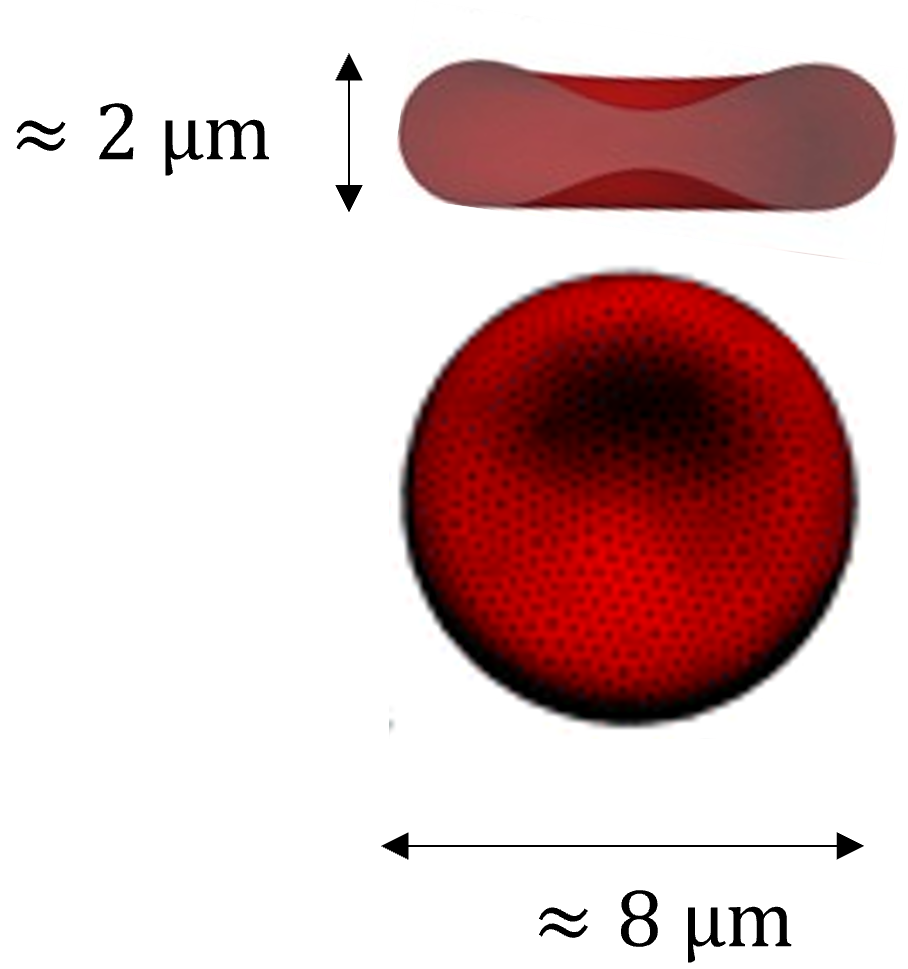
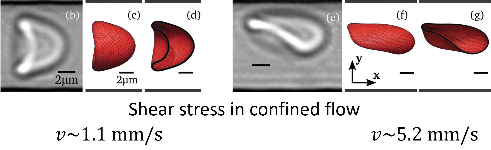
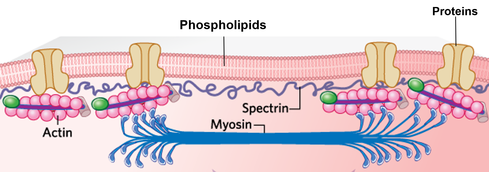
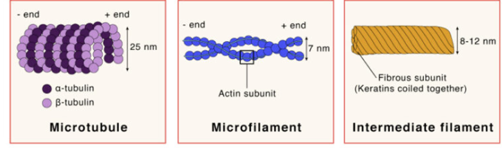
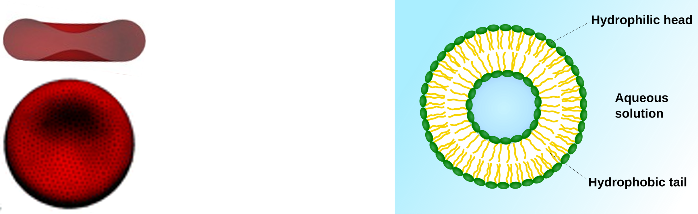
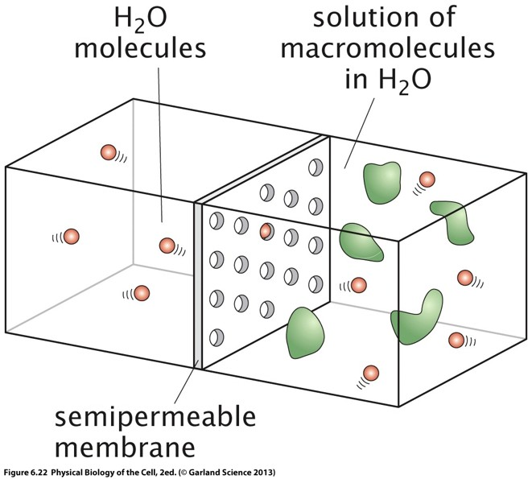
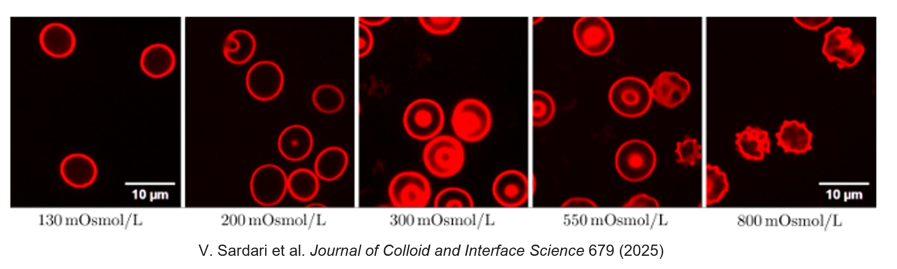
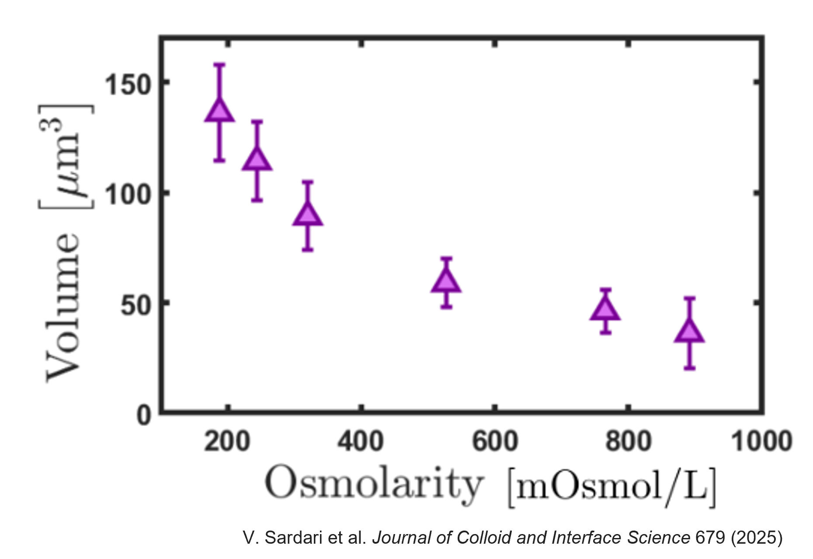
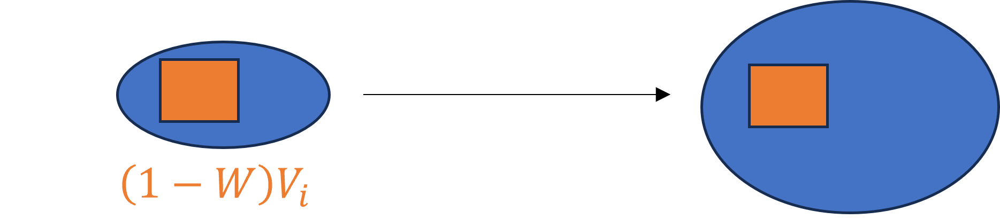

# Introduction

In the previous lectures, we discussed:

- fluid mechanics,
- low Reynolds number flows,
- diffusion,
- complex fluids,
- viscoelasticity.

We now turn our attention to one of the most important biological building blocks: the cell.

At cellular scales, both solid-like and liquid-like physics become essential.

A living cell:

- is immersed in a liquid environment,
- contains a liquid cytoplasm,
- possesses an elastic membrane,
- contains an active cytoskeleton.

Understanding cellular mechanics therefore requires combining fluid dynamics and elasticity, as we hinted before. After the introduction to fluid dynamics we covered last week, the "Cell Mechanics" part of this lecture will introduce more in-depth physics of elastic membranes and how cell membranes interacts with surrounding fluids.

In this lecture we will focus on:

1. Red blood cells as a model biological cell.
2. Osmotic pressure.
3. Cell volume regulation.
4. The relationship between membrane mechanics and osmotic swelling.

# Red blood cells: a model biological cell

Red blood cells (RBCs), or erythrocytes, provide one of the simplest and most important examples of a biological cell.

Their primary role is oxygen transport throughout the body.

They are also exceptionally abundant:

> Red blood cells constitute roughly 70–80% of all cells in the human body.

Because they are:

- plentiful,
- easy to isolate,
- mechanically simple,

they have become a model system for studying cellular mechanics.

## Characteristic dimensions

A healthy red blood cell has a characteristic diameter of approximately $8\ \mu\text m$, and a thickness of roughly $2\ \mu\text m$.

These dimensions place RBCs in an interesting regime:

- much larger than proteins,
- larger than bacteria,
- much smaller than tissues.

{fig-align="center" style="max-height:15em;" #fig-RBCdim}

# Mechanical properties of red blood cells

One of the most remarkable features of RBCs is their deformability.

Capillaries may have diameters comparable to or even smaller than the cell diameter.

Nevertheless, RBCs can travel through these narrow vessels without rupturing.

## Deformation in flow

When exposed to shear stresses or confined flows, RBCs undergo significant shape changes.

The exact shape depends on:

- the applied stress,
- the flow velocity,
- the degree of confinement.

<video autoplay loop muted playsinline style="width:100%; max-width:700px;">
  <source src="figures/CellChannelCompr.mp4">
</video>
Video: Cells deforming while passing through a narrow cross-section. Adapted from Danielczok J. G. et al.,  Frontiers in physiology (2017).

The shape and dynamics of a red blood cell flowing through a microchannel result from a balance between several competing physical effects:

- viscous shear stresses generated by the surrounding fluid,
- hydrodynamic interactions between the cell and the channel walls,
- elastic deformation of the cell membrane and cytoskeleton.

These competing effects drive the cell towards an equilibrium shape and lateral position within the channel. Both the equilibrium shape and the cell trajectory depend strongly on the degree of confinement (the ratio between cell size and channel size) and on the imposed flow rate.

As the flow rate increases, the hydrodynamic stresses acting on the cell become larger, leading to stronger membrane deformations and transitions between different dynamical states. Depending on the flow conditions, red blood cells may adopt parachute-like, slipper-like or more strongly elongated shapes, while simultaneously migrating across streamlines toward preferred positions in the channel.

{#fig-RBCflow}

Predicting these shape changes and understanding their consequences for blood rheology, microvascular transport, and oxygen delivery remain active areas of contemporary research. In particular, the coupling between cell deformability, hydrodynamic interactions and mass transport continues to be investigated using a combination of experiments, theory and numerical simulations.

In this series of lectures, we will gradually build the physical framework required to understand these deformations, beginning with the structure and mechanical properties of the red blood cell membrane.

# Membrane structure of red blood cells

{#fig-CellMemb}

To understand the origin of red blood cell deformability, and later their response to mechanical stresses, we must first examine the structure and composition of the cell membrane.

The membrane contains:

- phospholipids,
- transmembrane proteins,
- a cytoskeletal network.

Among the membrane proteins are:

- transporters,
- receptors,
- ion channels,
- aquaporins.

Aquaporins are particularly important for today's discussion.

## Aquaporins

Aquaporins are specialized membrane proteins that facilitate water transport through the membrane.

Without aquaporins, water transport would be much slower.

Because RBC membranes contain many aquaporins:

- water can rapidly cross the membrane,
- cell volume can rapidly change,
- osmotic effects become extremely important.

# A brief introduction to the cytoskeleton

Many of the mechanical properties of cells originate from the cytoskeleton: a network of protein filaments attached to the cell membrane and extending throughout the cell interior.

The cytoskeleton is composed of several families of filaments, including:

- actin filaments,
- microtubules,
- intermediate filaments,

which differ in both structure and function.

{#fig-Cytoskel}

Together, these filaments form an elastic scaffold that helps cells maintain their shape, resist deformation through (visco-)elastic forces, and reorganize their internal structure.

Importantly, the cytoskeleton is not a static structure. Filaments continuously assemble, disassemble and reorganize, while active cellular processes constantly remodel the network. Consequently, the mechanical properties of cells may vary between different cell types, from one region of a cell to another, or over time within the same cell.

A complete and general description of cell mechanics therefore would require accounting for the spatial organization and dynamic remodeling of the cytoskeleton. This is particulalry important for self-propelling cells, such as some white blood cells.

In this course, however, we will focus primarily on red blood cells. Over the timescales and conditions considered here, we will assume that the mechanical properties of the membrane-associated cytoskeleton remain approximately constant. This approximation allows us to treat the cell as an elastic object with well-defined mechanical properties while still capturing the essential physics of cell deformation and osmotic response.

# About the rest shape of red blood cells

Most membrane vesicles naturally adopt spherical shapes.
 
Why?
 
Lipid membranes possess an effective **surface tension**, meaning that creating additional membrane area costs energy. More generally, the membrane free energy contains contributions associated with both surface area and membrane curvature.
 
As a consequence, a vesicle tends to adopt the shape that minimizes its mechanical energy while enclosing a fixed volume of fluid.
 
For a given enclosed volume, a sphere minimizes surface area.
 
Equivalently, for a fixed surface area, a sphere maximizes enclosed volume.
 
This geometric property implies that a sphere corresponds to the lowest surface-energy configuration available to a simple fluid vesicle.
 
Therefore, in the absence of additional mechanical constraints,
 
> membrane vesicles tend to adopt spherical shapes.
 
Many artificial lipid vesicles and soap bubbles indeed exhibit nearly spherical geometries because their mechanics are dominated by surface tension and bending energy.
 
Yet healthy red blood cells exhibit a characteristic biconcave discoid shape.

Understanding the origin of this shape is one of the big questions answered by membrane physics, that will be our guiding theme for the next lessons.

# Osmolarity and red blood cell shape

Experiments reveal that RBC shape depends strongly on the osmolarity of the surrounding solution.

Typical observations include:

- low osmolarity → swollen cells, or spherocytes
- physiological osmolarity → the usual biconcave disk, or discocytes
- high osmolarity → cells with regular spikes, or echinocytes.

This immediately suggests that water transport through the membrane is altering cell volume and cell shape.

To understand why, we must introduce osmotic pressure.

# Osmotic pressure

Consider two compartments separated by a semipermeable membrane.

The membrane allows water to pass through but prevents some solute molecules from crossing.

Initially:

- one side contains pure water,
- the other side contains water plus solute.

One will observe experimentally that in this case, the water will move to the compartment containing the solute.

<video autoplay loop muted playsinline style="width:100%; max-width:700px;">
  <source src="figures/OsmoticExp.mp4">
</video>
Video: Experiment demonstrating the existence of the osmotic pressure. [Original Video](https://www.youtube.com/watch?v=Xxp6oponwkg)

## Entropy of mixing

The microscopic origin of osmosis lies in entropy.

Recall Boltzmann's relation

$$
S=k_B \ln \Omega,
$$

where:

- $S$ is entropy,
- $\Omega$ is the number of microscopic states.

For a mixture containing several components, one obtains the entropy of mixing 

$$
S
=
-k_B N
\sum_i x_i \ln(x_i),
$$

where:

- $x_i$ is the fraction of component $i$, 
- $N$ is the total number of particles.

::: {.callout-note collapse="true"}
## Derivation of the entropy of mixing
(see also chap 6.2 of Physical Biology of the cell.)

To understand the origin of the entropy of mixing, consider a system containing $N$ particles distributed among several species.

Let

$$
N_i
$$

be the number of particles of species $i$, such that

$$
N
=
\sum_i N_i.
$$

We also define the particle fraction

$$
x_i
=
\frac{N_i}{N}.
$$

### Counting microscopic states

Suppose the particles are distributed over $N$ available positions.

The number of distinct microscopic arrangements is

$$
\Omega
=
\frac{N!}
{\prod_i N_i!}.
$$

The numerator counts all possible arrangements of the $N$ particles, while the denominator removes overcounting caused by exchanging identical particles of the same species.

### Applying Boltzmann's relation

Using

$$
S
=
k_B\ln\Omega,
$$

we obtain

$$
S
=
k_B
\left[
\ln N!
-
\sum_i \ln N_i!
\right].
$$

For the large particle numbers encountered in biological systems, we may use Stirling's approximation

$$
\ln n!
\approx
n\ln n-n.
$$

Substituting into the expression above gives

$$
\begin{aligned}
S
&\approx
k_B
\left[
N\ln N-N
-
\sum_i
\left(
N_i\ln N_i-N_i
\right)
\right]
\\
&=
k_B
\left[
N\ln N
-
\sum_i N_i\ln N_i
\right],
\end{aligned}
$$

since

$$
\sum_i N_i=N.
$$

### Introducing the concentrations

Using

$$
N_i=Nx_i,
$$

we obtain

$$
\begin{aligned}
S
&=
k_B
\left[
N\ln N
-
\sum_i
Nx_i\ln(Nx_i)
\right]
\\
&=
k_BN
\left[
\ln N
-
\sum_i
x_i
\left(
\ln N+\ln x_i
\right)
\right].
\end{aligned}
$$

Expanding the sum gives

$$
S
=
k_BN
\left[
\ln N
-
\ln N
\sum_i x_i
-
\sum_i x_i\ln x_i
\right].
$$

Finally, since

$$
\sum_i x_i =1,
$$

the first two terms cancel, leaving

$$
\boxed{
S_{\rm mix}
=
-k_BN
\sum_i x_i\ln x_i.
}
$$

### Physical interpretation

The entropy of mixing originates purely from counting the number of possible microscopic arrangements.

When different species are mixed together, the number of accessible configurations increases dramatically:

$$
\Omega_{\rm mixed}
>
\Omega_{\rm separated}.
$$

Since

$$
S=k_B\ln\Omega,
$$

mixing therefore increases the entropy.

For a binary mixture with equal concentrations,

$$
x_1=x_2=\frac12,
$$

the entropy of mixing becomes

$$
\boxed{
S_{\rm mix}
=
Nk_B\ln 2.
}
$$

This increase in entropy is the fundamental thermodynamic driving force behind osmotic phenomena.

:::

Mixing increases the number of microscopic states and therefore increases entropy.

Consequently, systems tend to favor mixing. One can show that this process leads to a so-called "Osmotic pressure" $\Pi$ that can be computed as
$$
\boxed{
\Pi
=
k_B T
\frac{\sum_i N_i}{V}.
}
$$

The sum only includes non-permeating particles.

This result is known as the van't Hoff equation.

It is mathematically identical to the ideal gas law.

::: {.callout-note collapse="true"}
# Derivation of the osmotic pressure

Consider a mixture containing water molecules and several solute species.

From the previous section, the entropy of mixing is

$$
S
=
-k_B N
\sum_i x_i\ln x_i,
$$

or equivalently,

$$
S
=
-k_B
\sum_i
N_i
\ln\!\left(\frac{N_i}{N}\right),
$$

where

$$
N=\sum_i N_i.
$$

## From entropy to chemical potential

The chemical potential of water is obtained by differentiating the entropy of mixing with respect to the number of water molecules.

Starting from

$$
S
=
-k_B
\sum_i
N_i
\ln\left(\frac{N_i}{N}\right),
$$

with

$$
N=\sum_i N_i,
$$

we use its thermodynamic relationship with the chemical potential, in order to find what change in the cheical potential is induced by the mixing entropy.

$$
\mu_w
=
-T
\left(
\frac{\partial S}{\partial N_w}
\right)_{N_i,\,i\neq w}.
$$

Differentiating the entropy gives

$$
\frac{\mu_w}{T}
=
-\frac{\partial S}{\partial N_w}
=
k_B
\sum_i
\frac{\partial}{\partial N_w}
\left[
N_i
\ln\left(\frac{N_i}{N}\right)
\right].
$$

Using the product rule,

$$
\frac{\mu_w}{T}
=
k_B
\sum_i
\left[
\delta_{iw}
\ln\left(\frac{N_i}{N}\right)
+
N_i
\frac{\partial}{\partial N_w}
\ln\left(\frac{N_i}{N}\right)
\right],
$$

where

$$
\delta_{iw}
=
\begin{cases}
1 & i=w\\
0 & i\neq w
\end{cases}
$$

is the Kronecker delta.

The derivative of the logarithm can be evaluated step by step.

Recall that

$$
N=\sum_i N_i.
$$

Since $N_w$ contributes to the total number of particles, both the numerator and denominator depend on $N_w$.

We first use the property

$$
\ln\left(\frac{N_i}{N}\right)
=
\ln(N_i)-\ln(N).
$$

Therefore,

$$
\frac{\partial}{\partial N_w}
\ln\left(\frac{N_i}{N}\right)
=
\frac{\partial}{\partial N_w}\ln(N_i)
-
\frac{\partial}{\partial N_w}\ln(N).
$$

Let us evaluate each term separately.

For the first term,

$$
\frac{\partial}{\partial N_w}\ln(N_i)
=
\frac{1}{N_i}
\frac{\partial N_i}{\partial N_w}.
$$

Because only the water particle number changes,

$$
\frac{\partial N_i}{\partial N_w}
=
\delta_{iw},
$$

where

$$
\delta_{iw}
=
\begin{cases}
1 & i=w,\\
0 & i\neq w.
\end{cases}
$$

Thus,

$$
\frac{\partial}{\partial N_w}\ln(N_i)
=
\frac{\delta_{iw}}{N_i}.
$$

For the second term,

$$
\frac{\partial}{\partial N_w}\ln(N)
=
\frac{1}{N}
\frac{\partial N}{\partial N_w}.
$$

Since

$$
N=\sum_j N_j,
$$

which, similarly, leads to

$$
\frac{\partial N}{\partial N_w}
=
1.
$$

Therefore,

$$
\frac{\partial}{\partial N_w}\ln(N)
=
\frac{1}{N}.
$$

Combining both results,

$$
\boxed{
\frac{\partial}{\partial N_w}
\ln\left(\frac{N_i}{N}\right)
=
\frac{\delta_{iw}}{N_i}
-
\frac{1}{N}.
}
$$

This latter equality yields

$$
\frac{\mu_w}{T}
=
k_B
\sum_i
\left[
\delta_{iw}
\ln\left(\frac{N_i}{N}\right)
+
N_i
\left(
\frac{\delta_{iw}}{N_i}
-
\frac{1}{N}
\right)
\right].
$$

Carrying out the summation,

$$
\frac{\mu_w}{T}
=
k_B
\left[
\ln\left(\frac{N_w}{N}\right)
+
1
-
\frac{\sum_i N_i}{N}
\right].
$$

Since

$$
\sum_iN_i=N,
$$

the last two terms cancel, giving

$$
\frac{\mu_w}{T}
=
k_B
\ln\left(\frac{N_w}{N}\right).
$$

Recognizing the water mole fraction

$$
x_w
=
\frac{N_w}{N},
$$

we finally obtain

$$
\boxed{
\mu_{w,\text{mix}}
=
\mu_{w,0}
+
k_BT\ln(x_w).
}
$$

This result shows that the chemical potential of water is directly determined by the entropy of mixing. The logarithm appears naturally from the combinatorial counting of microscopic configurations, rather than being introduced phenomenologically.

## Dilute solutions

For a dilute solution, most molecules are water, so

$$
x_w
=
1-\sum_{i\neq w}x_i.
$$

Using the approximation

$$
\ln(1-x)
\approx
-x,
\qquad x\ll1,
$$

gives

$$
\mu_{w,\mathrm{mix}}
=
\mu_{w,0}
+
k_B T
\ln\!\left(
1-\sum_{i\neq w}x_i
\right)
$$

$$
\approx
\mu_{w,0}
-
k_B T
\sum_{i\neq w}x_i.
$$

The presence of solute molecules therefore lowers the chemical potential of water.

This decrease is entirely entropic: mixing water with solutes increases the number of accessible microscopic configurations.

## Equilibrium across a semipermeable membrane

Consider two compartments separated by a semipermeable membrane.

The membrane allows water to pass but prevents certain solute molecules from crossing.

At equilibrium, the chemical potential of water must be identical on both sides:

$$
\mu_{w,1}
=
\mu_{w,2}.
$$

Suppose:

- compartment 1 contains pure water,
- compartment 2 contains a dilute solution.

The chemical potential on the pure-water side is

$$
\mu_{w,1}
=
\mu_{w,0}(p_1,T).
$$

On the solution side,

$$
\mu_{w,2}
=
\mu_{w,0}(p_2,T)
-
k_B T
\sum_{i,\mathrm{non\!\!-\!\!perm}}
\frac{N_i}{N}.
$$

The sum includes only non-permeating solutes, since permeating molecules ultimately reach the same concentration on both sides and therefore do not generate osmotic pressure.

## Introducing the pressure dependence

Expanding the chemical potential to first order in pressure,

$$
\mu_{w,0}(p_2,T)
\approx
\mu_{w,0}(p_1,T)
+
(p_2-p_1)
\left(
\frac{\partial\mu_{w,0}}{\partial p}
\right)_T.
$$

Using

$$
\left(
\frac{\partial\mu}{\partial p}
\right)_T
=
\nu,
$$

where $\nu$ is the molecular volume of water, the equilibrium condition becomes

$$
(p_2-p_1)\nu
=
k_B T
\sum_{i,\mathrm{non\!\!-\!\!perm}}
\frac{N_i}{N}.
$$

Since

$$
N\nu
=
V,
$$

we finally obtain

$$
\boxed{
\Pi
=
p_2-p_1
=
k_B T
\frac{\sum_{i,\mathrm{non\!\!-\!\!perm}}N_i}{V}.
}
$$

## The van't Hoff equation

The osmotic pressure is therefore

$$
\boxed{
\Pi
=
k_B T\,c,
}
$$

where

$$
c
=
\frac{\sum_i N_i}{V}
$$

is the concentration of non-permeating solute particles.

This result is known as the **van't Hoff equation**.

Its form is identical to the ideal gas law,

$$
p=nk_B T,
$$

revealing that osmotic pressure is fundamentally an entropic effect arising from the large number of microscopic configurations available when solvent and solute molecules mix.

:::

# Osmolarity

To use the osmotic pressure equation in practice, we introduce osmolarity.

## Definition

Osmolarity is the concentration of osmotically active particles:

$$
O
=
\frac{\text{number of particles}}
{\text{solution volume}}.
$$

whose units are written as $\text{Osm/L}\qquad$.

## Difference between osmolarity and molarity

Molarity counts molecules.

Osmolarity counts particles.

For example,

$$
\text{NaCl}
\rightarrow
\text{Na}^+
+
\text{Cl}^-.
$$

In aqueous solution, small inorganic salts such as NaCl are typically very strongly dissociated. Under physiological conditions, assuming complete dissociation of these salts is therefore usually an excellent approximation.
 
One molecule therefore produces approximately two osmotically active particles.

Therefore,

$$
O \approx 2M.
$$

for fully dissociated NaCl.

For more concentrated solutions, ion-ion interactions and incomplete dissociation may lead to small deviations from this ideal behavior, but the approximation remains sufficiently accurate for most biological applications. More generally,

$$
\boxed{
O
=
\sum_i
M_i
\left[
1+\alpha_i(p_i-1)
\right],
}
$$

where:

- $M_i$ is the molar concentration,
- $\alpha_i$ is the dissociation fraction,
- $p_i$ is the number of particles generated by dissociation.

Using this definition of osmolarity, for a semi-permeable membrane letting only water through, one gets

$$
\boxed{
\Pi
=
O\,k_B T.
}
$$

This is usually the most practical form of the osmotic pressure equation.

:::{.callout-note collapse="true"}
# Example: physiological saline solutions

Physiological conditions correspond approximately to $290\ \text{mOsm/L}$. To create a physiological slaine solution simply requires to reach this osmolarity, in order to prevent osmotic pressure between the solution and the biological tissues.With sodium chloride, assuming complete dissociation,

$$
O
=
2M.
$$

Thus

$$
M
=
145\ \text{mM}.
$$

Using the molar mass $MM_\mathrm{NaCl}=58.44\ \text{g/mol}$, gives a mass concentration of approximately $C=MM_\mathrm{NaCl}\,M=8.5\ \text{g/L}$.

This corresponds closely to standard physiological saline.
:::
::: {.callout-note collapse="true"}
## Physiological solution with Calcium chloride

Calcium chloride dissociates as

$$
\text{CaCl}_2
\rightarrow
\text{Ca}^{2+}
+
2\text{Cl}^-.
$$

Each molecule therefore generates three particles.

Assuming complete dissociation, the osmolarity is

$$
O \approx 3M.
$$

We wish to prepare a physiological solution with

$$
O = 290\ \mathrm{mOsm/L}.
$$

The required molarity is therefore

$$
M
=
\frac{O}{3}
=
\frac{290}{3}
\ \mathrm{mM}
\approx
96.7\ \mathrm{mM}.
$$

The molar mass of calcium chloride is

$$
M_{\mathrm{CaCl_2}}
=
40.08
+
2\times 35.45
=
110.98\ \mathrm{g/mol}.
$$

The corresponding mass concentration is therefore

$$
C
=
M M_{\mathrm{CaCl_2}}
=
0.0967\times110.98
\ \mathrm{g/L}.
$$

Hence

$$
\boxed{
C
\approx
10.7\ \mathrm{g/L}.
}
$$

Therefore, a solution containing approximately

$$
\boxed{
10.7\ \mathrm{g/L}
}
$$

of CaCl$_2$ has roughly the same osmolarity as a physiological saline solution ($\sim290\ \mathrm{mOsm/L}$).
:::

# Tonicity versus osmolarity

A crucial point is that

> Tonicity is not the same thing as osmolarity.

Osmolarity counts all particles.

Tonicity $O_{\rm eff}$ concerns only non-permeating solutes that generate sustained osmotic pressure. It is essentially an *effective osmolarity*.

Therefore, two solutions may have the same absolute osmolarity, yet produce different cellular responses because of the membrane specific permeability. When computing actual osmotic pressure, one should then use 
$$
\boxed{
\Pi
=
O_{\rm eff}\,k_B T.
}
$$

# Red blood cells in different osmotic environments

Experimental observations show dramatic changes in RBC morphology.

In hypotonic solutions, i.e. at low osmolarity, down to $130\ \text{mOsm/L}$. Water enters the cell and the cell swells. The membrane becomes increasingly spherical.

For isotonic solutions, i.e. at approximately $290\ \text{mOsm/L}$, the normal discocyte shape is observed.

In hypertonic solutions, i.e. at high osmolarity, upto $800\ \text{mOsm/L}$. Water leaves the cell and the cell shrinks.Complex spiky shapes known as echinocytes appear.

::: {.callout-note collapse="true"}
### A word of caution: not all red blood cells are identical

The images above show the *typical* response of red blood cells to changes in osmolarity. However, even within a healthy blood sample, individual cells are not identical.

For example, red blood cells exhibit a distribution of:

- volumes,
- membrane surface areas,
- intracellular haemoglobin concentrations,
- cell ages.

As a consequence, two cells exposed to exactly the same osmotic conditions may not respond identically. Some cells may swell or shrink more than others, and shape transitions often occur over a range of osmolarities rather than at a single well-defined value.

In practice, a blood sample should therefore be viewed as a population of cells characterized by a distribution of physical properties, rather than as a collection of identical particles.

Understanding how this population variability affects blood rheology, oxygen transport and disease diagnosis remains an active area of research.
:::

## Hemolysis

If osmolarity becomes too low, water enters the cell excessively.

The membrane can only stretch by a limited amount.

Once its mechanical limit is reached, the membrane ruptures.

This phenomenon is known as

$$
\boxed{\text{Hemolysis}.}
$$

Hemoglobin is released into the surrounding fluid.

<video autoplay loop muted playsinline style="width:100%; max-width:700px;">
  <source src="figures/Hemolysis.mp4">
</video>
Video: Experiment observation of hemolysis. [Original Video](https://www.youtube.com/shorts/GwA3MtLsaHg)

## Predicting cell volume at various osmolarities

Let's first verify whether a red blood cell behaves as a perfect osmometer.

The number of intracellular solutes remains constant.

Then

$$
O_iV_i
=
O_fV_f.
$$

Therefore

$$
\boxed{
\frac{V_f}{V_i}
=
\frac{O_i}{O_f}.
}
$$

This predicts that cell volume should be inversely proportional to external osmolarity. Let's compare with typical experimental values:

$$
V_i
\approx
90\ \mu\mathrm m^3,
$$

while the characteristic surface area of a red blood cell is
$$
A
\approx
136\ \mu\mathrm m^2.
$$

A sphere with this surface area would have a maximum volume of roughly

$$
150\ \mu\mathrm m^3.
$$

Using the ideal osmometer model predicts complete swelling around

$$
180\ \text{mOsm/L}.
$$

Experiments show hemolysis happens at significantly lower osmolarities.

The ideal model is therefore incomplete.

## Accounting for intracellular solid volume

Not all of the cell volume is water.

A fraction of the volume is occupied by proteins and other intracellular components.

Let

$$
W
$$

be the water fraction of the cell volume.

Only this fraction participates in osmotic swelling.

The osmotic balance becomes

$$
O_i W V_i
=
O_f
\left[
V_f-(1-W)V_i
\right].
$$

Solving gives

$$
\boxed{
\frac{V_f}{V_i}
=
W\frac{O_i}{O_f}
-
W+1.
}
$$

For $W\approx 0.7$, from experimental estimations, the prediction improves substantially.
 
Indeed, assuming complete hemolysis occurs when the cell reaches its maximum spherical volume,
 
$$
V_f \approx 1.67\,V_i,
$$
 
the modified osmometer model predicts hemolysis at

$$
O_f
=
O_i\,
\frac{1}{\dfrac{\left(V_f/V_i\right)-1}{W}+1}.
$$
 
Substituting
 
$$
O_i \approx 290\ \mathrm{mOsm/L},
\qquad
W\approx0.7,
\qquad
V_f/V_i\approx1.67,
$$
 
gives
 
$$
\boxed{
O_f \approx 154\ \mathrm{mOsm/L}.
}
$$
 
This prediction is significantly closer to the experimentally observed osmolarity at which hemolysis occurs ($130\,\mathrm{mOsm/L}$) than the ideal osmometer model neglecting the volume occupied by intracellular solids.

## Non-ideal osmometer behavior

Experimental measurements show that RBCs are not perfect osmometers.

To account for this discrepancy, an empirical correction factor

$$
R\in[0,1]
$$

is often introduced:

$$
\boxed{
\frac{V_f}{V_i}
=
RW
\left(
\frac{O_i}{O_f}-1
\right)
+1.
}
$$

The parameter $R$ quantifies how closely the cell behaves as an ideal osmometer:

- $R=1$: ideal osmometer;
- $R<1$: reduced volume response to osmotic stress.

For red blood cells, experimental measurements typically yield $R\approx0.7$.

Using again

$$
W\approx0.7,
\qquad
O_i\approx290\ \mathrm{mOsm/L},
\qquad
\frac{V_f}{V_i}\approx1.67,
$$

the model predicts complete hemolysis at

$$
O_f
=
\frac{O_i}
{
1+\dfrac{\left(V_f/V_i\right)-1}{RW}
\approx
127\ \mathrm{mOsm/L}
}.
$$

This prediction is substantially closer to the experimentally observed hemolysis threshold than either the ideal osmometer model or the fixed solid-volume model.

The introduction of the non-ideal osmometer factor therefore captures an additional piece of the underlying cell physics. However, the parameter $R$ is purely empirical and does not explain the microscopic origin of the deviation.

A natural question therefore arises:

> Why do red blood cells respond less strongly to osmotic pressure than an ideal osmometer would predict?

The most likely explanation is that part of the osmotic work is expended in deforming the membrane and the membrane-associated cytoskeleton. In other words, membrane elasticity opposes osmotic swelling and modifies the volume response of the cell.

A complete description of the cell geometry therefore requires coupling osmotic pressure and membrane elasticity. The latter will be the topic of our next lecture.

# Learning outcomes

After this lecture, you should be able to:

- explain why RBCs are a useful model cell;
- describe the structure of the RBC membrane and the role of aquaporins;
- define osmolarity and distinguish it from molarity;
- enunciate the van't Hoff osmotic pressure equation;
- explain the difference between tonicity and osmolarity;
- predict how cells respond to hypo-, iso- and hypertonic environments;
- understand the origin of hemolysis;
- derive the ideal osmometer model;
- argument why RBCs behave as non-ideal osmometers;
