# Introduction

Throughout this course, we have mostly focused on the behavior of individual red blood cells:

- membrane mechanics,
- osmotic regulation,
- cell deformability,
- interactions with confined flows.

However, blood is not simply a suspension of isolated cells.

Under physiological conditions, red blood cells interact strongly with one another, forming transient clusters and larger structures known as **rouleaux**.

These interactions profoundly influence:

- blood viscosity,
- microvascular flow,
- sedimentation,
- numerous diagnostic tests.

Understanding blood therefore requires moving from **single-cell mechanics** to **collective behavior**, where concepts from:

- colloid physics,
- statistical physics,
- rheology,
- soft matter,

become essential.

# Why study red blood cell aggregation?

In the lecture on complex fluids, we saw that blood is a strongly non-Newtonian fluid. In particular, its apparent viscosity decreases as the shear rate increases:

$$
\eta_{\rm app}
\downarrow
\qquad
\text{when}
\qquad
\dot\gamma
\uparrow.
$$

This phenomenon, known as **shear thinning**, plays an essential role in blood circulation. It allows blood to flow relatively easily through small vessels while remaining significantly more viscous under weakly sheared conditions.

One of the most remarkable observations is that the shear-thinning behavior of blood varies considerably between species.

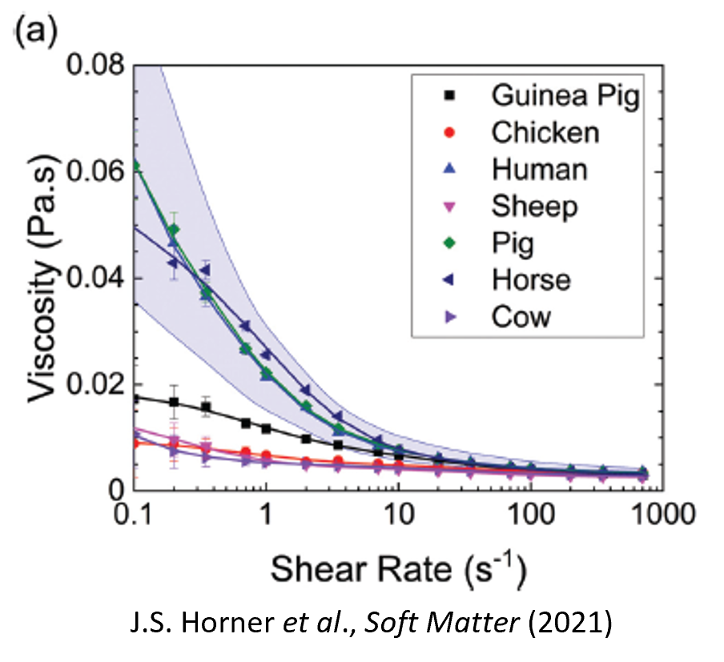

Some species exhibit only weak shear thinning, whereas others show a dramatic decrease in viscosity as the shear rate increases.

This immediately suggests that an additional microscopic mechanism is influencing blood rheology.

## A clue: red blood cell aggregation

Microscopy observations reveal that red blood cells do not always behave as isolated particles.

Under physiological conditions, human erythrocytes spontaneously form aggregates composed of multiple stacked cells.

These structures are known as **rouleaux**, from the French word describing stacks of coins.

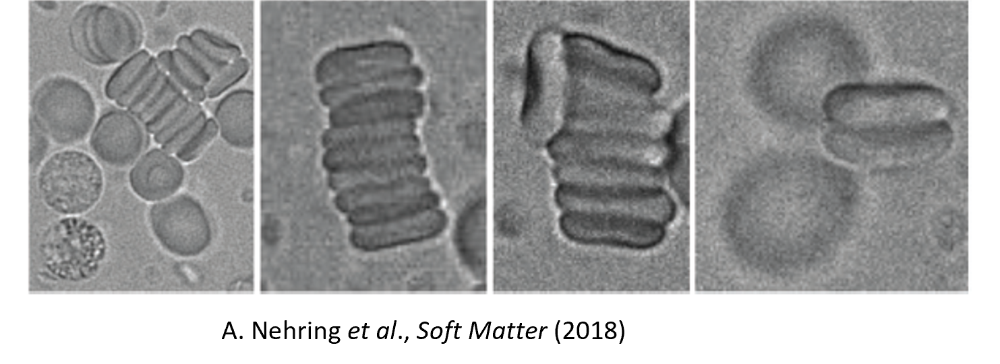

At low shear rates, such aggregates can contain several red blood cells and may continuously form and break apart as blood flows.

The existence of these aggregates provides a natural explanation for shear thinning:

- at low shear rates, aggregation increases the effective size of suspended objects and therefore increases the viscosity;
- at high shear rates, hydrodynamic forces progressively disrupt the aggregates, reducing their influence on the flow.

Consequently, the strength of aggregation is expected to play a major role in determining the rheological properties of blood.

This observation also explains why blood rheology differs from one species to another: the tendency of red blood cells to aggregate varies significantly across species.

## A physical question

The existence of rouleaux raises an important question:

> Why do red blood cells attract one another at all?

Red blood cells carry a net negative surface charge and are suspended in a fluid environment undergoing continuous thermal agitation. At first sight, one might therefore expect cells to remain separated.

Yet experiments clearly show the existence of stable aggregates under physiological conditions.

Understanding the origin of this attraction remains an active area of research.

## Two major theories

Over the last decades, two major physical mechanisms have been proposed to explain red blood cell aggregation:

1. **Bridging**, in which macromolecules adsorb onto neighboring cells and directly connect them;
2. **Depletion**, in which macromolecules are excluded from the narrow gap between cells, generating an effective attraction through osmotic effects.

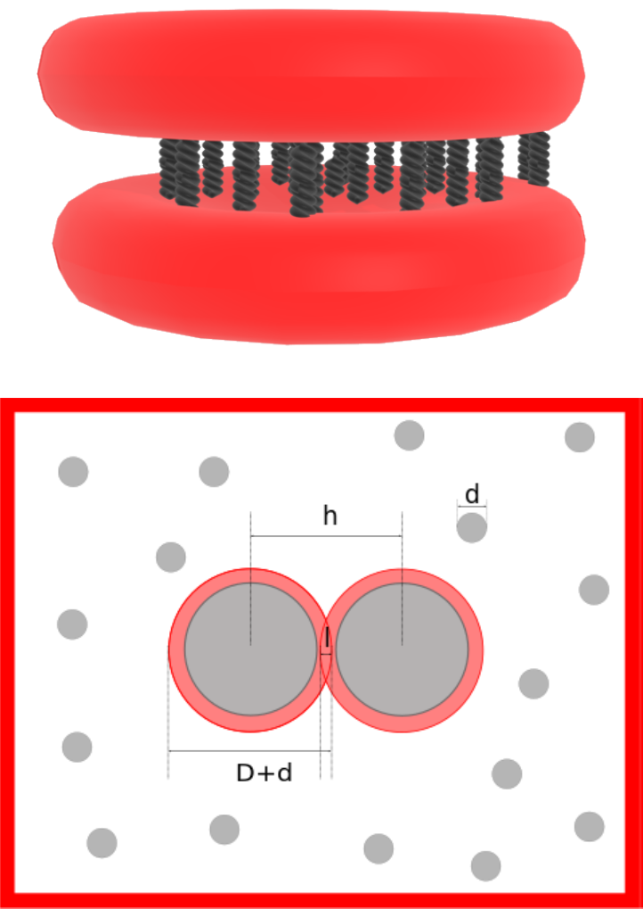

Both approaches reproduce important experimental observations, and both continue to be investigated in modern blood physics.

In the remainder of this lecture, we will examine these two mechanisms in detail and discuss their respective strengths and limitations in explaining red blood cell aggregation.

# Bridging theory

Bridging assumes that macromolecules dissolved in plasma adsorb onto neighboring cell membranes.

A polymer molecule may simultaneously attach to two different cells.

The molecule therefore acts as a molecular spring linking the cells together.

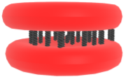

## Spring model

Suppose a molecular bond behaves like a spring.

The force produced by a single bond is

$$
f_b
=
k_b(l-l_0),
$$

where:

- $k_b$ is the bond stiffness,
- $l_0$ is the equilibrium length,
- $l$ is the current bond length.

If

$$
n_b
$$

bonds are present,

the total bridging force becomes

$$
\boxed{
f_m
=
n_b f_b.
}
$$

The interaction therefore depends not only on the mechanical properties of each bond but also on the number of bonds.

## Bond kinetics

The key idea behind bridging models is that aggregation does not simply depend on the existence of adhesive macromolecules, but also on how many molecular bridges are actually formed between two cells at a given instant.

The number of active bonds is therefore a dynamic quantity.

Let $n$ be the surface density of aggregation molecules available on each cell membrane, and $n_b$ the density of bonds currently linking the two cells.

Because bonds can continuously form and break, $n_b$ evolves according to a reaction equation analogous to those used in chemical kinetics.

A commonly used description is

$$
\frac{\partial n_b}{\partial t}
=
2
\left[
k_+
\frac{(n-n_b)^2}{2}
-
k_-
\frac{n_b}{2}
\right].
$$

The first term corresponds to bond formation, while the second term corresponds to bond rupture.

### Physical interpretation

The precise dependence of the bond formation rate on the number of available molecules is not known. In the present model, a second-order reaction law is assumed:
 
$$
\text{bond formation rate}
\propto
(n-n_b)^2.
$$
 
This quadratic dependence should therefore be viewed primarily as a modeling hypothesis rather than a rigorously established consequence of the underlying molecular mechanism.
 
Physically, it reflects the idea that bond formation becomes increasingly difficult as the available adhesion molecules are progressively exhausted.

In contrast, a bond can only break if it already exists, so the rupture term is proportional to the number of existing bonds:

$$
k_- n_b.
$$

The competition between these two processes determines whether aggregation strengthens or weakens with time.

At equilibrium,

$$
\frac{\partial n_b}{\partial t}=0,
$$

so the rates of bond formation and bond rupture exactly balance one another.

### Dependence on cell separation

The rates $k_+$ and $k_-$ are not constants.

They depend on the distance between the two cell membranes.

This is because each molecular bridge behaves approximately like a spring.

If

- $l_0$ is the equilibrium bond length,
- $l$ is the current bond length,

then stretching or compressing the bond changes its elastic energy.

The attachment and detachment rates are commonly modeled using thermally activated processes,

$$
k_+
=
k_+^0
\exp
\left(
-\frac{k_{ts}(l-l_0)^2}{2k_B T}
\right),
$$

and

$$
k_-
=
k_-^0
\exp
\left(
-\frac{(k_b-k_{ts})(l-l_0)^2}{2k_B T}
\right).
$$

Here:

- $k_+^0$ is the bond formation rate when no force is applied,
- $k_-^0$ is the spontaneous bond rupture rate,
- $k_b$ is the effective spring constant of an individual bond,
- $k_{ts}$ characterizes the transition state associated with bond formation,
- $l_0$ is the equilibrium bond length,
- $l$ is the current bond length,
- $k_B$ is Boltzmann's constant,
- $T$ is the absolute temperature.

### Why does a Boltzmann factor appear?

The exponential terms have the form

$$
e^{-E/k_B T},
$$

which is the usual Boltzmann factor encountered in statistical physics.

This factor expresses a simple idea:

> Configurations with a higher elastic energy are statistically less likely to occur.

Stretching a molecular bridge away from its preferred length increases its elastic energy by approximately

$$
\frac12 k(l-l_0)^2.
$$

The thermal energy available in the system is

$$
k_B T.
$$

The ratio

$$
\frac{\text{elastic energy}}
     {\text{thermal energy}}
=
\frac{k(l-l_0)^2}{2k_B T}
$$

therefore determines how probable the configuration is.

Large deformations correspond to high energies, making the corresponding configurations exponentially less likely.

As a result:

- bond formation becomes less probable when molecules are strongly stretched,
- bond rupture becomes more probable when large elastic tensions develop.

### Effective number of bridge-forming molecules

A subtle but important point is that the quantity

$$
n
$$

appearing in the kinetic model does **not necessarily correspond to the total number of adsorbed macromolecules on the membrane**.

Instead, it should be interpreted as an **effective density of molecules capable of forming bridges** between two neighboring cells.

At low concentrations of aggregation molecules, these two quantities are approximately identical:

$$
n
\approx
n_{\rm ads},
$$

because most adsorbed molecules remain accessible and can participate in bridge formation.

However, this correspondence breaks down at larger concentrations.

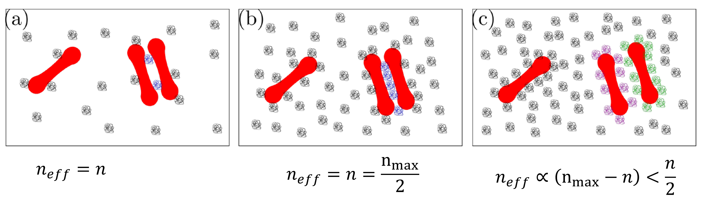

The sketches above illustrate three qualitatively different regimes:

#### Low concentration

In panel (a), only a small number of macromolecules are present near the cell surfaces.

Most molecules remain isolated and accessible.

Increasing the concentration therefore increases almost proportionally the number of molecules capable of forming bridges.

In this regime,

$$
n \propto n_{\rm ads}.
$$

#### Intermediate concentration

In panel (b), more molecules are available in the interaction region.

The number of possible bridges increases rapidly because many new configurations become available.

The probability that a given molecule finds a suitable partner on the opposite cell increases, which favors aggregation.

This regime is often the most efficient for bridge formation.

#### High concentration

In panel (c), the membrane surface becomes crowded.

Many adsorbed molecules compete for the same available binding sites.

Steric interactions between neighboring molecules may:

- reduce their mobility,
- hinder their proper orientation,
- block access to the membrane surface,
- reduce the number of mechanically effective bridges.

As a result, the effective density of bridge-forming molecules may increase much more slowly than the total number of adsorbed molecules, and can even decrease for sufficiently strong crowding.

Consequently,

$$
n
\neq
n_{\rm ads}
$$

in general.

Instead,

$$
n=n(n_{\rm ads})
$$

should be viewed as an effective quantity that depends on:

- the concentration of adsorbed molecules,
- their spatial organization,
- the geometry of the contact region,
- steric interactions between neighboring molecules.

### Consequences for aggregation

This distinction is important because it implies that increasing the concentration of aggregation proteins does not necessarily lead to stronger aggregation.

Adding more molecules initially increases the number of possible bridges, but beyond a certain concentration crowding effects will reduce bridge formation.

The relationship between protein concentration and aggregation strength is therefore expected to be non-monotonic in general.

This observation helps explain why quantitative predictions of bridging models remain challenging: the effective parameter $n$ is not simply determined by measuring the concentration of aggregation proteins, but depends on the microscopic organization of those proteins in the contact zone between neighboring cells.

## Advantages of bridging models

Bridging models are attractive because they can naturally be combined with:

- membrane deformation,
- fluid flow,
- hydrodynamic simulations.

They are therefore widely used in computational blood mechanics.

## Difficulties

The main limitation is that many parameters are difficult to determine experimentally.

Examples include:

- bond stiffnesses,
- attachment rates,
- detachment rates,
- densities of active macromolecules.

Reported values often span several orders of magnitude.

As a consequence, bridging models can be difficult to validate quantitatively.

# Depletion theory

An alternative explanation comes from colloid physics.

Unlike bridging, depletion does not require any direct molecular binding between cells.

Instead, the attraction emerges from entropy.

## Physical origin

Consider two red blood cells immersed in a solution containing macromolecules or nanoparticles.

The polymers or particles cannot approach arbitrarily close to the cell surface.

An depletion layer, within which the center of mass of the macromolecules, therefore appears around each cell.

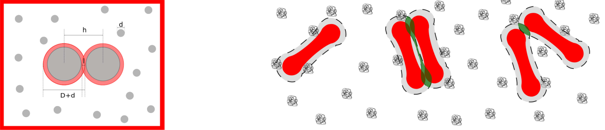

When two cells approach one another, these depletion layers overlap.

The overlap increases the volume available to polymers elsewhere in the solution.

Because entropy increases, the corresponding configuration is favored.

The result is an effective attraction between the cells.

Remarkably:

> two particles can attract one another even if all microscopic interactions are purely repulsive.

This is one of the most important ideas in colloid science.

# Simplest depletion model

Consider two parallel plates immersed in a suspension of particles of radius $r$. The plate separation is $h$.

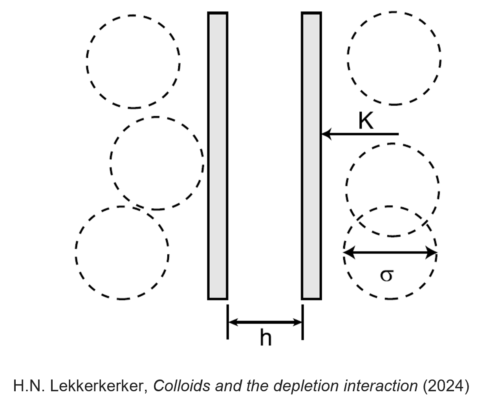

## Large separations

If

$$
h \ge 2r,
$$

particles can enter the gap.

The osmotic pressure inside and outside the gap is identical:

$$
P_i=P_o.
$$

No net force appears.

## Small separations

If

$$
h < 2r,
$$

the particles cannot enter the gap.

The osmotic pressure becomes

$$
P_i=0,
\qquad
P_o=\Pi.
$$

The resulting force is

$$
\boxed{
F=S\Pi,
}
$$

where $S$ is the plate area.

For an ideal solution,

$$
\Pi=nk_B T.
$$

The corresponding interaction energy becomes

$$
\boxed{
U
=
-Snk_B T
\left(
r-\frac{h}{2}
\right),
\qquad
h<2r.
}
$$

This is the classical Asakura–Oosawa depletion attraction.

# Realistic depletion models

Actual blood plasma is considerably more complicated.

Polymers:

- possess finite size,
- partially penetrate glycocalyces,
- deform near surfaces,
- interact with one another.

Consequently, more sophisticated theories are required.

## Polymer penetration

Neu and Meiselman proposed an [influential model](https://doi.org/10.1016/S0006-3495(02)75259-4) incorporating:

- penetration depth $p$,
- depletion thickness $\Delta$,
- osmotic pressure $\Pi$.

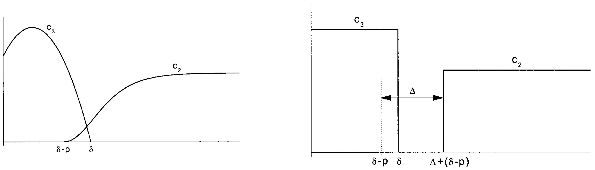

The resulting interaction energy becomes

$$
\boxed{
w_D
=
-2\Pi
\left(
\Delta
-\frac{p+d}{2}
+\delta
\right),
}
$$

where:

- $d$ is the cell-cell separation,
- $\delta$ characterizes the glycocalyx thickness.

## Osmotic-pressure corrections

At sufficiently large polymer concentrations, ideal-solution approximations become insufficient.

A virial expansion can be used:

$$
\Pi
=
n_b k_B T
+
B_2 n_b^2.
$$

The depletion thickness then becomes concentration dependent.

Experimental measurements reveal strong decreases of depletion thickness as polymer concentration increases.

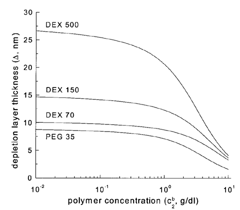

# Comparison with experiments

Depletion models make quantitative predictions for:

- interaction energies,
- equilibrium spacing,
- concentration dependence.

The resulting interaction energies exhibit minima at specific cell-cell distances.

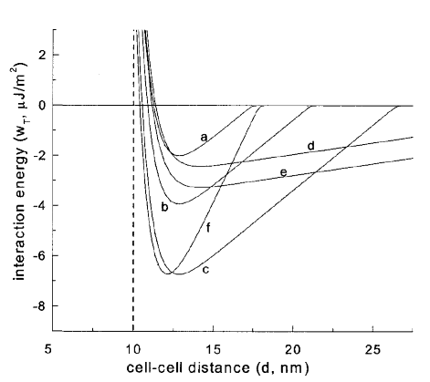

These predictions can be directly compared with experiments.

Remarkably good agreement is often obtained for dextran solutions.

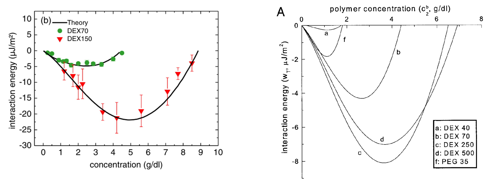

This success is one reason depletion theory remains extremely influential in the field.

# Direct experimental measurements

Ultimately, interaction forces should be measured directly.

Several techniques are available.

## Atomic force microscopy

A red blood cell can be attached to an AFM cantilever and brought into contact with another cell.

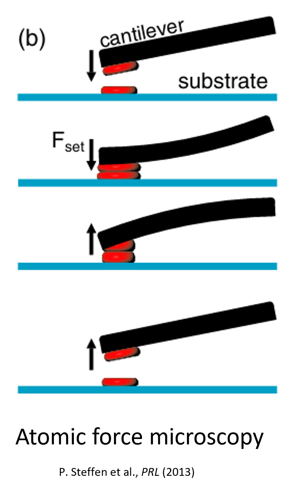

The force required to separate the cells can then be measured directly.

Typical force-distance curves reveal attractive interactions of order tens of piconewtons.

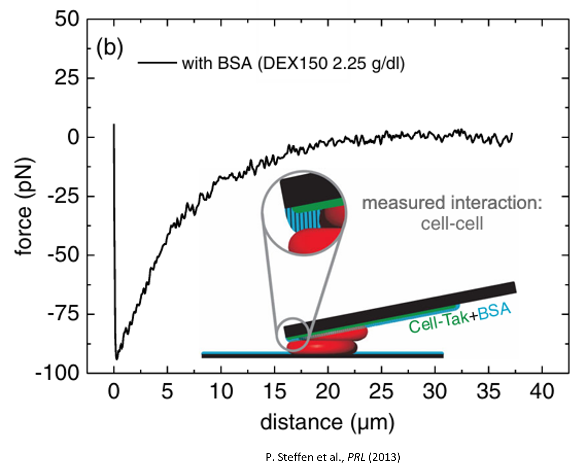

## Experimental precautions

Such measurements are challenging.

Contact times must often be carefully controlled because:

- prolonged contact may induce bridging,
- cells continuously deform,
- aggregation may become history dependent.

Consequently, interpretation of experiments requires considerable care.

# Optical tweezers and aggregation

Optical tweezers provide another powerful approach.

A focused laser beam can trap and manipulate individual red blood cells.

The trapping force is often well approximated by

$$
\mathbf F
\propto
-k\mathbf x,
$$

making the optical trap behave similarly to a spring.

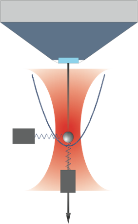

Modern experiments use optical tweezers to measure:

- aggregation forces,
- disaggregation forces,
- aggregation-disaggregation hysteresis.

These measurements provide particularly clean comparisons with theoretical predictions.

# Comparing interaction models

Recent studies have compared experiments with numerical simulations based on:

- pure depletion,
- pure bridging,
- depletion plus bridging.

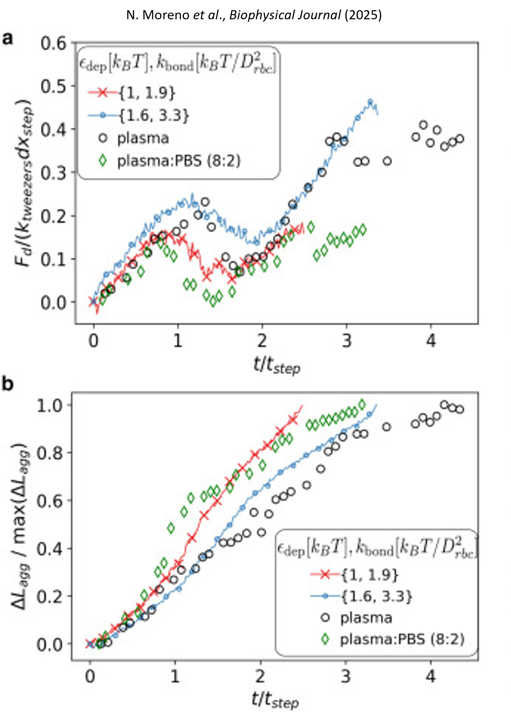

An important conclusion is that multiple mechanisms may contribute simultaneously.

This remains an active area of debate.

Current research seeks to determine:

- which mechanism dominates,
- under what physiological conditions,
- and for which aggregation agents.

# Mixing aggregation and elasticity

Real red blood cells are neither rigid colloids nor purely elastic objects.

They are deformable particles that aggregate.

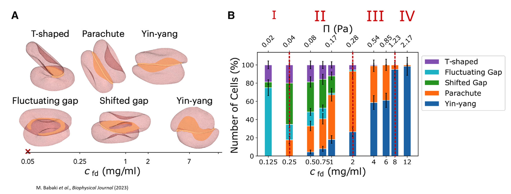

Modern models therefore attempt to combine:

- membrane elasticity,
- hydrodynamic forces,
- aggregation interactions.

One emerging question is:

> What determines the distribution of red blood cell shapes in aggregates?

This naturally leads to statistical-physics approaches, which remains an active research area.

# From aggregation to blood structure

At sufficiently large hematocrits,

$$
\phi
\approx
0.5,
$$

and when

$$
U_{\rm agg}
\gg
k_B T,
$$

aggregation can become a collective phenomenon.

Instead of isolated rouleaux, one obtains:

$$
\boxed{
\text{Percolating networks.}
}
$$

Blood can then behave similarly to:

- colloidal gels,
- attractive suspensions,
- soft solids.

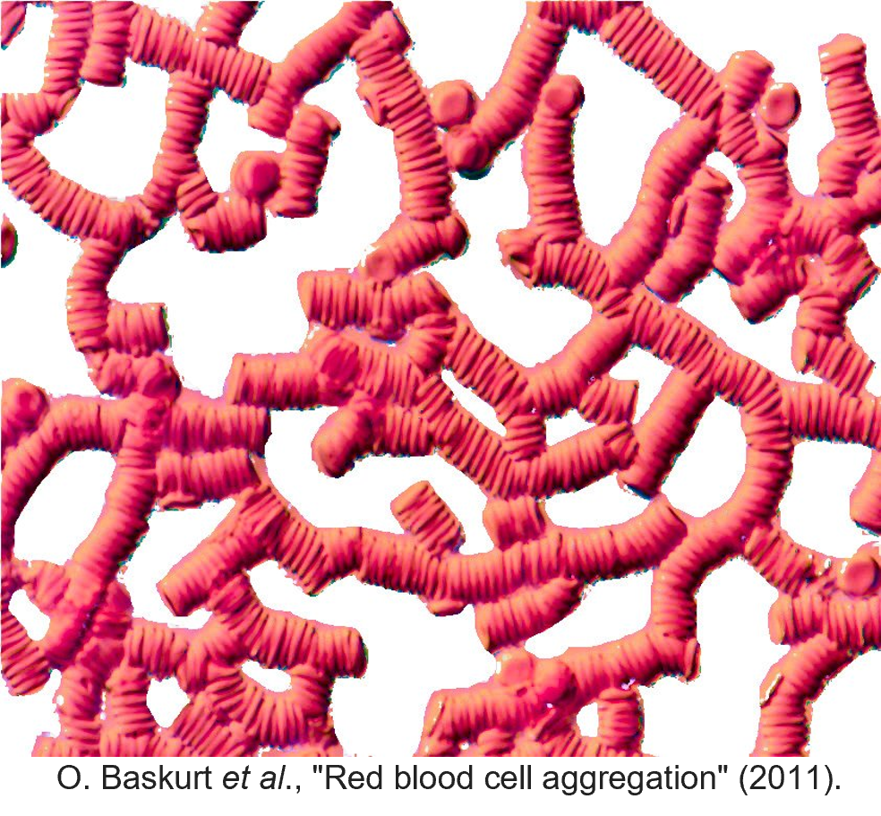

This observation links blood physics directly to modern soft-matter physics.

# Blood as a soft-matter system

A useful perspective is to view blood as a concentrated suspension of attractive deformable particles.

Under storage or in vitro conditions:

- there is no active propulsion,
- aggregation dominates thermal motion,
- dense networks may emerge.

Consequently, many concepts from:

- colloidal gels,
- dense suspensions,
- particulate matter,

become directly applicable.

Blood therefore provides a fascinating bridge between biology, physics and engineering.

# Research perspectives

Many blood tests used daily in clinics rely on physical phenomena whose detailed mechanisms remain incompletely understood.

Important challenges include:

- understanding aggregation mechanisms,
- predicting blood rheology from cellular properties,
- improving numerical simulations,
- developing new diagnostic biomarkers,
- optimizing blood-storage protocols.

Red blood cells remain one of the most accessible and informative model systems in biological physics.

They provide a unique playground in which:

- single-cell mechanics,
- fluid dynamics,
- statistical physics,
- colloid science,
- soft matter,

interact simultaneously.

# Learning outcomes

After this lecture, you should be able to:

- explain why red blood cells aggregate;
- distinguish bridging and depletion mechanisms;
- derive the basic depletion attraction between surfaces;
- understand how aggregation influences blood rheology;
- describe modern experimental methods used to measure aggregation forces;
- explain the challenges of quantitatively validating aggregation theories;
- appreciate the connections between blood physics and soft condensed matter physics.